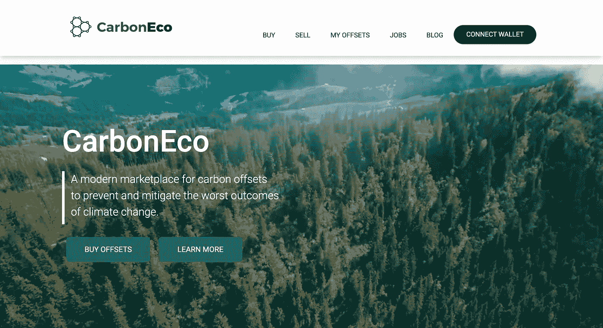
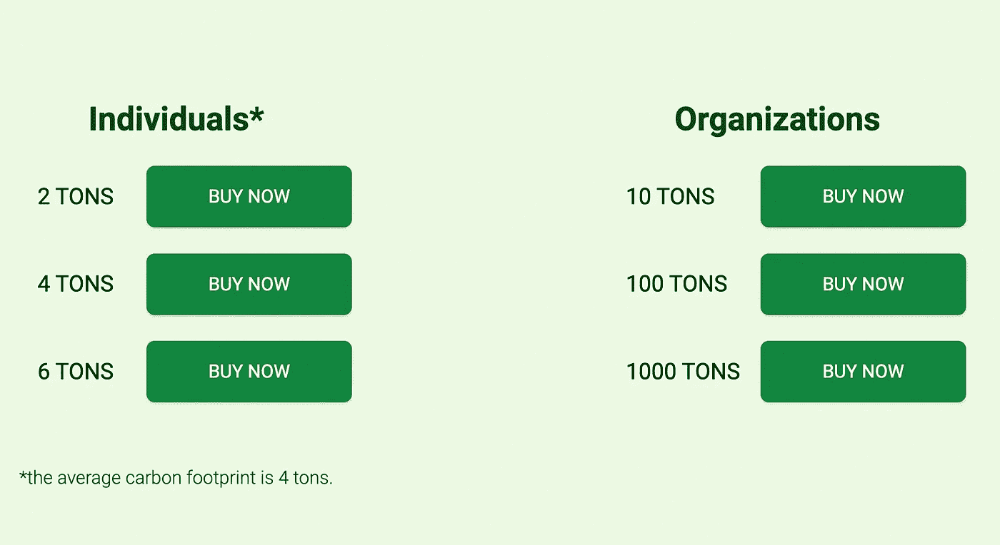
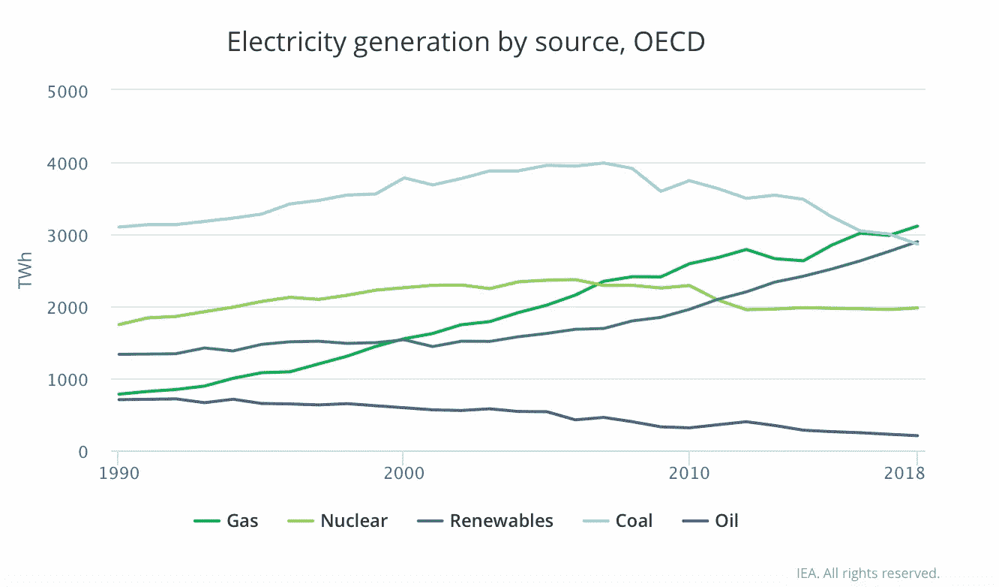

# CarbonEco:通过以太坊智能合约减少碳足迹

> 原文：<https://medium.com/coinmonks/carboneco-reduction-of-carbon-footprints-via-smart-contracts-on-ethereum-709f3d5476ca?source=collection_archive---------15----------------------->

# 自愿碳市场

自愿碳市场是公司自愿购买碳信用额以抵消其碳排放的一种方式。

随着越来越多的公司意识到采取措施保护我们的星球的好处，以及越来越多的人意识到这种市场比其他方法更加高效和划算，自愿碳市场正在快速增长。

# CarbonEco

[CarbonEco](https://carboneco.trade/) ，一个让卖家和买家参与自愿碳抵消的新平台，刚刚启动。

该平台利用[以太坊区块链](https://www.investopedia.com/terms/e/ethereum.asp#:~:text=Ethereum%20is%20a%20blockchain%2Dbased,long%2Dterm%20visions%20and%20limitations.)来简化上市过程，并使交易实时发生。

它的目标是让企业更容易参与环保工作，同时也让个人更容易做出有助于他们的社区和地球的选择。

这个生态系统的关键组件是 [CarbonEco](https://carboneco.trade/) 智能合约和 [carbonEco (c0)](https://coinmarketcap.com/currencies/carboneco/) 令牌。

智能合同充当您的个人账本，以跟踪您拥有的碳信用额，而令牌是符合 ERC20 的数字资产，代表系统内的价值单位。

第二个组成部分是他们的数字注册表，所有参与者可以在任何时候查看他们可用的碳信用余额。

> 交易新手？尝试[加密交易机器人](/coinmonks/crypto-trading-bot-c2ffce8acb2a)或[复制交易](/coinmonks/top-10-crypto-copy-trading-platforms-for-beginners-d0c37c7d698c)

# 这有什么关系？

自愿碳市场是气候变化解决方案的重要组成部分。

它们可以帮助我们减少碳排放，减少对化石燃料的依赖。

自 2000 年以来，我们看到大多数经合组织国家的可再生能源大幅增加。

然而，我们仍需要加大努力，以实现巴黎气候协议所规定的目标(近 200 个国家同意到 2100 年将全球变暖限制在不超过 2 摄氏度，并以不超过 1.5 摄氏度为目标)。

自愿碳市场是我们实现这些目标的一种方式；他们鼓励个人和企业购买“碳信用”，通过支持世界其他地方的绿色能源项目来抵消自己的温室气体排放。

通过参与这种类型的计划，每个人都有机会做出贡献，并且每个人都从减少自己对环境的影响中受益！

# 权力下放符合所有人的最佳利益

分散的碳市场是确保所有人分享碳信用的好处的好方法。

不幸的是，在许多第三世界国家，由于腐败，虽然几个碳项目筹集了资金，但很难看到实际的实施。

拥有一个买卖双方都能更容易进入的市场，可以产生自我监管的效果，让那些真正有影响力的人留下来，而腐败的一方将被社区排除在外。

区块链提供了这种程度的透明度。

自愿碳市场可以运作，但它们仍处于起步阶段。CarbonEco 是未来自愿碳市场的关键部分。

CarbonEco 是一个开源平台，任何人都可以在这个平台上建立和连接自己的市场(即交易所)。

它也是一个区块链平台，使用智能合约来促进碳信用的买家和卖家之间的交易。

# 自愿碳市场是可行的

自愿碳市场对每个人来说都是双赢的局面。

它们为减少温室气体排放提供了一种有效、灵活的方式，并为投资者创造了通过买卖排放配额赚钱的机会。

根据路孚特的分析师，全球碳市场在 2021 年扩大了 164%，达到**8510 亿美元**。欧盟排放交易体系(EU ETS)目前价值 6830 亿欧元(约合 7690 亿美元)。欧盟排放交易体系自 2005 年就存在了。

未来 30 年，这个市场可能会继续快速增长。这将使它成为除零售业以外最大的行业。

有如此多的潜在收入，难怪自愿碳市场在全球消费者中如此受欢迎:它们易于使用，不需要任何生活方式的改变——只需购买一些信用额！

另外，你可以在帮助拯救地球的同时自我感觉良好。

我们[金融集团](https://www.financely-group.com/our-services)不提倡任何特定的政策，但我们支持所有有助于控制温室气体排放的政策。

谈到碳市场，我们认为在设计碳市场时着眼于公平和包容是很重要的，这样每个人都可以参与。

我们还认为，在设计这些市场时，应该牢记**透明和问责的原则，这样公众才能信任它们。**

我们将继续关注这些问题，如果在这个领域有任何新闻或进展，我们将向您报告！