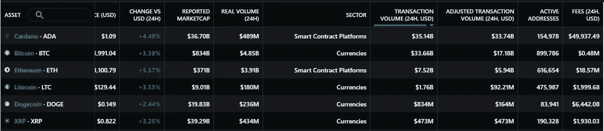

# Cardano 连续三天蝉联连锁活动冠军！

> 原文：<https://medium.com/coinmonks/cardano-1-in-chain-activity-3-days-in-a-row-3bd4cac35d07?source=collection_archive---------15----------------------->

Cardano #1 in chain activity

这几天，推特空间一直在讨论卡尔达诺的连锁活动。但是在一个月无情的 FUD 之后，这仅仅是一种解脱。我将总结一下过去一个月的活动，自从 1 月 20 日 [SundaeSwap 的](https://sundaeswap.finance/) DEX 推出以来。仅此一项，就导致了区块链的流量激增。将来自 [DripDropz，](https://dripdropz.io/)的令牌添加到该卷，该 DripDropz 在每个时期将令牌从 ISPOs 批量发送到代理器。添加更多出现在同一时间，甚至更早的索引，比如 [MuesliSwap](https://muesliswap.com/) 。这导致了巨大的延迟，即使是简单的事务也是如此，只需要几分钟而不是几秒钟(在第 2 层应用程序上是几小时)。块已满到其最大容量，事务必须在队列中等待，然后才会被经验证的块选取。假设平均每 20 秒传播一个数据块，并且大多数事务需要 20–30 个或更多数据块才能通过验证，则延迟大约为 10–20 分钟。

IOG 对一系列预先规划的网络参数进行了调整，将块大小从 64K 增加到 72K，然后增加到 80K，从而允许每个块容纳更多的数据。他们还将普路托斯内存大小限制提高了 12.5%，允许每个脚本进行更多的操作。所有这些措施似乎都起了作用，因为现在网络运行得更好了。(我在 5 分钟内从被动节点发送 TXs)。所有这些真实实验的令人惊讶的积极结果是，Cardano 网络在 95%或更多的负载下工作，从未动摇过，从未丢失过一个交易，从未中断过。我说的不是钱包的性能，而是区块链的性能。

最后，所有这些活动，人们交换代币，铸造-购买-销售-NFT，发送 ADA 等等。已经积累了足够的资金，我们可以直接获得连锁活动[的第一名](https://messari.io/screener/most-active-chains-DB01F96B)！

正如你所看到的，今天(2022 年 2 月 15 日)messari.io 的图表显示，Cardano 的调整后交易量为 337.4 亿美元，其次是比特币的 170 亿美元和以太坊的 5.94 亿美元。昨天，卡尔达诺的数字是 170 亿美元，比特币是 90 亿美元，以太坊是 40 亿美元，XRP 是 40 亿美元，这很有趣，因为 17 = 9 + 4 + 4！

另一个值得注意的有趣的事情是交易费。对于 Cardano 上所有交易量，花费在费用上的不到 5 万美元。比特币为 48 万美元，以太坊为 1857 万美元。如果我们将这两个数字相除，得到每 1 美元交易的费用值，我们得到:

也就是说 Cardano 网络上的移动价值平均比比特币网络便宜 **20 倍，比以太坊网络便宜 2123 倍！！！**难以置信！

至于卡尔达诺活跃地址少的说法，那证明卡尔达诺社区的人比另一个区块链活跃得多。活跃的卡尔达诺地址有 154K，相比之下，比特币上有 90 万，以太坊上有 60 万，即分别是 1/6 和 1/4。但与市值相比，我们再次领先:卡尔达诺为 367 亿美元，比特币为 8340 亿美元，以太坊为 3710 亿美元，分别为 1/22 和 1/10。我不是财务顾问，你自己去研究吧，但这看起来是被严重低估的资产。最后我说一下，卡尔达诺 5 岁，以太坊 7，比特币 13。所以，我不担心 Cardano 没有相同数量的活跃地址或市值。我们正在迎头赶上，总有一天我们会有更多活跃的地址和更高的市值。

如果你觉得这篇文章有用，请考虑委派一些 ADA 到我的池:
ADA Skepsis—ASKP
【www.skepsispool.com】T4

如果您在 2 月 19 日之前授权，您还将获得圣代代币，作为反向 ISO 的一部分。

> *加入 Coinmonks* [*电报频道*](https://t.me/coincodecap) *和* [*Youtube 频道*](https://www.youtube.com/c/coinmonks/videos) *了解加密交易和投资*

# 另外，阅读

*   [3 商业评论](/coinmonks/3commas-review-an-excellent-crypto-trading-bot-2020-1313a58bec92) | [Pionex 评论](https://coincodecap.com/pionex-review-exchange-with-crypto-trading-bot) | [Coinrule 评论](/coinmonks/coinrule-review-2021-a-beginner-friendly-crypto-trading-bot-daf0504848ba)
*   [莱杰 vs n rave](/coinmonks/ledger-vs-ngrave-zero-7e40f0c1d694)|[莱杰 nano s vs x](/coinmonks/ledger-nano-s-vs-x-battery-hardware-price-storage-59a6663fe3b0) | [币安评论](/coinmonks/binance-review-ee10d3bf3b6e)
*   [Bybit Exchange 审查](/coinmonks/bybit-exchange-review-dbd570019b71) | [Bityard 审查](https://coincodecap.com/bityard-reivew) | [Jet-Bot 审查](https://coincodecap.com/jet-bot-review)
*   [3 commas vs Cryptohopper](/coinmonks/3commas-vs-pionex-vs-cryptohopper-best-crypto-bot-6a98d2baa203)|[赚取加密利息](/coinmonks/earn-crypto-interest-b10b810fdda3)
*   最好的比特币[硬件钱包](/coinmonks/hardware-wallets-dfa1211730c6) | [BitBox02 回顾](/coinmonks/bitbox02-review-your-swiss-bitcoin-hardware-wallet-c36c88fff29)