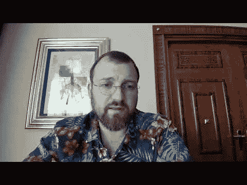

# 卡尔达诺(ADA)创始人告诉密码市场的新来者不要惊慌

> 原文：<https://medium.com/coinmonks/cardano-ada-founder-tells-newcomers-to-the-crypto-market-not-to-panic-70f87ba7e2c1?source=collection_archive---------57----------------------->

负责[卡尔达诺](https://mkt57.blogspot.com/2022/04/cardano-adds-over-450000-wallets-to-its.html)研发的公司 IO Global(又名“IOG”，原名“IOHK”)的联合创始人兼首席执行官 Charles Hoskinson ，正在尽最大努力减轻人们对加密市场崩溃的担忧，声称大规模修正在该行业很常见。

在 5 月 11 日发布到他的 YouTube 频道的视频中，Hoskinson 表示，长期加密货币投资者对最近的价格调整并不担心。Hoskinson 指出，该行业以前经历过类似的严重价格调整，这意味着市场波动是正常的。

霍金森认为，新投资者或那些在牛市开始后开始投资加密的人最有可能出现恐慌性抛售。

据 Hodl 日报报道，Hoskinson 说，

> *我已经在这个领域工作了近十年，我记得比特币之前是 1 美元，然后上涨到 30 美元，然后下跌到 4 美元，然后到 250 美元，然后到 80 美元，然后到 1200 美元，然后再次下跌到 250 美元，然后上涨到 2 万美元，然后下跌到 4000 美元，然后到 6.4 万美元。*

霍金森声称，世界各地对[加密价格](https://mkt57.blogspot.com/2022/04/trying-my-favorite-snoop-dogg-teams-up.html)的看法惊人地相似，声称在保守派中“没有什么能左右我们”。

霍金森接着说，新投资者夸大了形势，声称最近的价格下跌标志着“加密的终结”霍金森尽最大努力减轻这些投资者的恐惧，希望他们“欢迎”潜在的熊市，他称之为“加密冬天”。

他警告说，加密市场可能需要几周或几个月才能找到价格底部，我们正处于“惊慌失措、血流成河的阶段”霍斯金森最后预测，在此之后将会有一个“漫长的攀登过程”。

# 放弃

作者或任何其他人在本文中表达的观点或意见仅供参考，不构成金融、投资或其他建议。投资或交易加密资产会带来财务风险。

*原载于 2022 年 5 月 16 日 https://mkt57.blogspot.com**的* [*。*](https://mkt57.blogspot.com/2022/05/cardano-ada-founder-tells-newcomers-to.html)

> 加入 Coinmonks [电报频道](https://t.me/coincodecap)和 [Youtube 频道](https://www.youtube.com/c/coinmonks/videos)了解加密交易和投资

# 另外，阅读

*   [本地比特币审核](/coinmonks/localbitcoins-review-6cc001c6ed56) | [加密货币储蓄账户](https://coincodecap.com/cryptocurrency-savings-accounts)
*   [什么是融资融券交易](https://coincodecap.com/margin-trading) | [成本平均法](https://coincodecap.com/dca)
*   [支持卡审核](https://coincodecap.com/uphold-card-review) | [信任钱包 vs 元掩码](https://coincodecap.com/trust-wallet-vs-metamask)
*   [Exness 回顾](https://coincodecap.com/exness-review)|[moon xbt Vs bit get Vs Bingbon](https://coincodecap.com/bingbon-vs-bitget-vs-moonxbt)
*   [如何开始用加密贷款赚取被动收入](https://coincodecap.com/passive-income-crypto-lending)