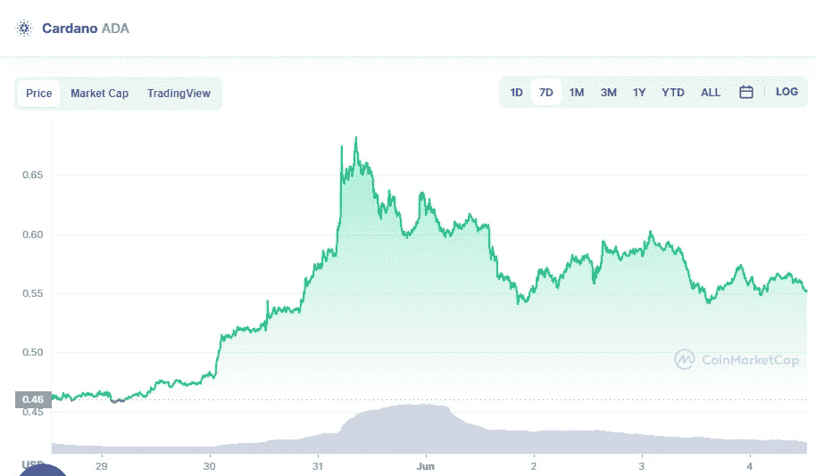

# 卡尔达诺(ADA)价格分析 6 月 4 日

> 原文：<https://medium.com/coinmonks/cardano-ada-price-analyse-4th-of-june-bc749527f54b?source=collection_archive---------29----------------------->

Source photo [Cardano price today, ADA to USD live, marketcap and chart | CoinMarketCap](https://coinmarketcap.com/currencies/cardano/)

使用 4 小时卡达诺价格分析，我们可以看到，随着价格的上涨，市场现在处于有利位置。更重要的是，市场的波动遵循紧密的趋势，导致加密货币的波动性较小。由于布林带的上限是 0.6 美元，所以 ADA 的最高阻力位是 0.6 美元。另一方面，ADA 受布林带下轨 0.53 美元支撑。