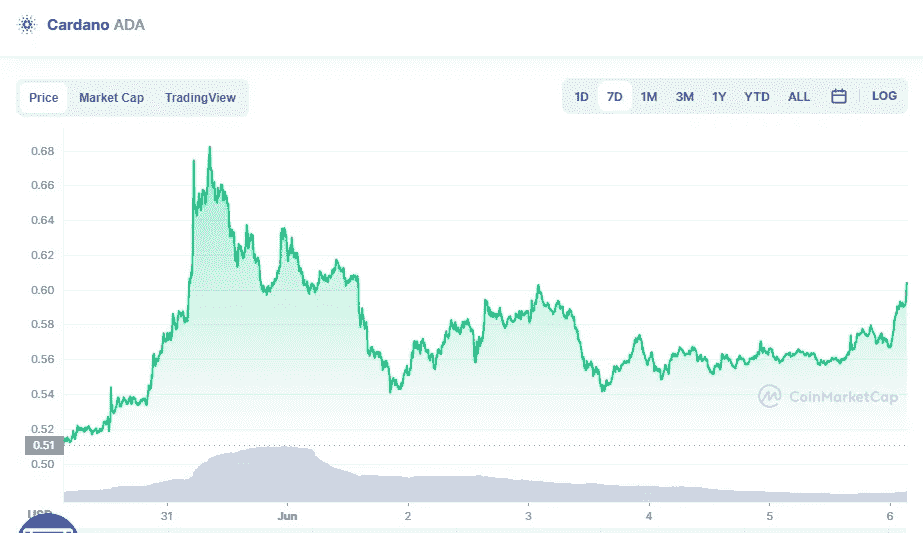

# 卡尔达诺(ADA)6 月 6 日价格分析

> 原文：<https://medium.com/coinmonks/cardano-ada-price-analyse-6th-of-june-62d010dc1618?source=collection_archive---------27----------------------->

Source photo [Cardano price today, ADA to USD live, marketcap and chart | CoinMarketCap](https://coinmarketcap.com/currencies/cardano/)

尽管卡尔达诺(ADA)在 5 月 31 日突破了下降趋势线，从当天的蜡烛线可以看出，多头无法维持较高的水平。

然而，尽管空头有效地防御了下降趋势线，但多头成功地将 ADA/USDT 货币对保持在 20 天均线(0.56 美元)上方。下降趋势线被突破的可能性更大。