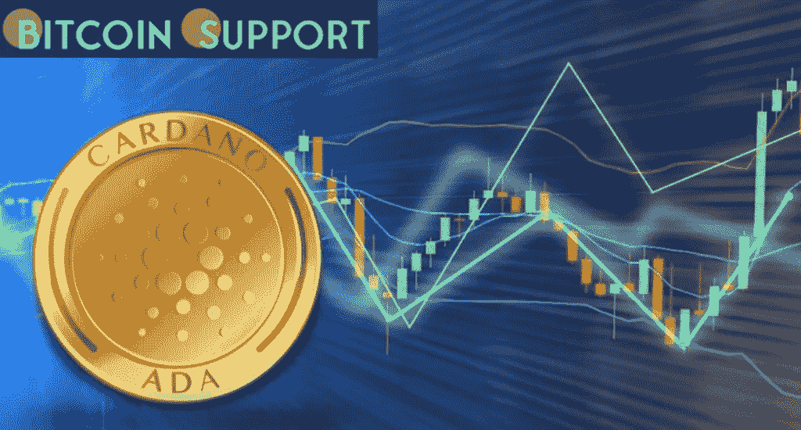
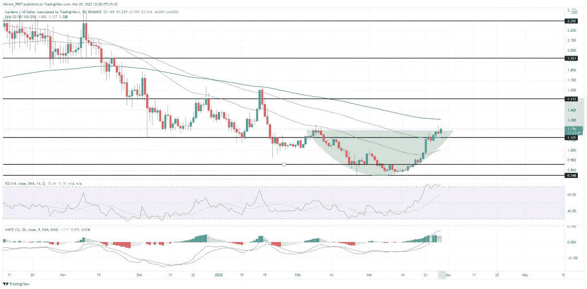

# 卡尔达诺(ADA)价格分析

> 原文：<https://medium.com/coinmonks/cardano-ada-price-analysis-3ab783addd7?source=collection_archive---------80----------------------->

**Visit our website:-** [**https://bitcoinsupports.com/**](https://bitcoinsupports.com/)

ADA 硬币的价格行为表明在 1.18 美元的颈线处有一个圆形的底部突破，表明可能会有一个到 1.50 美元的牛市。你应该购买额外的物品吗？

**关键技术点:**

- ADA 价格接近 200 日均线。

——50 日均线显示突然反转，戏弄潜在的多头交叉。

——最后，卡达诺的 24 小时交易量为 1.49 美元

**阿达之前的表现**

阿达币价格在 2 月和 3 月初下跌 35%之后，取得了非凡、乐观的回报。然而，占 50%涨幅的复苏飙升将价格从 0.77 美元的低点推高至 1.21 美元。此外，反转导致圆形底部形态的突破，在 100 日均线突破后，颈线在 1.18 美元左右。

**Visit our website:-** [**https://bitcoinsupports.com/**](https://bitcoinsupports.com/)

**ADA 的技术分析**

ADA 币价格随着交易量的增加，表现出购买压力的增加，表明了强烈的看涨承诺。因此，增加的买入压力表明上升趋势很有可能在 1.20 美元上方继续。

Cardano 的市场价格在 100 日均线之后最近几天飙升，导致 50 日均线出现明显反转。因此，50 日和 100 日指数移动平均线之间看涨交叉的概率增加。

**RSI 指标:**RSI 指标进一步攀升至超买区，在 70%的边界处下探。此外，14 日均线继续向超买区倾斜。

**MACD 指标:**在日线图上，MACD 和信号线在零上方交叉，正对齐。然而，MACD 直方图的下降分布表明空头交叉，尽管线之间的传播仍然很大。

总之，ADA 技术分析确定了突破进场机会，有 1.50 美元突破暴涨的可能性。

**即将到来的趋势**

随着整个加密市场收到更多流入，ADA 币价格获得看涨支撑。因此，即将到来的突破反弹增加了突破 1.50 美元水平的可能性，如果它保持在 200 天指数移动平均线以上。

**访问我们的网站:-**[**https://bitcoinsupports.com/**](https://bitcoinsupports.com/)

**免责声明:以上为作者观点，不应视为投资建议。读者应该自己做研究。**

> 加入 Coinmonks [电报频道](https://t.me/coincodecap)和 [Youtube 频道](https://www.youtube.com/c/coinmonks/videos)了解加密交易和投资

# 另外，阅读

*   最好的比特币[硬件钱包](/coinmonks/hardware-wallets-dfa1211730c6) | [BitBox02 回顾](/coinmonks/bitbox02-review-your-swiss-bitcoin-hardware-wallet-c36c88fff29)
*   [block fi vs Celsius](/coinmonks/blockfi-vs-celsius-vs-hodlnaut-8a1cc8c26630)|[Hodlnaut 审核](/coinmonks/hodlnaut-review-best-way-to-hodl-is-to-earn-interest-on-your-bitcoin-6658a8c19edf) | [KuCoin 审核](https://coincodecap.com/kucoin-review)
*   [Bitsgap 审查](/coinmonks/bitsgap-review-a-crypto-trading-bot-that-makes-easy-money-a5d88a336df2) | [Quadency 审查](/coinmonks/quadency-review-a-crypto-trading-automation-platform-3068eaa374e1) | [Bitbns 审查](/coinmonks/bitbns-review-38256a07e161)
*   [加密复制交易平台](/coinmonks/top-10-crypto-copy-trading-platforms-for-beginners-d0c37c7d698c) | [Coinmama 评论](/coinmonks/coinmama-review-ace5641bde6e)
*   [印度的加密交易所](/coinmonks/bitcoin-exchange-in-india-7f1fe79715c9) | [比特币储蓄账户](/coinmonks/bitcoin-savings-account-e65b13f92451)