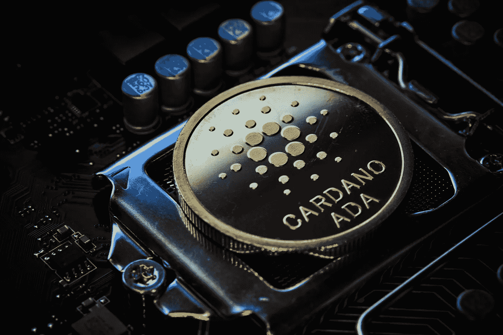

# 卡尔达诺(ADA)2022–2025 年价格预测

> 原文：<https://medium.com/coinmonks/cardano-ada-price-prediction-2022-2025-c25980836415?source=collection_archive---------25----------------------->

Source photo Unsplash.com

## 2022 年卡尔达诺(ADA)价格预测

截至 2021 年 10 月 31 日，Cardano 联合创始人兼首席执行官 Charles Hoskinson 宣布了在非洲采用区块链的新重点。他补充说，500 万埃塞俄比亚学生将获得基于卡达诺区块链的数字身份证，用于连接他们的学术数据。由于…的原因，预计卡达诺的价格会上涨