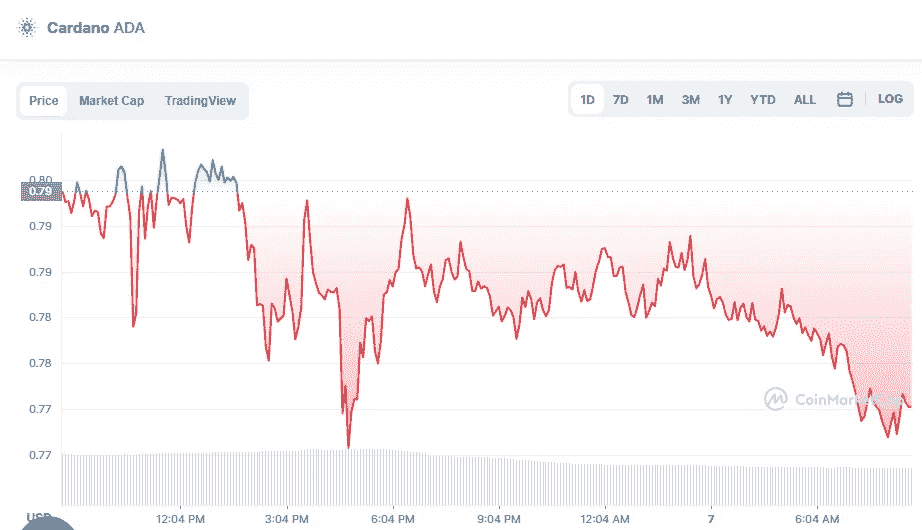

# 5 月 7 日卡尔达诺和索拉纳价格分析

> 原文：<https://medium.com/coinmonks/cardano-and-solana-price-analyse-on-7th-of-may-d37182bb3c8c?source=collection_archive---------29----------------------->

# 卡尔达诺(-2.92%)

Source photo [Cardano price today, ADA to USD live, marketcap and chart | CoinMarketCap](https://coinmarketcap.com/currencies/cardano/)

# 市值 259.5 亿美元

Cardano 目前的价格为 0.7775 美元，24 小时交易量为 1.22 亿美元。

在过去的 24 小时里，卡尔达诺的使用率下降了 2.92%。