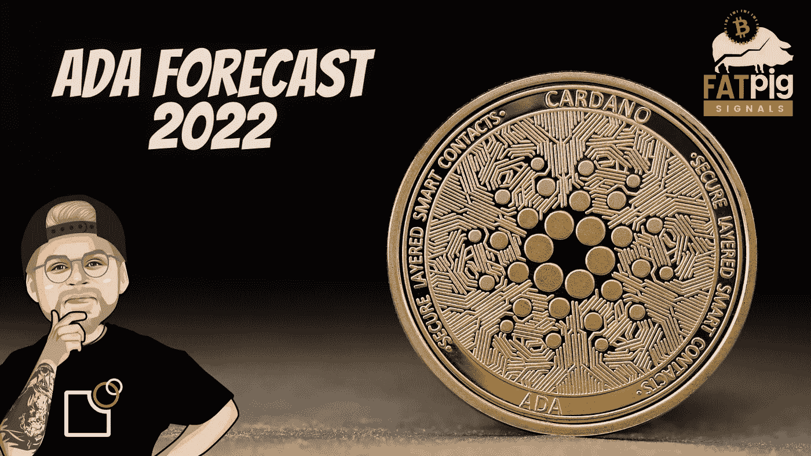

# Cardano Basho，Sundaeswap 更新和看涨预测？

> 原文：<https://medium.com/coinmonks/cardano-basho-sundaeswap-update-and-a-bullish-forecast-4125f1fbc5c3?source=collection_archive---------1----------------------->

这个问题的答案很简单。因为在卡尔达诺价格下跌近一年后，**胖子发出信号，我敢说，本土阿达币的价格已经找到了底部。没错。你没看错。2021 年的 ADA 冬天现在大概已经结束了。**

**是什么让我如此看好卡尔达诺的价格，以及我对卡尔达诺的短期预测…**