# 卡尔达诺区块链:大毒蛇协议

> 原文：<https://medium.com/coinmonks/cardano-blockchain-the-ouroboros-protocol-5e3edf229add?source=collection_archive---------10----------------------->

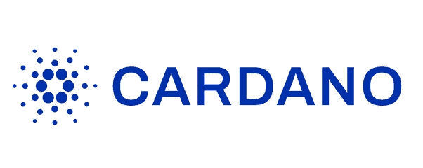

The Cardano Blockchain

比特币和以太坊正在重塑金融领域。由于某些原因，与其他区块链相比，这些二人组效率较低。能源消耗大、交易速度慢、交易费用高、去中心化问题是导致其效率低下的原因。尽管开始了区块链世界，但它们在可扩展性、透明度和可持续性方面落后。卡尔达诺区块链是一个拥有比这两个加密巨头更好模型的系统。

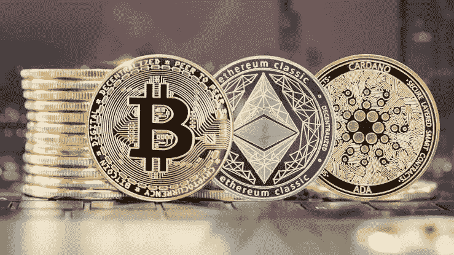

Cardano is 3rd Generation Blockchain Birthed From Bitcoin and Ethereum.

Cardano Blockchain 是一个可持续的开源加密货币平台，由其内部令牌 ADA 提供支持。它是作为第三代区块链平台构建的，包括两层系统。其 Ouroboros 协议是学者研究人员首次测试的安全的利害关系证明区块链。其他区块链声称随机化他们的块验证器选择，但没有随机化的证据。然而，卡尔达诺的大毒蛇有其随机化的数学证明。卡达诺区块链是一块稀有的宝石，还在打磨中。

**卡达诺区块链简史**

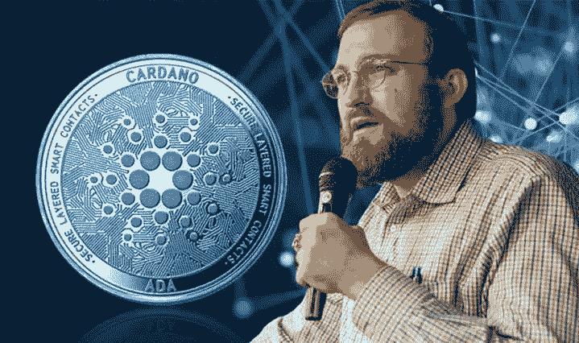

Charles Hoskinson Cardano's Founder.

以太坊的联合创始人 *Charles Hoskinson* 在 2015 年描述了一个股权证明平台。在与以太坊创始人之一维塔利克·布特林发生争执后，他离开了以太坊。这一论点是基于这样一个事实，即查尔斯希望将风险投资引入区块链，并为以太坊的开发过程创建一个盈利实体。后者拒绝了，并希望该平台继续作为一个非营利组织。查尔斯的想法站不住脚，因为社区已经接受了维塔利克的意识形态。离开以太坊后，他联合创立了 IOHK、Cardano Foundation 和 EMURGO 来开发 Cardano 区块链。

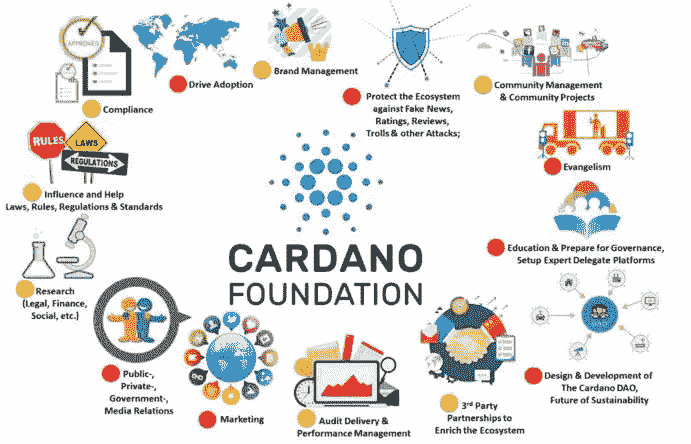

Cardano is a more perfect model than the two Crypto Giant.

虽然卡达诺区块链没有白皮书。相反，它利用了旨在克服其他加密货币所面临的问题的设计原则，如可扩展性、互操作性和法规遵从性。它是通过 2015 年首次发行硬币成立的，并于 2017 年与其原生令牌 ADA 一起推出。在智能合约和去中心化方面，它有类似以太坊的应用。卡尔达诺区块链是以意大利数学家吉罗拉莫·卡尔达诺的名字命名的。

即使今天在加密市场上有很多 POS 区块链，Cardano 是不同的，因为它试图成为第一个科学同行评审的区块链。它的特点以及它们与其他的区别是值得讨论的。

**大毒蛇协议**

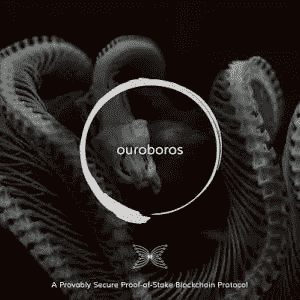

Ouroboros, The protocol That Powers Cardano Blockchain.

Ouroboros 是一个风险证明的加密货币平台，它可以运行许可和许可区块链。霍金森将比特币每年 6 万亿瓦时的能耗与剑桥大学(University of Cambridge)估计的 110.53 万亿瓦时的能耗进行了比较，称之为节能。Ouroboros 是一种使用利害关系证明协议来挖掘块的算法，从而消除了对哈希能力和大量计算资源的需要。

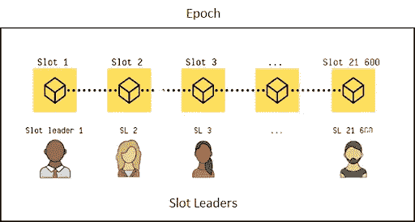

A Schematic Representation of Epochs, Slots and Slot leaders.

该协议将时间分为纪元(5 天)和时间段(1 秒。).插槽类似于工厂中的轮班。时代也与此相对相似。槽领导是在整个槽中创建块和验证事务的节点。他们是通过抽签系统选出的，你的 ADA 越高，你被选中的机会就越大。

下注是指 ADA 持有者将其代币添加到下注池中，以获得作为老虎机领先者的奖励。由于采矿是一项 24/7 的工作，赌注池充当节点，并按其所押 ADA 的比例在他们的股份中分享回报。

**双层系统**

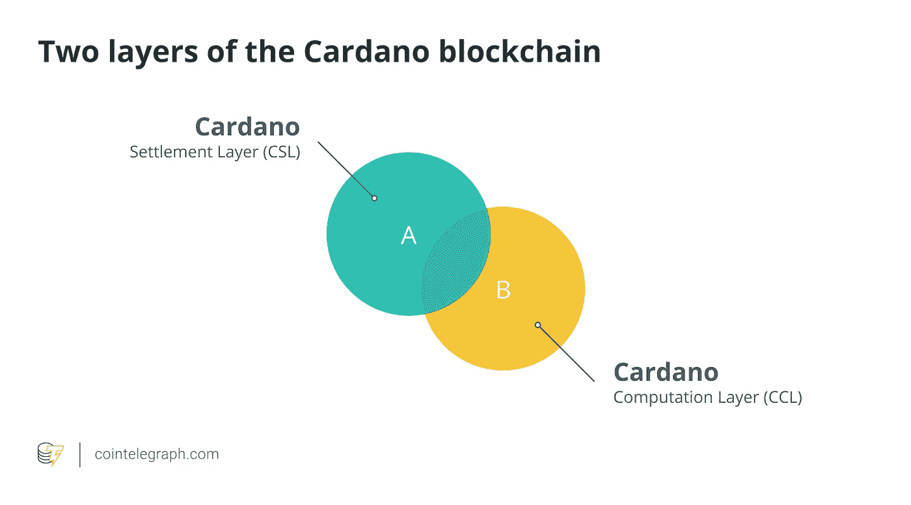

Cardano Blockchain Is Characterized with A Two layer Blockchain System.

Cardano 是作为一个将交易价值与其计算数据分离的系统而创建的。因此，Cardano 区块链包括两层。

卡尔达诺结算层(CSL)是一个类似于比特币的层，并跟踪交易。它的任务是将价值从发送者转移到接收者。

Cardano 计算层(CCL)是一个在智能合同执行和创建方面与以太坊共享特征的层。它负责实现支持智能合约和应用的代码，并管理网络。

**三家合作机构**

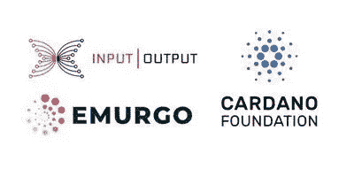

The Three Partnering Bodies Of The Cardano Blockchain.

卡尔达诺有一个特殊的目标和模式，它的社区希望达到。三个机构管理和努力实现这些功能。这些机构是:

1.  **IOHK:** 这是一家区块链工程和技术公司，其任务是建设 Cardano。它非常热衷于研究，并与许多学术研究机构合作。这不仅是为了改善其教育部门，也是为了改善 Cardano 协议的长期可扩展性，通过使用最新的同行评审科学研究，在实施之前通知平台更新。
2.  **EMURGO:** 这是一家全球技术合作伙伴，负责推动 Cardano 协议的商业应用，并将各行各业的业务整合到他们的区块链系统中。
3.  **卡尔达诺基金会:**该机构负责推进区块链在全球经济中的可见性，创建用例，并与政策制定者、监管者和学术界互动。

**卡尔达诺时代**

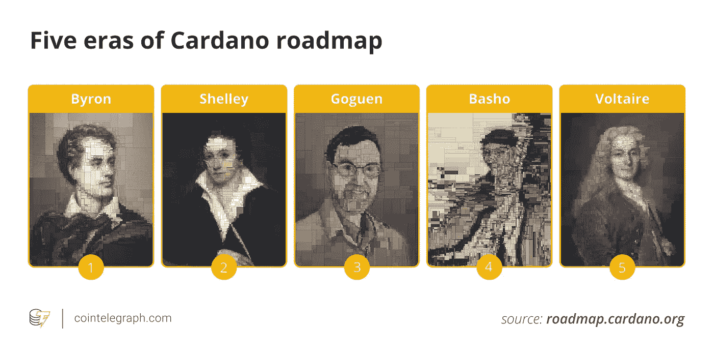

Cardano's Roadmap As Divided Into Eras.

卡尔达诺的发展分为称为时代的阶段。这有助于社区专注于实现那个时代的主要目标。它们共有五个，以著名数学家的名字命名。

1.  **br on Era**——这个阶段涉及区块链架构基础和功能测试。这是区块链基础设施如钱包和 ADA 令牌的发展阶段。
2.  **雪莱时代**——这个阶段是 Cardano Mainnet 推出的地方，区块链网络是去中心化的。这个阶段实现了挖掘、标桩和节点去中心化。
3.  **Goguen 时代**——这一阶段催生了智能合约平台的实现和区块链上去中心化应用的构建。这个时代将引入普路托斯智能合同语言和平台、马洛特定领域语言，并支持多货币分类帐，从而能够创建本地支持的可替换和不可替换令牌。
4.  **Basho Era -** 这个阶段是区块链的规模化、优化、性能提升。
5.  **伏尔泰时代-** 这个阶段是生态系统为其行为投票，区块链由其用户管理的阶段。还有一个未来支出的金库。

**ADA 令牌**

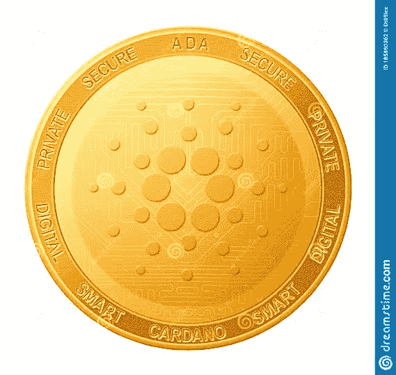

ADA, The Native Token Of The Cardano Blockchain.

ADA 是 Cardano 区块链的原生令牌，它用于价值转移、投票、赌注和交易费用。它是以 19 世纪数学家阿达·洛芙莱斯的名字命名的，他被认为是第一个计算机程序员。ADA 的子单元是 Lovelace，1 个 ADA = 1，000，000 个 Lovelace。它上市时市值为 6 亿美元，最大供应量为 450 亿 ADA。2021 年 5 月，该公司市值创下 770 亿美元的历史新高。它的平均费用为 0.1 ADA，每秒处理 250+事务(TPS)。

**卡达诺区块链的好处**

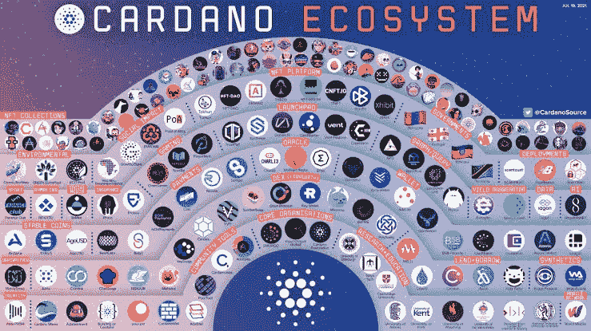

Cardano Has Created For Its Self An Ecosystem That Has Wide Range Of Application In Our Everyday life.

这些年来，Cardano 区块链取得了很多成就，但它继续将自己与教育和研究联系在一起，以改善其模型。

它的一些用例见于它分别于 2019 年和 2021 年与格鲁吉亚和埃塞俄比亚教育部的整合。新百伦鞋业还整合了 Cardano 的技术来认证其产品。所有这些导致其在 2021 年创下每 ADA 2 美元的历史新高。它在加密领域的一些突出特点是:

*快速交易流程* - Cardano 的标准在可扩展性方面很高。它比大多数大型区块链都要快。目前，它执行 250+ TPS。

*高度去中心化* - Cardano 的去中心化使 ADA 持有者能够验证交易并审查分类账中的新块。由于 Ouroboros 协议的健壮性，它允许普通用户成为节点。

*环境友好型采矿* -通过使用 Ouroboros 协议利害关系证明采矿算法，消耗的能源与其他区块链相比微不足道。可以归为碳中性的区块链。

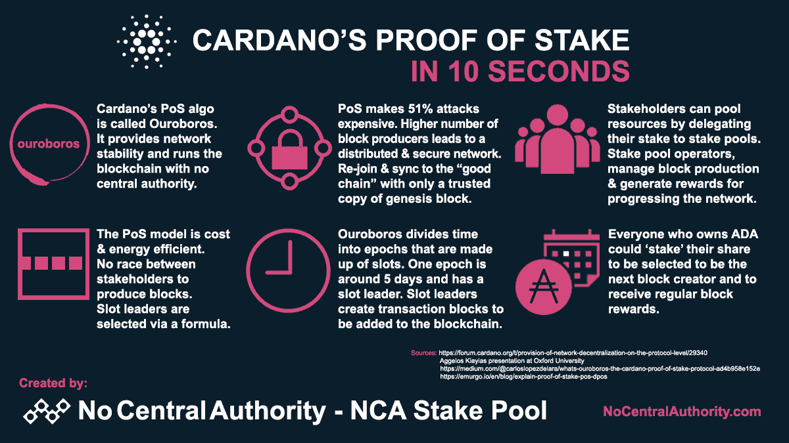

A Short Sneak Peak On How Cardano's Proof-Of-Stake Protocols Works.

*更便宜的汽油费*——相比比特币和以太坊，卡达诺的汽油费更便宜。平均汽油费是 0.1 阿达，不到 1 美分。

*被动收入*——把你的 ADA 赌在泳池里会给你一些被动收入。你需要一个像 Yoroi 一样的钱包来购买和锁定池中的令牌。

**卡达诺区块链的约束**

卡尔达诺，即使有这么大的潜力，仍然有重大的限制。从技术上讲，这是一项正在进行的工作。这往往会影响其与其他完整型号的竞争。在试图评估顶级 Cryptos 和 Cardano 的市值时，投资者和开发商往往更喜欢其他公司，因为它们的价格成就，即使 Cardano 是一个更完美的模型。一般来说，卡尔达诺问题是他们的不发达、财政和公众情绪所固有的。我们期望通过其路线图的旅程将结束这些问题。

结论

From What We Have Discussed, How Wide Do Think Cardano's Future Is?

我们讨论过的 Cardano 区块链是动态的。模型开发完成后，将有审查和采用的空间。它在财务、建模、参与和治理方面还没有发挥出全部潜力。这个区块链将与生活的各个领域相融合。目前它参与了 GameFi，元宇宙和 DeFi。凭借其尖端技术，金融可能性将有利于社区、投资者和整个世界。

在这种情况下，我们向您展示 Cardano 区块链。大毒蛇协议挖掘平台。一个财富无限的地方。

马文·桑迪

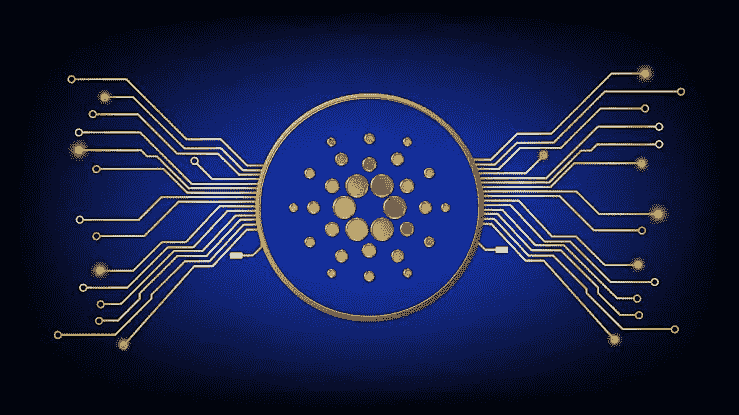

We Present To The Cardano Blockchain!!!

有关 Cardano 区块链的更多详细信息，您可以查看以下链接👇

看看他们的网站👉https://www.cardano.org/

在推特上看看吧👉https://www.twitter.com/Cardano/

注意:这不是一条财务建议，因为 Crypto Infoscope 团队不会对错误投资的任何损失负责。投资前要小心谨慎，做彻底的研究。

谢谢你

我们是加密信息示波器。我们在区块链上闪耀更多的光芒。

> 加入 Coinmonks [电报频道](https://t.me/coincodecap)和 [Youtube 频道](https://www.youtube.com/c/coinmonks/videos)了解加密交易和投资

# 另外，阅读

*   [加密交易机器人](/coinmonks/crypto-trading-bot-c2ffce8acb2a) | [Probit 审查](https://coincodecap.com/probit-review)
*   [隐翅虫替代品](/coinmonks/cryptohopper-alternatives-d67287b16d27) | [HitBTC 审查](/coinmonks/hitbtc-review-c5143c5d53c2)
*   [CBET 点评](https://coincodecap.com/cbet-casino-review) | [库币 vs 比特币基地](https://coincodecap.com/kucoin-vs-coinbase)
*   [折叠 App 回顾](https://coincodecap.com/fold-app-review) | [Kucoin 交易机器人](/coinmonks/kucoin-trading-bot-automate-your-trades-8cf0ca2138e0)
*   [如何匿名购买比特币](https://coincodecap.com/buy-bitcoin-anonymously) | [比特币现金钱包](https://coincodecap.com/bitcoin-cash-wallets)
*   [币安 vs FTX](https://coincodecap.com/binance-vs-ftx) | [最佳(SOL)索拉纳钱包](https://coincodecap.com/solana-wallets)