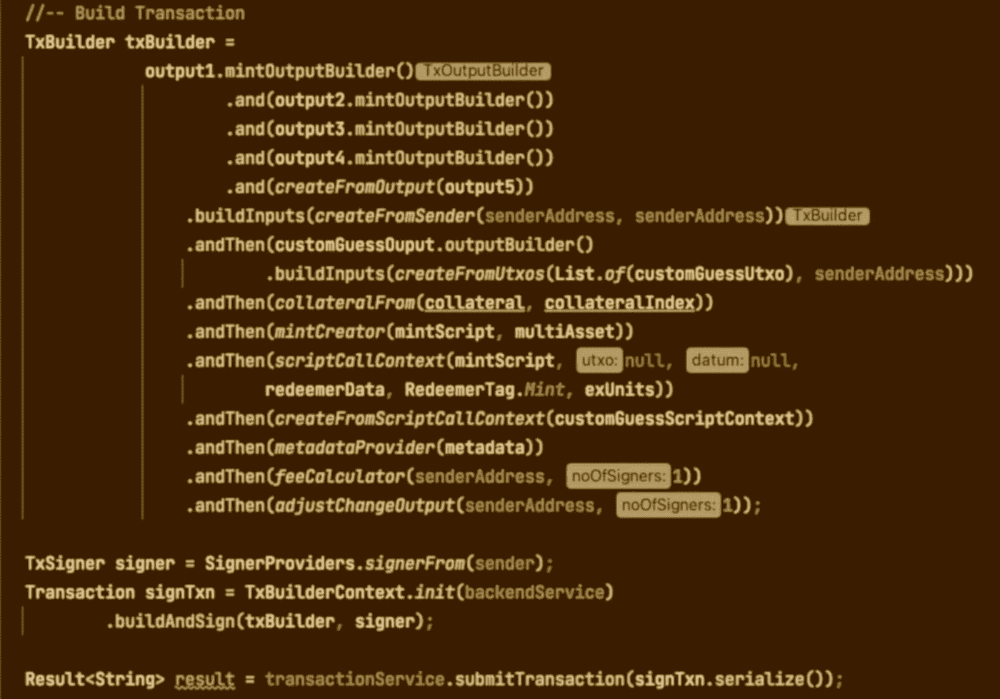

# Cardano-client-lib:用 Java 构建事务的新的可组合函数——第一部分

> 原文：<https://medium.com/coinmonks/cardano-client-lib-new-composable-functions-to-build-transaction-in-java-part-i-be3a8b4da835?source=collection_archive---------11----------------------->



[**Cardano-client-lib**](https://github.com/bloxbean/cardano-client-lib)是针对 [**Cardano**](https://cardano.org/) 区块链的 Java 客户端库。它简化了从 Java 应用程序与卡尔达诺区块链的交互。使用这个库，您可以在 Java 应用程序中执行各种类型的事务。

例如，您可以从一个地址转移到另一个地址，铸造令牌或 NFT，并调用 Java 中的普路托斯智能合约。

在这篇文章中，我将解释新引入的可组合函数 API 的概念。

> 在本系列接下来的几篇文章中，我将介绍一些具体的例子，从常规转移到令牌铸造，再到使用可组合函数 API 的 plutus 契约调用。

如果您不熟悉 **cardano-client-lib** ，它目前支持三种类型的 API 来构建/执行各种事务。

1.  **高级 API :** 提供简单的接口进行转账和代币交易。但是一些复杂的事务可能无法通过高级 API 完成。
2.  **低级 API :** 这些是低级序列化 API，用于为 Cardano network 构建事务。这些 API 非常灵活，适合复杂的场景。基本上，你可以用低级 api 实现任何复杂性，但同时这些 API 对初学者并不友好。
3.  **可组合功能:**这些 API 是在 v0.2.0-beta2 中引入的，它们在简单接口和灵活性之间提供了平衡。使用**现成的**可组合函数，您可以实现任何复杂性，同时，您可以编写自己的可组合函数来定制事务构建期间的行为。

所以在这篇文章中，我将重点介绍库中可组合函数的一般概念。

# **可组合功能**

该库的当前版本提供了一组 *FunctionalInterface* ，可用于实现可组合的功能。这些函数可用于构建各种不同类型的事务。该库提供了这些函数的许多有用的现成实现。

以下是主要的*功能界面*

1.  **TxBuilder**
2.  **TxOutputBuilder**
3.  **TxInputBuilder**
4.  **TxSigner**

**TxBuilder :** 此功能接口帮助转换交易对象。该接口中的 build 方法将一个 *TxBuilderContext* 和一个*事务*对象作为输入参数。该函数的作用是用附加属性转换输入事务对象或更新现有属性。

**TxOutputBuilder :** 这个函数接口帮助构建一个 *TransactionOutput* 对象，并将其添加到事务输出列表中。该接口中的 *accept* 方法接受一个 *TxBuilderContext* 和一个 *TransactionOutput* 列表。

**TxInputBuilder :** 这个功能接口负责从预期的输出构建输入。

**TxSigner :** 该接口负责提供交易签名功能。

# TxBuilderContext

每个函数都将 *TxBuilderContext* 作为第一个输入参数。 *TxBuilderContext* 的主要职责是在事务构建过程中向函数提供 *UtxoSupplier* 、 *ProtocolParamsSupplier、*UtxoSelectionStrategy 等上下文数据以及一些临时数据。

# **函数助手**

该库通过帮助构建事务的助手类提供了许多现成的功能。所以你不需要从零开始，同时如果需要的话你可以写你自己的函数。

在该库的当前版本中，可以使用以下助手类

1.  **OutputBuilders :** 提供了创建 *TxOutputBuilder* 函数的助手方法列表，该函数用于从 *TransactionOutput* 或 *Output* 对象创建 *TransactionOutput* 。 *TxOutputBuilder* 函数验证最小 ada 要求，并相应地更新*事务输出*中的 ada 数量。

该类中可用的一些帮助器方法有

```
*-* TxOutputBuilder createFromOutput(Output output) - TxOutputBuilder createFromOutput(TransactionOutput txnOutput) - TxOutputBuilder createFromMintOutput(Output output) - TxOutputBuilder createFromMintOutput(TransactionOutput txnOutput)
```

您可以使用“ ***和*** ”方法组合多个 *TxOutputBuilder* 。

```
TxOutputBuilder txOutputBuilder = **createFromOutput(output1)
                                     .and(createFromOutput(output2))**
```

> **注意:**对于 token minting 交易，为了准确计算输出中所需的最小 ada，mint outputs 或 createFromMintOutput()方法应该在所有常规输出或 createFromOutput()方法之后调用。

2. **InputBuilders :** 提供助手方法来创建 *TxInputBuilder* 函数，该函数用于使用 *TxOutputBuilder* 的 *buildInputs* ()方法从 *TransactionOutput* 列表中构建所需的 *TransactionInput* 。

```
TxBuilder txBuilder = txOutputBuilder1
                       .and(txOutputBuilder2)
                       **.buildInputs(createFromSender(senderAddress, changeAddress))**
```

该类中可用的一些帮助器方法有

```
- TxInputBuilder createFromSender(String sender, String changeAddress) - TxInputBuilder createFromUtxos(List<Utxo> utxos) - TxInputBuilder createFromUtxos(Supplier<List<Utxo>> supplier) - TxInputBuilder createFromUtxos(List<Utxo> utxos, String changeAddress) - TxInputBuilder createFromUtxos(List<Utxo> utxos, String changeAddress, Object datum) - TxInputBuilder createFromUtxos(List<Utxo> utxos, String changeAddress, String datumHash)
```

3. **MintCreators :** 它提供了帮助方法来创建一个 *TxBuilder* 函数，该函数用于将多资产铸造相关数据添加到*事务*对象中。

```
TxBuilder txBuilder = txOuputBuilder1
                        .and(txOuputBuilder2)
                        .and(createFromMintOutput(mintOutput))
                      .buildInputs(txInputBuilder)
                     ** .andThen(mintCreator(script, multiAsset)**
```

> **注意:**对于 mint 交易，需要一个特定于 mint 输出的 TxOutputBuilder。这可以通过调用 output builders . createfrommintoutput 方法之一来完成。

该类中可用的一些帮助器方法有

```
- TxBuilder mintCreator(Script script, MultiAsset multiAsset) - TxBuilder mintCreator(Script script, MultiAsset multiAsset, boolean inclScriptInAuxData) 
```

4. **AuxDataProviders :** 提供帮助方法来创建一个 *TxBuilder* 函数，该函数用于向*事务*对象添加元数据。

```
TxBuilder txBuilder = txOuputBuilder1
                        .and(txOuputBuilder2)
                      .buildInputs(txInputBuilder) **.andThen(*metadataProvider*(metadata))**
```

5. **CollateralBuilders :** 提供助手方法来创建一个 *TxBuilder* 函数，该函数用于将抵押品添加到 plutus 脚本事务中的*事务*对象。

```
TxBuilder txBuilder = txOuputBuilder1
                        .and(txOuputBuilder2)
                      .buildInputs(txInputBuilder)
                      **.andThen(*collateralFrom*(txHash, txIndex))**
```

该类中可用的一些帮助器方法有

```
- TxBuilder collateralFrom(String txHash, int txIndex) - TxBuilder collateralFrom(List<Utxo> utxos) - TxBuilder collateralFrom(Supplier<List<Utxo>> supplier)
```

6.**ScriptCallConextProviders:**提供帮助器方法来创建 *TxBuilder* 函数，该函数用于将 plutus 脚本特定数据添加到*事务*对象中。

```
TxBuilder txBuilder = txOuputBuilder1
              .and(txOuputBuilder2)
           .buildInputs(txInputBuilder)
           .andThen(collateralFrom(txHash, txIndex))
           **.andThen(createFromScriptCallContext(scriptCallContext))**
```

该类中可用的一些帮助器方法有

```
- TxBuilder createFromScriptCallContext(ScriptCallContext sc) - TxBuilder scriptCallContext(PlutusScript plutusScript, Utxo utxo,              T datum, K redeemerData,RedeemerTag tag, ExUnits exUnits) - TxBuilder scriptCallContext(PlutusScript plutusScript, int scriptInputIndex, T datum, K redeemerData, RedeemerTag tag, ExUnits exUnits)
```

7. **FeeCalculators :** 提供帮助器方法来创建 *TxBuilder* 函数，以计算费用并相应地更新*事务*对象。

```
TxBuilder txBuilder = txOuputBuilder1
                        .and(txOuputBuilder2)
                      .buildInputs(txInputBuilder)
                      .andThen(otherTxBuilder)
                      ...
                      **.andThen(feeCalculator(changeAddress, noOfSigners))**
```

> **注:**准确计算费用需要签名人数。例如，对于带有策略脚本的铸币交易，最小签名者数量是 2。(铸造帐户，策略脚本密钥)

在这个助手类中创建 *TxBuilder* 函数的助手方法有

```
- TxBuilder feeCalculator(String changeAddress, int noOfSigners) - TxBuilder feeCalculator(int noOfSigners, UpdateOutputFunction updateOutputWithFeeFunc)
```

8.**ChangeOutputAdjustments:**提供帮助器方法来创建 *TxBuilder* 函数，该函数可以调整变更输出。此功能用于验证变更输出中的 ada 量是否满足最小 ada 要求。如果没有，它会尝试获取额外的输入，并在费用计算后调整变化输出。该功能在*费用计算*功能之后使用。

```
TxBuilder txBuilder = txOuputBuilder1
             .and(txOuputBuilder2)
             .buildInputs(txInputBuilder)
             .andThen(otherTxBuilder)
             ...
             .andThen(feeCalculator(changeAddress, noOfSigners))
             **.andThen(*adjustChangeOutput*(senderAddress, changeAddress, noOfSigners))**
```

9. **SignerProviders :** 提供帮助器方法来创建 *TxSigner* 函数来签署事务。

```
TxSigner signer = *signerFrom*(sender1, sender2, ..., sendern)
                   .andThen(signerFrom(secretKey1, ..., secretKeyn))
```

该类中可用的一些帮助器方法有

```
- TxSigner signerFrom(Account... signers)- TxSigner signerFrom(SecretKey... secretKeys)- TxSigner signerFrom(Policy... policies)
```

10.**MinAdaChecker:**提供了一个 helper 方法来返回 *MinAdaChecker* 函数。 *MinAdaChecker* 函数返回 *TransactionOutput* 满足最小 ada 要求所需的额外 lovelace 金额。该函数由其他函数的实现在内部使用。您可能不需要直接使用该功能。

# **建立并签署交易**

在通过组合不同的函数创建了 *TxBuilder* 之后，可以构建一个*事务*对象并对其进行签名。

```
TxBuilder txBuilder = *createFromOutput*(output)
        .buildInputs(*createFromSender*(senderAddress, senderAddress))
        .andThen(*metadataProvider*(metadata))
        .andThen(*feeCalculator*(senderAddress, 1))
        .andThen(*adjustChangeOutput*(senderAddress, 1));TxSigner signer = SignerProviders.signerFrom(sender);**/*** Create instance of UtxoSupplier & ProtocolParamsSupplier ***/** UtxoSupplier utxoSupplier = new         DefaultUtxoSupplier(backendService.getUtxoService());ProtocolParamsSupplier protocolParamsSupplier = new DefaultProtocolParamsSupplier(backendService.getEpochService());**/**** Build and Sign in one step ****/**
Transaction signedTxn = 
     TxBuilderContext.*init*(utxoSupplier, protocolParamsSupplier)
           .buildAndSign(txBuilder, signer);**/**** OR, Build Txn and then sign using signer *****/**
Transaction transaction = 
      TxBuilderContext.*init*(utxoSupplier, protocolParamsSupplier)
           .build(txBuilder);

Transaction signedTxn = signer.sign(transaction);
```

# **向卡达诺网络提交交易**

一旦交易被签署，您就可以使用 *TransactionService* 将它提交给网络。

```
Result<String> result =           transactionService.submitTransaction(signedTxn.serialize());
```

# **添加您自己的 TxBuilder 实现**

在某些场景下，需要提供自己的 *TxBuilder* 等函数来转换事务对象。

**举例:**
目前没有 *TxBuilder* 函数在交易对象中设置 ***ttl*** 参数。但是您可以轻松地提供自己的实现来设置 ttl 或添加/更新其他参数。

```
TxBuilder txBuilder = txOuputBuilder1
             .and(txOuputBuilder2)
             .buildInputs(txInputBuilder)
             .andThen(otherTxBuilder)
             **.andThen((context, transaction) -> {
                   transaction.getBody().setTtl(100000);** **//set or update other transaction parameters
             })**
             .andThen(feeCalculator(changeAddress, noOfSigners))
```

因此，在**摘要**中，要使用可组合函数 API，请按照以下步骤构建一个事务

1.  定义预期输出
2.  从输出创建一个或多个 *TxOutputBuilder*
3.  创建一个为发送者选择输入的 *TxInputBuilder*
4.  对于多个发送者，可以重复步骤 1 至步骤 3
5.  创建额外的*tx builder*以添加/更新交易中的不同属性。
6.  创建 *TxSigner*
7.  调用*txbuildercontext . init()*初始化上下文，然后调用 *buildAndSign()* 构建并签署事务。

> 在本系列接下来的几篇文章中，我将通过一些具体的例子来介绍使用可组合函数 API 从常规转移到令牌铸造再到普路托斯契约调用。

**同时**，你可以在这个 [GitHub repo](https://github.com/bloxbean/cardano-client-examples/tree/main/src/test/java/com/bloxbean/cardano/client/example/function) 中找到使用可组合函数的不同例子

# 资源

1.  [Cardano 客户端库项目 GitHub](https://github.com/bloxbean/cardano-client-lib)
2.  [Cardano 客户端示例 GitHub](https://github.com/bloxbean/cardano-client-examples)

> *加入 Coinmonks* [*电报频道*](https://t.me/coincodecap) *和* [*Youtube 频道*](https://www.youtube.com/c/coinmonks/videos) *了解加密交易和投资*

# 另外，阅读

*   [Bookmap 点评](https://coincodecap.com/bookmap-review-2021-best-trading-software) | [美国 5 大最佳加密交易所](https://coincodecap.com/crypto-exchange-usa)
*   最佳加密[硬件钱包](/coinmonks/hardware-wallets-dfa1211730c6) | [Bitbns 评论](/coinmonks/bitbns-review-38256a07e161)
*   [新加坡十大最佳加密交易所](https://coincodecap.com/crypto-exchange-in-singapore) | [购买 AXS](https://coincodecap.com/buy-axs-token)
*   [红狗赌场评论](https://coincodecap.com/red-dog-casino-review) | [Swyftx 评论](https://coincodecap.com/swyftx-review) | [CoinGate 评论](https://coincodecap.com/coingate-review)
*   [投资印度的最佳密码](https://coincodecap.com/best-crypto-to-invest-in-india-in-2021)|[WazirX P2P](https://coincodecap.com/wazirx-p2p)|[Hi Dollar Review](https://coincodecap.com/hi-dollar-review)
*   [加拿大最佳加密交易机器人](https://coincodecap.com/5-best-crypto-trading-bots-in-canada) | [库币评论](https://coincodecap.com/kucoin-review)
*   [用于 Huobi 的加密交易信号](https://coincodecap.com/huobi-crypto-trading-signals) | [HitBTC 审查](/coinmonks/hitbtc-review-c5143c5d53c2)
*   [如何在 FTX 交易所交易期货](https://coincodecap.com/ftx-futures-trading) | [OKEx vs 币安](https://coincodecap.com/okex-vs-binance)