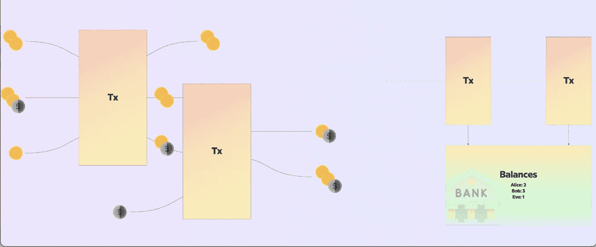

# 卡尔达诺决定论— E-UTxO 分类帐模型

> 原文：<https://medium.com/coinmonks/cardano-determinism-e-utxo-ledger-model-ef183d1e88ce?source=collection_archive---------13----------------------->

确定性是 Cardano 的 E-UTxO 分类账模型的核心特征。这是区别和超越[以太坊](https://twitter.com/hashtag/Ethereum?src=hashtag_click)基于账户的分类账模型的不确定性的特征之一。

**让我们深入探讨一下“决定论”的概念:**

那么什么是“决定论”呢？在事务和脚本处理的上下文中，确定性是使用户能够在事务的实际链上执行之前，在本地(链外)预测事务的影响和结果的能力。

这是基于 E-UTXO 的区块链的核心特性，就像 Cardano 一样。那么，为什么基于 E-UTxO 的区块链是确定性的呢？什么特征允许交易结果的链外可预测性？

正如我们所知，E-UTxO 和基于帐户的分类帐模型之间的主要区别在于状态的不同。在基于 E-UTxO 的模型中，状态是“本地”，而在基于帐户的模型中，状态是“全局”。

当用户在基于 E-UTxO 的区块链上创建和提交交易时，由于州的本地化性质，他们明确声明了在交易被接受后他们的分类帐部分应该是什么样子。

这使得交易结果的链外可预测性成为可能。

这可以防止 E-UTxO 出现以下情况:

*1。意外的脚本验证结果或失败；
2。意外费用；
3。意外的分类帐或脚本状态更新。*

**让我们来理解当一个链是不确定的时候会发生什么！**

像以太坊一样，基于账户的区块链是不确定的，这意味着以太坊/EVM 不能保证交易对链上影响的可预测性。

以太坊/EVM 无法做到这一点，因为在您构建交易和提交交易之间，区块链的状态可能会发生变化。在这种情况下，需要信任智能合约来做符合提交交易的人的最佳利益的事情。

这意味着当开发人员编写智能合约时，他/她需要考虑在事务执行期间可能发生状态变化的所有可能场景。

这几乎是不可能做到的，大量的开发工作、bug 的来源和黑客攻击的表面区域都来自这个特殊的缺陷，所以下次当你的交易在以太坊/EVM 链上失败时，想想总账的不确定性。

TL；DR —与 E-UTxO 相反，基于账户的区块链，如以太坊或基于 EVM 的连锁店是不确定的。这可能会带来金钱损失、不可预测的高额费用以及敌对行为的额外机会。

下面是一篇研究论文，解决以太坊智能合约造成财务损失的非确定性支付 bug:
[https://www . research gate . net/publication/336453428 _ Detecting _ non deterministic _ Payment _ Bugs _ in _ ether eum _ Smart _ Contracts](https://www.researchgate.net/publication/336453428_Detecting_nondeterministic_payment_bugs_in_Ethereum_smart_contracts)

原创线程 by[Sooraj](https://twitter.com/Soorajksaju2):
[https://Twitter . com/soorajksaju 2/status/1513985911549214725？s=20](https://twitter.com/Soorajksaju2/status/1513985911549214725?s=20)

> *加入 Coinmonks* [*电报频道*](https://t.me/coincodecap) *和* [*Youtube 频道*](https://www.youtube.com/c/coinmonks/videos) *了解加密交易和投资*

# 另外，阅读

*   [有哪些交易信号？](https://coincodecap.com/trading-signal) | [Bitstamp vs 比特币基地](https://coincodecap.com/bitstamp-coinbase) | [买索拉纳](https://coincodecap.com/buy-solana)
*   [ProfitFarmers 回顾](https://coincodecap.com/profitfarmers-review) | [如何使用 Cornix Trading Bot](https://coincodecap.com/cornix-trading-bot)
*   [十大最佳加密货币博客](https://coincodecap.com/best-cryptocurrency-blogs) | [YouHodler 评论](https://coincodecap.com/youhodler-review)
*   [my constant Review](https://coincodecap.com/myconstant-review)|[8 款最佳摇摆交易机器人](https://coincodecap.com/best-swing-trading-bots)
*   [MXC 交易所评论](/coinmonks/mxc-exchange-review-3af0ec1cba8c) | [Pionex vs 币安](https://coincodecap.com/pionex-vs-binance) | [Pionex 套利机器人](https://coincodecap.com/pionex-arbitrage-bot)