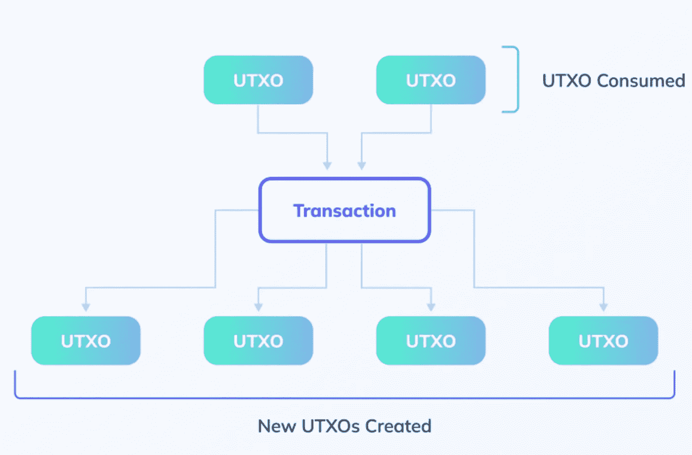
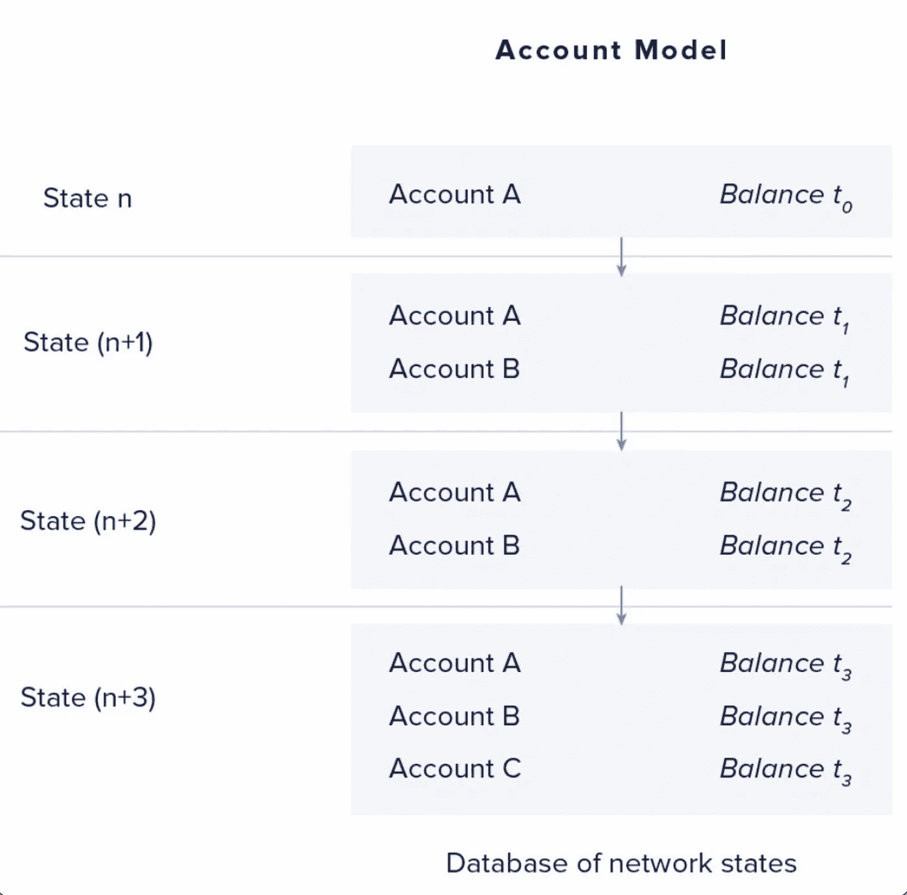

# Cardano E-UTxO 与帐户分类帐模型

> 原文：<https://medium.com/coinmonks/cardano-e-utxo-vs-account-ledger-model-9f2c2a078e4?source=collection_archive---------4----------------------->

以太坊基于账户的分类账模式目前正在主导 DeFi 领域。但是 T2 的卡达诺 T3 的死亡率正在上升。

以下是 Cardano 的 E-UTxO 分类帐架构优于以太坊基于帐户的模型的原因。

**有哪些不同的总账模型？**

*比特币的 UTxO* (未用交易输出)分类账模型 Satoshi 发明了这种无许可的分散式互联网货币。比特币引入了 UTxO 分类账模型，以最优雅的方式实现了这一目的。

在 UTXO 分类帐模型中，单个交易由一系列“输入”和“输出”组成。事务的输入所消耗的值的总和必须等于其输出所提供的值的总和。

UTxO 模型的主要优点是语义模型，或者分类帐中结构化数据的方法，在复杂的分布式动态计算环境中保持简单。
*这也带有一些限制。*

主要缺点是基于 UTxO 模型的协议的可编程性的表达非常有限。在 UTXO 模型之上，不可能建立一个像以太坊现在这样的 DeFi 生态系统。

在 Vitalik Buterin 和他的团队开发以太坊之前，他参与了一个也被称为彩色硬币的项目。
彩币本来是用来代表比特币上 Dapps 之类的应用，结果因为上述限制而没有成功。*比特币的这一局限性促使 Vitalik 为以太坊选择基于账户的分类账模型。*

**那么以太坊的基于账户的分类账模型是什么？**

基于帐户的交易模型将资产表示为不同帐户中的余额，类似于银行帐户。

在启用智能合约时，帐户模型提供了明显的优势。这种分类帐模型允许更多的可编程性表达方式。这导致了以太坊上 DeFi 的繁荣，正如我们今天所看到的。

不幸的是，这种表现力是有代价的。以太坊基于账户的模型引入了“共享可变状态”的概念。

你曾经为[以太坊](https://twitter.com/hashtag/Ethereum?src=hashtag_click)上的一次失败交易支付过高额交易费吗？这种事经常发生。这是“共享可变状态”的结果。这是基于帐户的模型的主要限制之一。

“共享可变状态”是什么意思？如果两方或多方可以更改相同的数据&如果它们的生命周期重叠，那么就有一方的修改妨碍其他方正常工作的风险。这极大地复杂化了合同代码的语义，并引入了安全问题。换句话说，基于帐户的模型比 UTXO 模型更容易受到攻击。

*这里是 Cardano 的 E-UTxO/Extended-UTxO 模型的意义。*

**那么 Cardano 的 E-UTxO 型号是什么呢？**

E-UTxO 模型的目的是扩展和修改基本的 UTxO 模型，以支持更多的表达能力，而无需切换到基于帐户的模型。这里，UTXO 模型以脚本和任意数据的形式用任意逻辑进行了扩展。

任意的逻辑/脚本允许 E-UTxO 模型具有更强的表现力。该任意数据携带有关于输出状态的信息，该信息使得契约状态能够在状态被本地化时被本地化。

没有“共享可变状态”的概念。

**为什么**[**Cardano**](https://twitter.com/hashtag/Cardano?src=hashtag_click)**的 E-UTxO 模式要优于**[**eth reum**](https://twitter.com/hashtag/Ethreum?src=hashtag_click)**的账户模式？**

1.智能合约验证在链上执行，所有其他逻辑在链外执行；

2.交易验证的“本地”特性允许高度并行；

3.E-UTxO 固有的碎片化特性允许更容易地实现第 2 层扩展解决方案，如同构状态通道(Hydra)和 ZK 卷。

图灵完成的链外代码的链上智能契约验证和链外执行使得能够执行复杂且消耗资源的计算，而对交易成本没有任何影响。

这一特性使得像 [@CardanoMaladex](https://twitter.com/CardanoMaladex) 和 [@GeniusyieldO](https://twitter.com/GeniusyieldO) 这样的 dex 能够实现诸如可编程互换和智能流动性金库的想法。*由于 Cardano E-UTxO 分类账模型，Defi 领域的创新成为可能。*

这将有助于减少众所周知的 AMM 指数问题，如非永久性损失(IL)。

这种代码的链外执行正是以太坊通过将事务推送到 L2/侧链伸缩解决方案所尝试的

TL；Cardano 的 DR-E-UTxO 型号提供:

链外执行复杂逻辑→可扩展性；
·高度并行→可扩展性；
·更轻松地实施第 2 层扩展解决方案→可扩展性。

这使得它优于以太坊的基于帐户的模型。

[Sooraj](https://twitter.com/Soorajksaju2):
https://Twitter . com/soorajksaju 2/status/1512886236066762762？s = 20&t = f 0 vomxmgn 69 phvta 7 ysia

> *加入 Coinmonks* [*电报频道*](https://t.me/coincodecap) *和* [*Youtube 频道*](https://www.youtube.com/c/coinmonks/videos) *了解加密交易和投资*

# 另外，阅读

*   [Bookmap 评论](https://coincodecap.com/bookmap-review-2021-best-trading-software) | [美国 5 大最佳加密交易所](https://coincodecap.com/crypto-exchange-usa)
*   最佳加密[硬件钱包](/coinmonks/hardware-wallets-dfa1211730c6) | [Bitbns 评论](/coinmonks/bitbns-review-38256a07e161)
*   [新加坡十大最佳加密交易所](https://coincodecap.com/crypto-exchange-in-singapore) | [购买 AXS](https://coincodecap.com/buy-axs-token)
*   [红狗赌场评论](https://coincodecap.com/red-dog-casino-review) | [Swyftx 评论](https://coincodecap.com/swyftx-review) | [CoinGate 评论](https://coincodecap.com/coingate-review)
*   [投资印度的最佳密码](https://coincodecap.com/best-crypto-to-invest-in-india-in-2021)|[WazirX P2P](https://coincodecap.com/wazirx-p2p)|[Hi Dollar Review](https://coincodecap.com/hi-dollar-review)