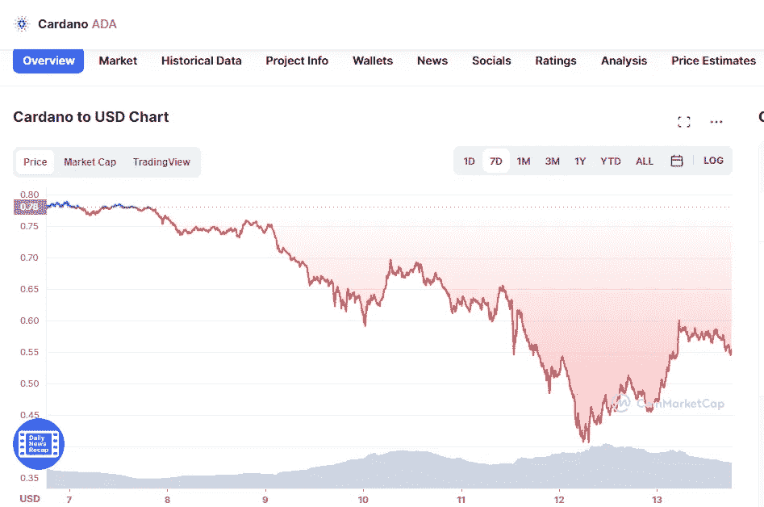

# 卡尔达诺、以太坊和柴犬价格分析

> 原文：<https://medium.com/coinmonks/cardano-ethereu-and-shiba-inu-price-analyse-db139a544a5f?source=collection_archive---------36----------------------->

# 卡尔达诺

Source photo [Cardano price today, ADA to USD live, marketcap and chart | CoinMarketCap](https://coinmarketcap.com/currencies/cardano/)

ADA 在过去的 24 小时内稳步回升，尽管大幅下降。仅低于 0.59 美元(币安)，在昨天找到支持，其价格目前徘徊。在过去的七天里，ADA 的表现不如其他两种加密货币，其价值下跌了 28%。