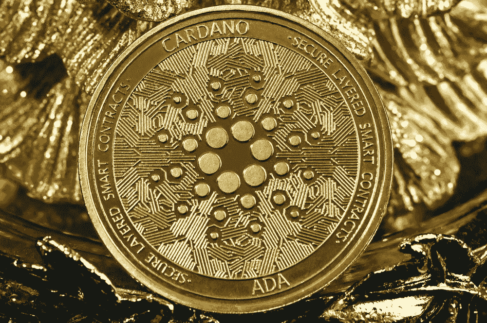
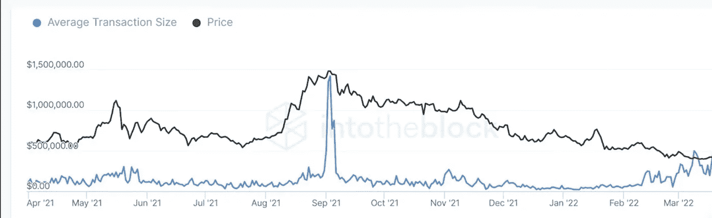

# 卡尔达诺—机构需求导致 2022 年创历史新高

> 原文：<https://medium.com/coinmonks/cardano-institutional-demands-leading-to-new-all-time-highs-in-2022-43b5a679678?source=collection_archive---------18----------------------->

Cardano 是一个分散的、不变的分类帐，在一个一致同意的股权证明网络上运行。随着智能合约的加入，Cardano 正在重新设计金融系统。

据@IntoTheBlock(一个为顶级加密资产*提供实时方向预测的组织)称，Cardano 的链上交易额超过 10 万美元，仅在今年就激增了 50 倍以上！

大于或等于 10 万美元的交易通常不会被典型的散户投资者看到，这让我们相信，要么是鲸鱼，要么是机构投资者开始进入 FOMO。2022 年 4 月 1 日，690 亿卡尔达诺在此类交易中被转移，占当天总交易量的 99%。从环比数据来看，上一次交易量大幅上升时，Cardano 的交易量达到了 3 美元以上的历史最高水平。这种数量和价格的飙升主要是由于阿隆佐硬分叉上智能合约的实施，导致机构投资者涌入。

App.intotheblock.com

最近卡尔达诺运动的大幅上涨很可能是因为为 2022 年夏天发生的巴绍硬分叉和九头蛇升级做准备。Barsho hard fork 和 Hydra 升级将允许许多新功能，包括备受期待的可扩展性升级，允许每秒更大的事务(TPS)。

除了大量投资，Cardano 现在已经锁定了超过 3 亿美元的总交易量(TVL)。这种 TVL 允许价格向下波动较小。历史不会总是重演，但历史确实经常押韵。卡尔达诺可能处于反弹的开始阶段，可能导致突破接近 4 美元甚至更高。卡尔达诺目前的股价较其历史高点有超过 50%的折扣。

随着机构投资者再次涌入购买卡达诺，期待看到卡达诺在今年达到新的价格发现点。

免责声明:本文并非财务建议。请明智投资。

> 加入 Coinmonks [电报频道](https://t.me/coincodecap)和 [Youtube 频道](https://www.youtube.com/c/coinmonks/videos)了解加密交易和投资

# 另外，阅读

*   [隐翅虫替代品](/coinmonks/cryptohopper-alternatives-d67287b16d27) | [HitBTC 审查](/coinmonks/hitbtc-review-c5143c5d53c2)
*   [CBET 评论](https://coincodecap.com/cbet-casino-review) | [库科恩 vs 比特币基地](https://coincodecap.com/kucoin-vs-coinbase)
*   [折叠 App 审核](https://coincodecap.com/fold-app-review) | [Kucoin 交易机器人](/coinmonks/kucoin-trading-bot-automate-your-trades-8cf0ca2138e0) | [Probit 审核](https://coincodecap.com/probit-review)
*   [如何匿名购买比特币](https://coincodecap.com/buy-bitcoin-anonymously) | [比特币现金钱包](https://coincodecap.com/bitcoin-cash-wallets)
*   [币安 vs FTX](https://coincodecap.com/binance-vs-ftx) | [最佳(SOL)索拉纳钱包](https://coincodecap.com/solana-wallets)
*   [比诺莫评论](https://coincodecap.com/binomo-review) | [斯多葛派 vs 3Commas vs TradeSanta](https://coincodecap.com/stoic-vs-3commas-vs-tradesanta)