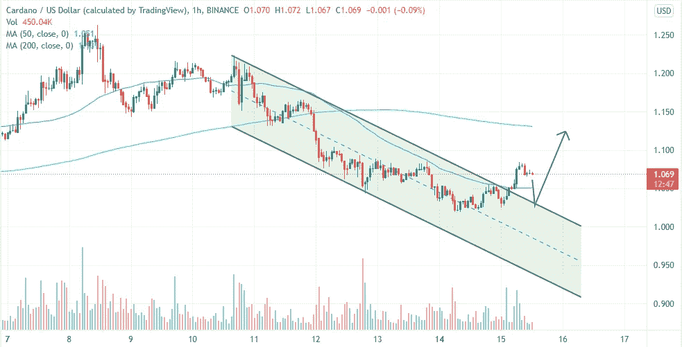

# 卡尔达诺依然岌岌可危，而这正是 ADA 价格可能达到 1.5 美元的时候！

> 原文：<https://medium.com/coinmonks/cardano-is-still-in-jeopardy-and-this-is-when-the-ada-price-may-reach-1-5-170a2b7a4a34?source=collection_archive---------34----------------------->

Source photo TrandingView

著名的以太坊杀手、第七大加密货币 Cardano 有跌出前十的危险。长期以来，这种资产一直在几乎相同的水平上交易，未能走高，排除了大幅反弹的可能性。结果，美国残疾人协会一成不变的行为引起了许多人的关注…