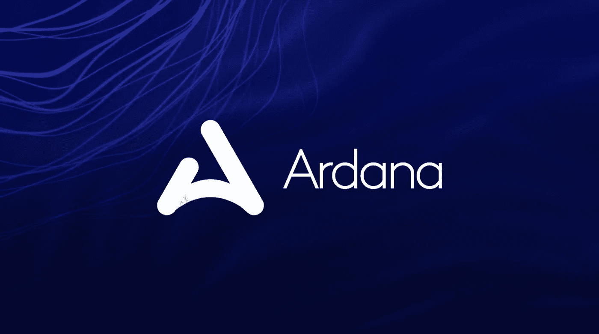

# 卡尔达诺·ISPO-阿尔达纳

> 原文：<https://medium.com/coinmonks/cardano-ispo-ardana-53689086db7b?source=collection_archive---------16----------------------->

Image curtesy of [https://www.asiacryptotoday.com/ardana/?amp](https://www.asiacryptotoday.com/ardana/?amp)

Ardana 是一个分散的稳定硬币中心，通过引入 dUSD(一种与美元挂钩的稳定硬币),增加了卡尔达诺区块链的流动性。除了 dUSD，Ardana 还将推出 Ardana-swap，这是一个分散的交易所，将为 dUSD 和其他稳定的硬币提供流动性。

一个名为 DANA 的治理令牌将允许用户对 Ardana 的未来进行投票。$DANA 还可以获得额外的 Cardano 奖励。

# 赌注池

阿尔达纳的 ISPO 将于 7 月开始。用户现在可以把他们的卡达诺押到一个与阿尔达纳相关的池子里，当 ISPO 发射时，这个池子将被空投$达纳。与 Ardana 相关的 Cardano 池有:

1LOVE、21ADA、A4G、AIR、ADAOZ、ALoop、AMOON、AZUL、AZUR1、BFADA、BREAK、ADI、CRFA、CHAMP、COINZ、DEN、ECO、EU01、FASO、FEEL、真菌、GAIA、GROW、HRMS、IAMX、KAWAN、考拉、LIV、LSS、LOOPS、MALU、MNKY、OZZY、STAKE1、PSYA、QXT、RADAR、RISE、SANTO、SAPIO、SPEC、SPRO、ST4NA、SWAG、PRIDE、TTS17、VITAL、VOLCY、QXT

# **早期用户**

在 2022 年 4 月 1 日之前将他们的 Cardano 下注到相关池中，并在 7 月正式推出之前一直下注的参与者，将获得一笔特殊的“乘数奖金”。

那些迟到的人和迟到加入任何 Ardana 赌注池的人，只要他们在 ISPO 官方发布日期之前加入，仍然有资格获得空投。在 ISPO 发布日之前的每一天，将适用一个减少的乘数红利。请务必在 4 月 1 日之前下注，以获得最大的倍数！

赢得的金额和与参与 ISPO 相关的乘数红利目前都是未知的。更多的细节请登陆 Ardana 的网站:https://ardana.org/

# **TLDR**

在 2022 年 4 月 1 日之前选择一个以上的游泳池并下注，然后在 7 月空投 DANA token。

把你的资产押上，让它们获得被动收入，是最明智的做法之一。让你的卡达诺为你工作是获得财富的一个关键。快乐的赌注！

*免责声明:以上文章并非财务建议。请使用受过教育的决定，做自己的研究。*

> 加入 Coinmonks [电报频道](https://t.me/coincodecap)和 [Youtube 频道](https://www.youtube.com/c/coinmonks/videos)了解加密交易和投资

# 另外，阅读

*   [3 商业评论](/coinmonks/3commas-review-an-excellent-crypto-trading-bot-2020-1313a58bec92) | [Pionex 评论](https://coincodecap.com/pionex-review-exchange-with-crypto-trading-bot) | [Coinrule 评论](/coinmonks/coinrule-review-2021-a-beginner-friendly-crypto-trading-bot-daf0504848ba)
*   [莱杰 vs n rave](/coinmonks/ledger-vs-ngrave-zero-7e40f0c1d694)|[莱杰 nano s vs x](/coinmonks/ledger-nano-s-vs-x-battery-hardware-price-storage-59a6663fe3b0) | [币安评论](/coinmonks/binance-review-ee10d3bf3b6e)
*   [Bybit Exchange 审查](/coinmonks/bybit-exchange-review-dbd570019b71) | [Bityard 审查](https://coincodecap.com/bityard-reivew) | [Jet-Bot 审查](https://coincodecap.com/jet-bot-review)
*   [3 commas vs crypto hopper](/coinmonks/3commas-vs-pionex-vs-cryptohopper-best-crypto-bot-6a98d2baa203)|[赚取加密利息](/coinmonks/earn-crypto-interest-b10b810fdda3)
*   最好的比特币[硬件钱包](/coinmonks/hardware-wallets-dfa1211730c6) | [BitBox02 回顾](/coinmonks/bitbox02-review-your-swiss-bitcoin-hardware-wallet-c36c88fff29)