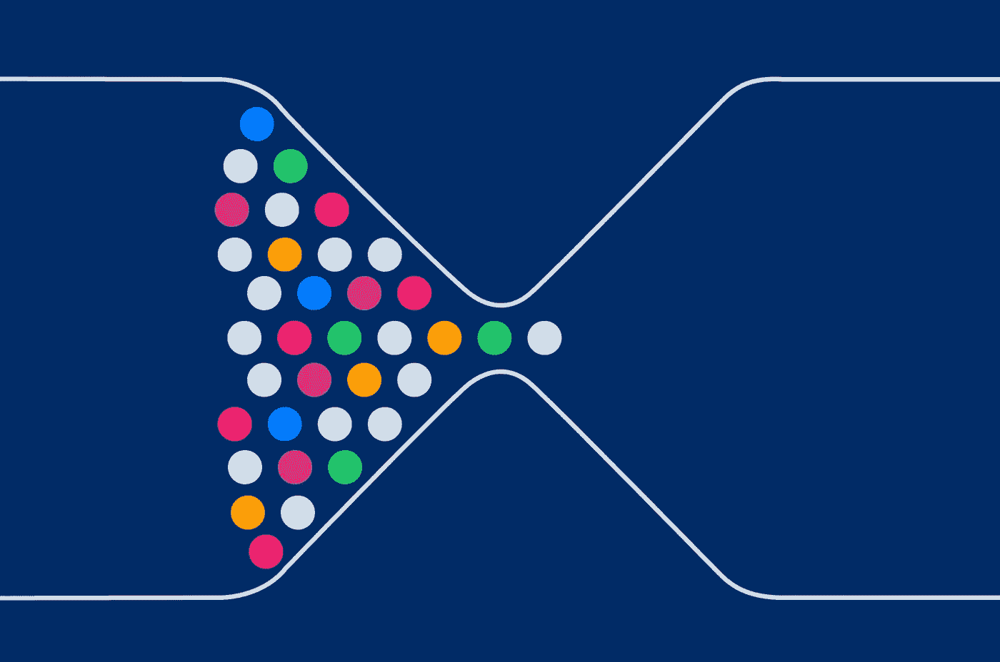
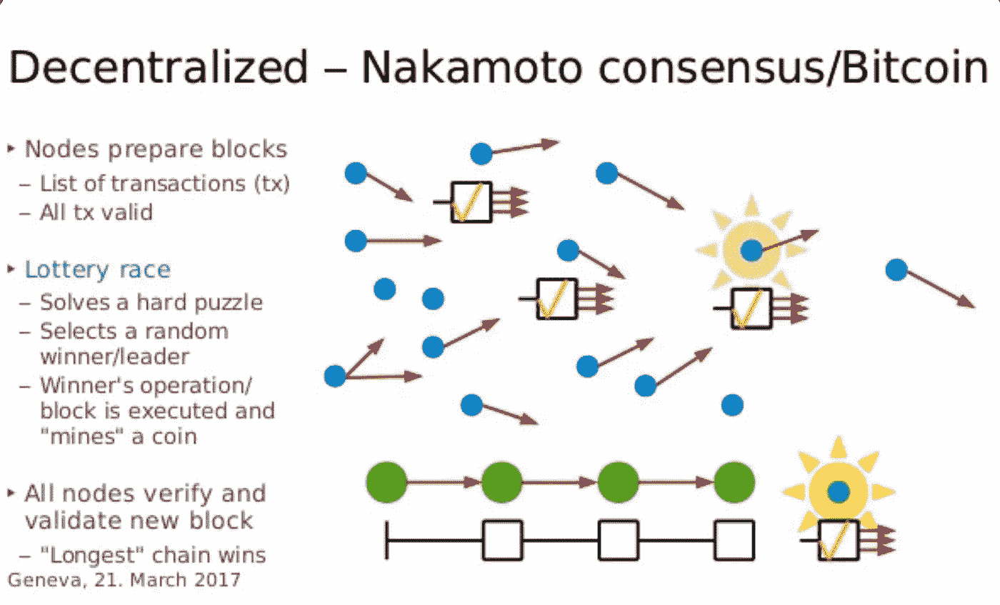
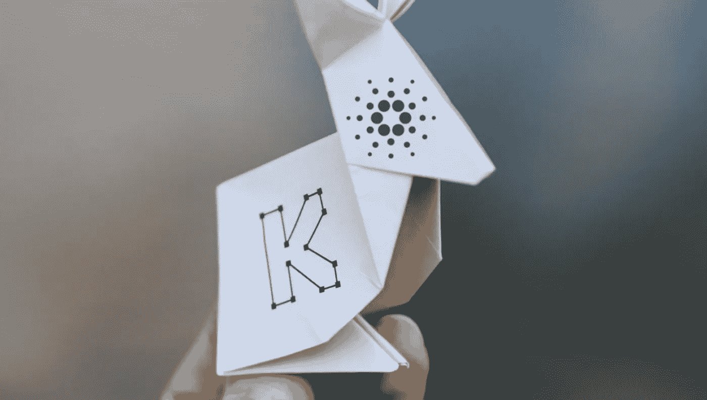
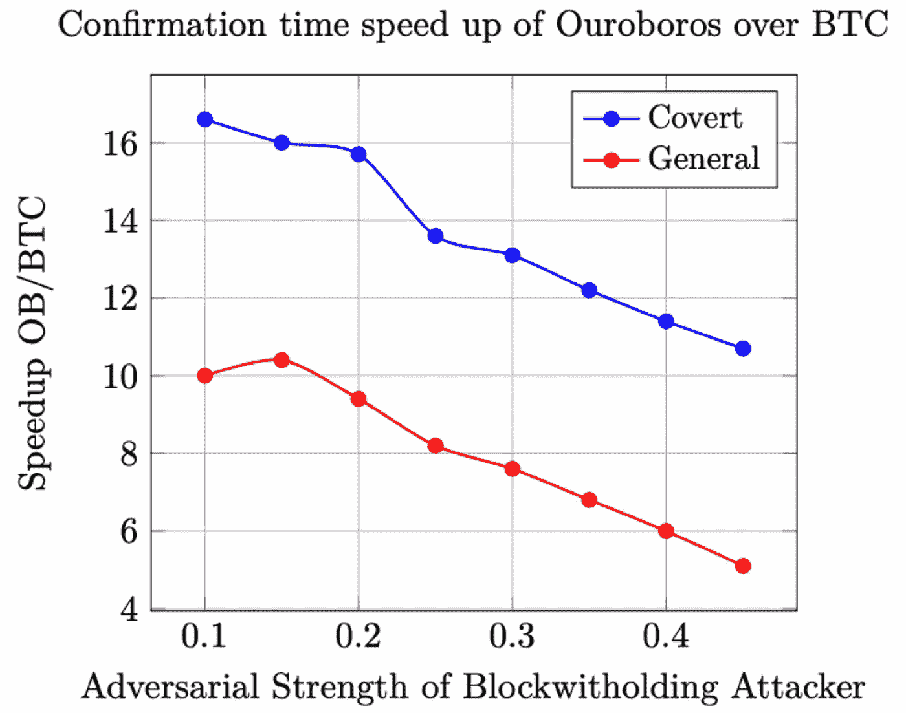

# Cardano Ouroboros 共识协议——一个新的创新

> 原文：<https://medium.com/coinmonks/cardano-ouroboros-consensus-protocol-a-novel-innovation-c460713708b6?source=collection_archive---------8----------------------->

大毒蛇共识协议是 [Cardano](https://twitter.com/hashtag/Cardano?src=hashtag_click) 的核心，为其提供了严格的安全保障，堪比[比特币](https://twitter.com/hashtag/Bitcoin?src=hashtag_click)的中本聪共识所实现的安全保障。

这是一项技术分析，这项技术使得卡尔达诺比其他任何 L1 都更像比特币。

**让我们像卡尔达诺那样从基本原则开始吧！**

那么什么是共识协议呢？这是一种方法，通过这种方法，分布式分散网络(例如:比特币)的所有对等点就分布式分类账的当前状态达成共识。

那么，大多数区块链人目前的共识是什么？区块链使用的共识模型的流行类型是经典共识和 Nakamoto 共识算法。

什么是经典共识协议？经典的共识协议是基于全体对全体的投票。因为全体对全体投票是达成共识的必要条件，这导致通信开销成倍增加。(例如 pBFT /实用拜占庭容错)。

简单地说，为了在节点间达成共识，每个人都必须与系统中的其他节点进行通信。所以如果有 10 个节点 100 条消息；如果有 1000 个节点，1，000，000，即节点之间有一百万条消息。

这是去中心化的一个瓶颈，因为你只能通过限制参与共识机制的节点数量来实现快速共识。

这是在 satoshi 发明比特币之前就存在的，这是我们今天在 L1 场景中在我们眼前看到的，例如:Polygon 有 97 个验证器，BSC 依赖于 21 个；Terra 有 125 个验证器，Cosmos 有 125 个验证器。

那么，是什么让比特币的共识与之前的所有经典共识协议不同呢？Satoshi 知道，如果他想让比特币成为一种无需许可且可扩展的互联网货币，用现有的经典共识协议是无法实现的。

所以他提出了“中本聪共识”。正是这种创新让比特币不同于之前的所有数字货币。这使得比特币成为第一个无需许可且可扩展的 BFT(拜占庭容错)系统。

工作证明(PoW)是这种共识模型的主要部分，其中计算资源被用于解决计算困难问题和验证新块的唯一目的。单个节点的计算能力越强，它验证新块的机会就越大。

这个模型被证明是既无权限又可伸缩的，但是最终我们发现它有很大的缺点。随着比特币网络的发展，使用 PoW 进行验证成为一个重要的能源密集型过程。

这使得比特币验证不仅是一项能源密集型工作，还为这一过程带来了规模经济。这降低了权力下放。比特币目前每年消耗约 113.89 太瓦时，占全球发电量的 0.55%；

 [## 20210513 银河数字矿业——论比特币能耗

### 文档发送

docsend.com](https://docsend.com/view/adwmdeeyfvqwecj2) 

问题是:花费如此多的精力来保护一个网络并同时妥协去中心化是明智的吗？有其他选择吗？**这是“Oroborus 协议”向前迈出的一步，使** [**Cardano**](https://twitter.com/hashtag/Cardano?src=hashtag_click) **成为一个无许可和可扩展的 PoS 区块链。**

那么 Oroborus 共识协议有什么特别之处呢？Oroborus 共识协议是第一个具有严格安全性分析的可证明安全的 stake 系统。

你这么说到底是什么意思？为了创建“Oroborus”，IOHK 首先创建了一个模型，确定了创建基于 PoS 的安全区块链的主要障碍。

1.该模型关注稳健交易分类账的两个正式属性:

A.坚持；

B.活力。

持久性/安全性意味着接受的事务在所有节点上都是有效和相同的。这是由安全参数“k”参数化的，我们在 Cardano 讨论赌注池时经常听到这个参数。

活性意味着系统中节点及时达成一致的能力。活性和持久性的结合提供了一个健壮的交易分类帐，IOHK 模型适当地修改了这些属性以反映基于 PoS 的动态。

2.该模型引入了一种新的基于 PoS 的区块链协议，其中通过安全多方计算随机选择块生产者，该安全多方计算利用区块链本身作为广播信道以称为“时期”的规则间隔发生。

3.该模型提供了一组正式的论据，证明没有对手可以破坏持久性和活性。该模型证明了持久性和活性参数可以被配置以实现拜占庭容错或安全性。

4.该模型提出了一种新的奖励机制，为协议中的参与者提供了积极的回报，以防止他们表现出敌对行为。

5.它引入了利益委托机制，可以无缝地添加到基础区块链协议中。这种授权机制允许协议即使在利益相关者高度分散的环境中也能扩展。该模型使利益相关者能够参与区块生产商的选择过程，而不必锁定他们的令牌。众所周知，我们不必“锁定我们的 ADA”来参与赌注。

6.该模型证明了设计的实际有效性。与比特币进行了对比。在保证水平为 99.9%的情况下，针对一个假设的双重消费攻击者，证明了交易确认时间比比特币快 10 到 16 倍。

**Ouroboros 是第一个可证明安全的赌注证明协议，它提供并改进了**[**#比特币**](https://twitter.com/hashtag/Bitcoin?src=hashtag_click) **的 Nakamoto consensus 协议的安全保证。只需花费能源成本的一小部分。**

原帖作者[Sooraj](https://twitter.com/Soorajksaju2):[https://Twitter . com/soorajksaju 2/status/1514567188891459590？s = 20&t = z-xeiwhuh 7 vybbzbnxuhwq](https://twitter.com/Soorajksaju2/status/1514567188891459590?s=20&t=z-xEiwHUH7vybbZbNxuHWQ)

> 加入 Coinmonks [电报频道](https://t.me/coincodecap)和 [Youtube 频道](https://www.youtube.com/c/coinmonks/videos)了解加密交易和投资

# 另外，阅读

*   [有哪些交易信号？](https://coincodecap.com/trading-signal) | [Bitstamp vs 比特币基地](https://coincodecap.com/bitstamp-coinbase) | [买索拉纳](https://coincodecap.com/buy-solana)
*   [ProfitFarmers 回顾](https://coincodecap.com/profitfarmers-review) | [如何使用 Cornix Trading Bot](https://coincodecap.com/cornix-trading-bot)
*   [十大最佳加密货币博客](https://coincodecap.com/best-cryptocurrency-blogs) | [YouHodler 评论](https://coincodecap.com/youhodler-review)
*   [MyConstant Review](https://coincodecap.com/myconstant-review) | [8 款最佳摇摆交易机器人](https://coincodecap.com/best-swing-trading-bots)
*   [MXC 交易所评论](/coinmonks/mxc-exchange-review-3af0ec1cba8c) | [Pionex vs 币安](https://coincodecap.com/pionex-vs-binance) | [Pionex 套利机器人](https://coincodecap.com/pionex-arbitrage-bot)