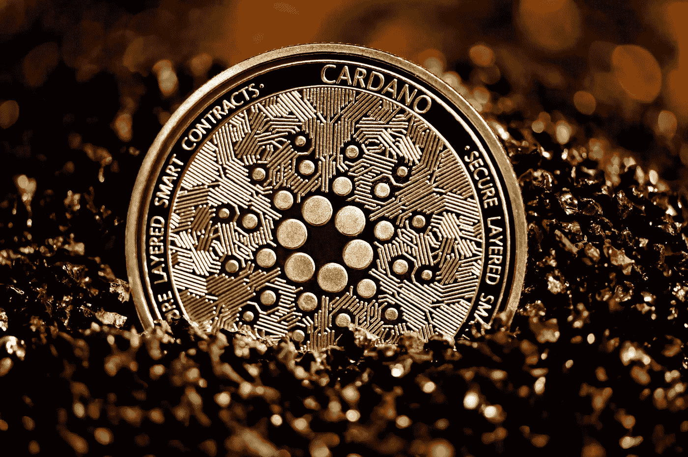

# 4 月 26 日卡尔达诺价格分析

> 原文：<https://medium.com/coinmonks/cardano-price-analysis-26th-of-april-8116662614a2?source=collection_archive---------5----------------------->

Source photo Unsplash.com

Cardano 的价格研究表明，1.10 美元的障碍水平正在大幅下降。在 0.90 美元的价位，该股在前一天已经跌破历史支持位 7%。在到达下一个关键支撑位 0.79 美元之前，预计买家会蜂拥而至。
卡尔达诺的价格分析仍然是负面的，在过去 24 小时内跌至 0.83 美元是最低点。如果先前的发生故障…