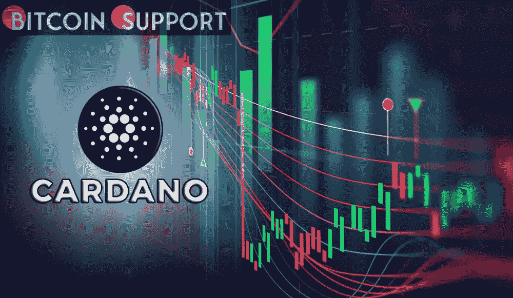
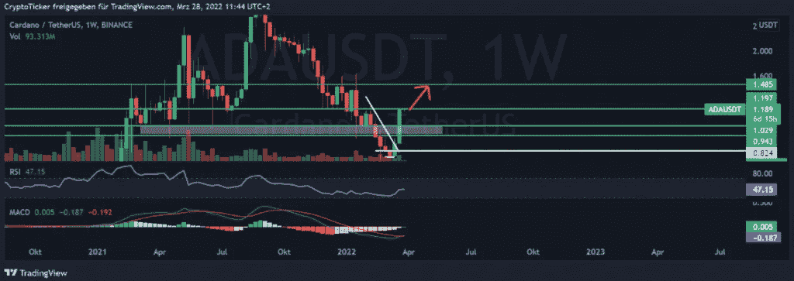
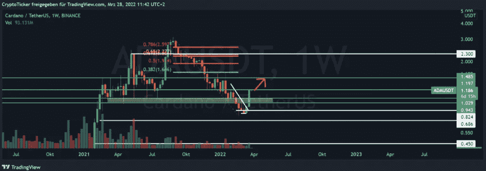

# 卡尔达诺价格爆炸！不要错过 ADA 在不久的将来达到 2 美元；原因如下

> 原文：<https://medium.com/coinmonks/cardano-price-explodes-dont-miss-ada-reaching-2-in-the-near-future-here-s-why-7ca30d20b705?source=collection_archive---------65----------------------->

**Visit our website:-** [**https://bitcoinsupports.com/**](https://bitcoinsupports.com/)

在我们之前的卡尔达诺价格预测中，我们讨论了卡尔达诺价格攀升的必要条件。此后，价格跟随我们的预测，又上涨了+/- 25%。今天，价格正在接近关键的 1.30 美元定价区。鉴于这个目标已经接近完成，让我们来看看 Cardano 的进展如何。价格很可能会很快回到 2 美元。我们比特币支持部门将为您提供卡达诺价格预测！

**卡达诺的价格还会继续上涨吗？**

在卡达诺价格的周线图上，我们可以观察到价格现在卡在了一个阻力位(+/-1.20 美元)。由于最近的周线蜡烛线未能突破关口，现在应该保持谨慎。然而，如果我们看指标，我们可以看到 MACD 指标已经完成了一个看涨交叉。这种交叉经常导致价格上涨，这就是为什么我们现在假设价格上涨。RSI 处于中性区域。这表明价格既不超买也不欠买。鉴于指标对腰果价格的强劲前景，我们预计两周内将攀升至 1.50 美元。这是下一个阻力点。

**Visit our website:-** [**https://bitcoinsupports.com/**](https://bitcoinsupports.com/)

**卡达诺近期能否冲击 2 美元？可以肯定的是，我们坚持认为 ADA 的定价可以接近 2 美元。在我们之前关于价格预测的文章中，我们指出这个目标极有可能实现。然而，我们讨论了一些需要首先完成的目标。我们之前讨论过 1.3 美元的定价范围。价格已经接近这个目标，应该建立一个新的目标。这个水平对应于 1.5 美元的价格区。Cardano 接近 2 美元的价格应该是可行的。唯一需要做的就是打破 1.5 美元的阻力。如果这一障碍水平被打破，通往 2 美元水平的道路变得清晰。2.30 美元左右是全面下跌的黄金口袋所在。此外，还有水平阻力。因此，一旦达到 2 美元的水平，价格可能还会再飙升 30%。**

**访问我们的网站:-**[**https://bitcoinsupports.com/**](https://bitcoinsupports.com/)

**免责声明:以上为作者观点，不应视为投资建议。读者应该自己做研究。**

> 加入 Coinmonks [电报频道](https://t.me/coincodecap)和 [Youtube 频道](https://www.youtube.com/c/coinmonks/videos)了解加密交易和投资

# 另外，阅读

*   [交易杠杆代币的最佳交易所](https://coincodecap.com/leveraged-token-exchanges) | [购买 HTZ 代币](https://coincodecap.com/how-to-buy-htz-token)
*   [5 大最佳社交交易平台](https://coincodecap.com/best-social-trading-platforms)|[NFT 瓦济克斯](https://coincodecap.com/wazirx-nft-india)
*   [10 本关于加密的最佳书籍](https://coincodecap.com/best-crypto-books) | [英国 5 个最佳加密机器人](https://coincodecap.com/uk-trading-bots)
*   [ko only Review](https://coincodecap.com/koinly-review)|[Binaryx Review](https://coincodecap.com/binaryx-review)|[Hodlnaut vs CakeDefi](https://coincodecap.com/hodlnaut-vs-cakedefi-vs-celsius)
*   [比斯勒评论](https://coincodecap.com/bitsler-review)|[WazirX vs coin switch vs coin dcx](https://coincodecap.com/wazirx-vs-coinswitch-vs-coindcx)