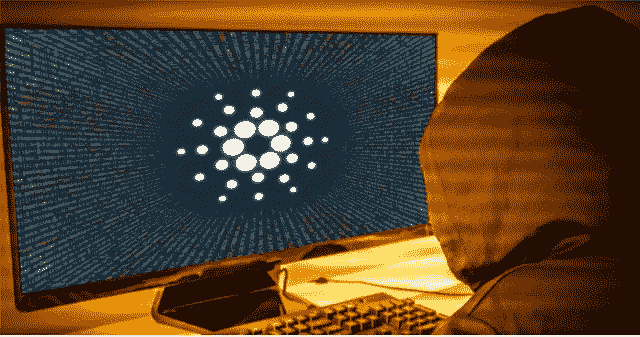

# 卡尔达诺在最钓鱼的加密项目列表中排名第三

> 原文：<https://medium.com/coinmonks/cardano-ranks-3rd-on-list-of-most-phished-crypto-projects-f62ad1cb44c9?source=collection_archive---------34----------------------->

几乎每个月，网络钓鱼都变得越来越普遍，对全球的个人和计算机网络构成了巨大的风险。

Tessian Research 一年前确定，员工每年平均会收到 14 封网络钓鱼电子邮件。

一些行业遭受了沉重打击，零售工人平均收入为 49 英镑。

反病毒和互联网安全公司 ESET 的数据显示，2021 年 5 月至 8 月，基于电子邮件的攻击增加了 7.3%，其中大部分是钓鱼攻击。

即使当加密货币市场面临危机时，加密骗子也继续以恶意的方式运作。网络罪犯非常喜欢网络钓鱼。

# 卡尔达诺在最钓鱼的加密项目排名中获得铜牌

Cardano 是欺诈者最有针对性的项目之一，他们越来越多地使用网络钓鱼来欺骗天真的消费者。

根据 URL 扫描工具 Checkphish 的记录，截至 6 月 22 日的三个月中，Cardano 是第三大被钓鱼的加密货币项目，共记录了 191 次尝试。

Checkphish 分析的数据与 Atlas VPN 团队的数据相同，将 Cardano 置于第三位，有 191 个钓鱼页面。

Atlas VPN 以 662 次攻击将 Blockchain.com 列为最受钓鱼攻击的加密货币项目，其次是加密货币投资软件 Luno，有 278 次攻击。

# ADA 在过去 7 天下跌了 0.7%

过去一周，卡达诺(ADA)价格对美元汇率从 0.545 美元阻力区大幅下跌。周二，ADA/USD 加速跌破 0.48 美元关口，进入负值区域。

根据 Coingecko 周二的数据，截至本文撰写之时，ADA 的交易价格为 0.4891 美元，过去七天下跌了 0.7%。

ADA 价格跌破 0.50 美元甚至跌破 0.45 美元支撑区，最低触及 0.420 美元。最近，美元开始在 0.450 美元关口向上修正。

Atlas VPN 还评估了 Poloniex 和 Magic Eden，分别以 72 次和 67 次攻击将它们评为第四和第五。其他值得注意的网络钓鱼活动针对的是加密货币交易所币安，记录了近 60 起违规事件，以及点对点交易平台 Paxful，记录了 9 起。

前十名中的其他名字包括加密钱包软件 MyEtherWallet，有 21 个案例，澳大利亚加密资产交易所 BTC 市场，有 16 个案例，比特币钱包服务 Electrum 有 16 个案例，日本加密交易所 bitFlyer 有 9 个案例。

# 网络钓鱼诈骗有望增加

Cardano 的创始人查尔斯·霍金森(Charles Hoskinson)去年警告说，由于 ADA 的增长，与平台相关的网络钓鱼将继续增加。令人惊讶的是，尽管加密市场大幅下滑，但情况在 2022 年有所改善。

与此同时，网络窃贼不仅利用加密货币获利，而且成功地做到了这一点。根据美国联邦贸易委员会的数据，仅在 2022 年的前三个月，网络欺诈者就窃取了价值约 3.3 亿美元的加密货币。

自去年以来，诈骗已经让受害者损失了超过 10 亿美元。总共有 9300 万美元被商业骗子诈骗。

点击这里关注我们了解更多故事[。](http://t.me/etellworld)

> 加入 Coinmonks [电报频道](https://t.me/coincodecap)和 [Youtube 频道](https://www.youtube.com/c/coinmonks/videos)了解加密交易和投资

# 另外，阅读

*   [最佳比特币保证金交易](/coinmonks/bitcoin-margin-trading-exchange-bcbfcbf7b8e3) | [萝莉点评](/coinmonks/lolli-review-e6ddc7895ad8) | [比特币保证金交易](https://coincodecap.com/bityard-margin-trading)
*   [创造并出售你的第一个 NFT](https://coincodecap.com/create-nft) | [密码交易机器人](/coinmonks/crypto-trading-bot-c2ffce8acb2a)
*   [如何在 CoinDCX 上购买柴犬(SHIB)币？](https://coincodecap.com/buy-shiba-coindcx)
*   [CBET 评论](https://coincodecap.com/cbet-casino-review) | [库科恩 vs 比特币基地](https://coincodecap.com/kucoin-vs-coinbase) | [拜比特 vs 比特币基地](https://coincodecap.com/bybit-vs-coinbase)
*   [折叠 App 回顾](https://coincodecap.com/fold-app-review) | [LocalBitcoins 回顾](/coinmonks/localbitcoins-review-6cc001c6ed56) | [Bybit vs 币安](https://coincodecap.com/bybit-binance-moonxbt)
*   [加密保证金交易交易所](/coinmonks/crypto-margin-trading-exchanges-428b1f7ad108) | [赚取比特币](/coinmonks/earn-bitcoin-6e8bd3c592d9) | [Mudrex 投资](https://coincodecap.com/mudrex-invest-review-the-best-way-to-invest-in-crypto)