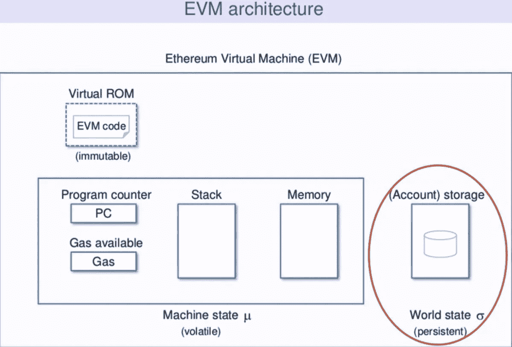

# 卡尔达诺普路托斯智能合同 DeFi 革命

> 原文：<https://medium.com/coinmonks/cardano-s-s-s-the-defi-revolution-eab079ead25f?source=collection_archive---------11----------------------->

以太坊的基于账户的模式&基于稳固性的智能合约是一场地狱里的婚姻。

Vasil-HFC 事件即将发生，是时候释放 Cardano 的 eUTxO 模型和普路托斯智能合同的协同效应了。

这里有一个关于为什么 EUTxO 模型和函数式编程是 DeFi 所需要的线索:

区块链的最终目标是取代腐败&中央集权的传统金融体系。创建一个包容性的全球金融体系，为没有银行账户的人提供银行服务。

但是我们要用一个比现在更有问题的系统来做吗？

普通加密& DeFi 在过去的十年里经历了巨大的增长。DeFi-exploit 也出现了成比例甚至更大的增长。这让我们意识到系统的基本要求，我们希望成为提供安全保障的区块链建筑的一部分。

一种区块链架构，旨在托管任务关键型 dApps，并提供简单优雅的安全设计。

这里有两个例子:

*   比特币的 UTxO 模型；
*   用 [Haskell](https://threadreaderapp.com/hashtag/Haskell) 进行函数式编程。

卡尔达诺结合了这两个世界:

*   通过扩展比特币的 EUTxO 模型；
*   卡尔达诺创建了 EUTxO-ledger 架构；
*   由基于普路托斯的智能合约提供支持；
*   这反过来又提供了一个基于 Haskell 的安全的全栈编程环境。

那么为什么比特币的 UTxO-ledger 模型&函数式编程与 Haskell 的结合呢？

天作之合！当与 Ethreum 的基于账户的模型&基于可靠性的命令式编程相比时。

所以要理解为什么 Cardano 选择了与以太坊完全不同的架构，我们应该理解 UTxO 模型和函数式编程之间的协同作用。

那么什么是函数式编程呢？

函数式编程是通过组合纯函数来构建软件的过程，它避免了:

*   共享状态；
*   可变数据；
*   副作用。

那么什么是纯函数呢？

在计算环境中，纯函数类似于数学函数，是所有形式科学推理的基础。它是一个函数(一段代码)，如果传递相同的参数，它总是返回相同的结果。

一个函数必须遵循四个规则才能表现得像数学中的函数:

*   它总是需要一个参数；
*   它必须总是返回值；
*   它决不能依赖于任何变化的东西；
*   它本身绝不能改变任何事情。

具有这种性质的函数称为“纯函数”。纯函数是“无状态的”和“永恒的”。

含义:纯函数易于并行化，因为它们鼓励不可变的数据结构。这减少了使代码难以在多个处理器上运行的副作用。

就像比特币的 UTxOs 一样，函数也只是从输入到输出的映射。它不依赖于程序执行期间的任何状态或数据变化，因此没有外部状态和副作用。

这为代码的行为提供了确定性和可预测性。

哈斯克尔的函数是一流的。当函数与以下情况下的任何其他变量没有区别时，则称编程语言具有第一类函数:

*   函数可以用作参数；
*   可作为其他函数的值返回；
*   可以分配给变量。

第一类函数允许从代码中抽象出任何重复的计算，并最终允许编写产生其他函数的函数。

这些函数称为高阶函数。

高阶函数只是指对其他函数进行操作的函数。

为什么有用？

1.高阶函数提高了抽象层次。

意思是:它允许对行为进行抽象，而不仅仅是价值。因此，我们不必对较低层次的细节进行推理

2.高阶函数是按行为参数化代码的关键。

含义:它允许我们定义通用的编程模式，并编写关于函数的函数。

拥有更高阶的函数是函数编程的很多好处的来源。

简言之:

*   函数编程使用类似数学的值和函数；
*   产生没有外部影响的结果&得到良好的评估；到处
*   导致更可并行的透明和更干净的代码；
*   这有助于用户进行调试和维护。

另一方面，使用面向对象编程在动态环境中进行编程会导致创建巨大的“依赖地狱”(Dependency Hell)，导致在抽象之上添加抽象以模块化复杂系统。

这导致“共享可变状态/全局状态”。

当子模块试图同时访问全局状态时，复杂性就产生了&这导致了一个混沌编程环境。就像以太坊的 Account 模型一样，这里有一个全局状态&在向用户收取费用后，交易会在脚本执行过程中失败。

如果我们能运用常识并考虑上述原因，像 Haskell 这样的纯函数式编程语言应该是 dApps 的理想编程语言，因为 dApps 可以实现数十亿美元以上的金融交易。

Haskell 类似于比特币的 UTxOs，其中的纯函数是从输入到输出的映射& Ethreum 的账户模型类似于面向对象编程——账户类似于对象，在对象中，它们在动态分布式设置中相互发送消息。

虽然在中本聪发明比特币时，他就已经知道了基于账户的模型，但他选择了 UTxO-Model，因为在复杂的分布式动态计算环境中，账本的语义模型仍然非常简单。

UTxO 模型对可编程性的表达非常有限。比特币的这种局限性促使 Vitalik 为以太坊选择了基于账户的分类账模型。但是这导致了“全局状态”的产生&这使得 dApps 的编程变得复杂。

Cardano 采取了一种系统的方法，通过使用基于 Haskell 的普路托斯编程语言，用脚本和任意数据扩展比特币的 UTxO 模型，其中 E-UTXO 交易的无副作用性质完美地映射到 Haskell 函数的纯功能性质。

任意的逻辑/脚本允许 E-UTxO 模型具有更强的表现力。该任意数据携带有关于输出状态的信息，该信息使得契约状态能够在状态被本地化时被本地化。没有“全球国家”的概念。

在以太坊中，要编写一个智能合同，你需要在 solidity 中编写链上代码，然后为运行在钱包中的链外部分编写 Javascript 代码。

这是不方便的，因为您必须在两段代码之间开发一个特别的集成，这是复杂和脆弱的。

Cardano 的普路托斯平台使用 Haskell 作为离线代码，PlutusTX 作为在线代码，向下编译到普路托斯核心，在代码的两个部分使用相同的语法、编译器和数据类型，这转化为一个集成的、紧凑的和健壮的编程模型。

含义:在普路托斯编程智能合约时，推理智能合约的行为要容易得多。实际上，证明代码将按照预期的方式运行并不太困难，从而为安全可靠的 dApps 提供易于验证的代码。

我们无法在每周发生数百万美元黑客攻击的平台上构建开放全球金融的未来。它必须建立在一个平台上，该平台投入了足够的工作和思想来构建不仅可扩展而且安全可靠的 dApps。

Cardano 将 E-UTxO-model 与比特币 UTxO-model 优雅而简单的架构相结合，完美地映射到 Haskell 函数的纯功能性质，带来了:

*   安全性；
*   安全性；
*   可扩展性。

@Soorajksaju2 原创线程:

[https://Twitter . com/soorajksaju 2/status/1532020250522296322？s = 20&t = WBDjtJ-iknoeku 6 fwkllcq](https://twitter.com/Soorajksaju2/status/1532020250522296322?s=20&t=WBDjtJ-iKnoEku6fWKlLCQ)