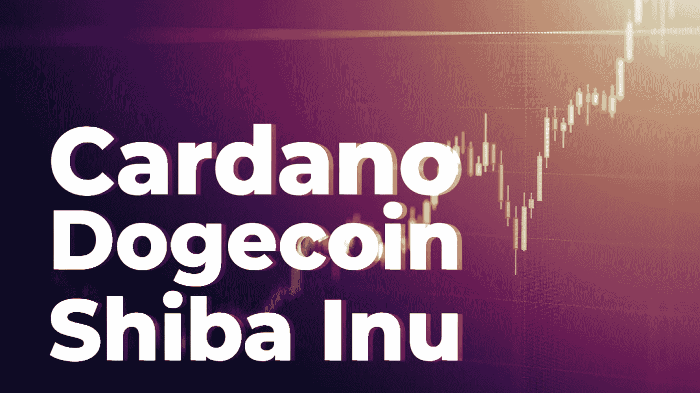
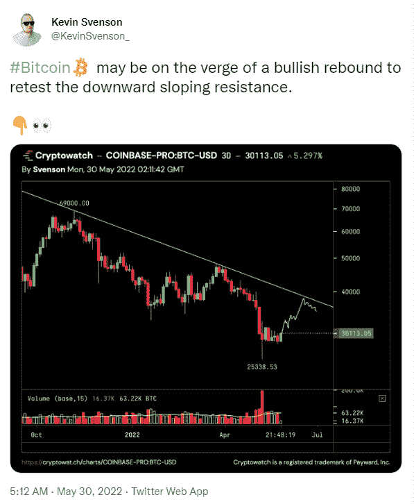

# 卡尔达诺，柴犬邮政双位数字的收益，因为比特币，以太坊安装超牛市反弹

> 原文：<https://medium.com/coinmonks/cardano-shiba-inu-post-double-digit-gains-as-bitcoin-ethereum-mount-ultra-bullish-rebound-52efb2063bf0?source=collection_archive---------52----------------------->

周一，比特币带领其他加密货币强劲反弹，此前八周的抛售导致 BTC 价格跌至 26000 美元。

截至发稿时，比特币在连续第三天印出看涨蜡烛后，过去 24 小时上涨 5.68%，至 30774 美元。这个世界上最大的加密货币在过去三天失去后，也恢复了 5850 亿美元的市值。以太坊自周六以来的反弹中上涨了 200 多美元，上涨了 6.80%，至 1903 美元。同样，以太公司的市值增长了 6.70%，至 2，300 亿美元。

按市值计算，Cardano 和 Shiba Inu 是前二十大加密货币中的最大涨幅，分别上涨 12%和 10.81%，交易价格分别为 0.52 美元和 0.00001199 美元。其他公司如 DOGE、Solana、Polkadot 和 Avalanche 也都上涨了 5%以上。根据 CoinMarketCap 的数据，整个加密货币市场也增长到了 5.46%，达到 1.27 万亿美元。

这种增长也反映在美国主要股市连续 8 周下跌之后。跟踪主要科技股的纳斯达克 100 指数今天与标准普尔 500 一道飙升 3.30%，美元指数 DXY 继续下跌。不过，值得注意的是，纳斯达克综合指数(Nasdaq composite)与 BTC 的走势越来越不相关，后者飙升，而前者在过去一周继续下跌。

同样，Cryptowatch 的创始人凯文·斯文森(Kevin Svenson)预测，在遇到趋势线阻力之前，BTC 的价格可能会上涨到 3.5 万美元至 3.7 万美元。

也就是说，仍然需要注意的是，顾名思义，救援集会可能是短暂的。例如，Svenson 警告说，一旦价格达到他的目标，它可能“然后再次抛售。”

关于比特币与科技股的关系，一些专家认为，如果比特币继续脱钩，它可能会陷入更大的麻烦。

> 加密贷款公司 Nexo 的联合创始人兼管理合伙人 Antoni Trenchev 告诉彭博记者*“这是没有人想要的去相关性类型*，比特币尚未测试其 5 月 12 日低于 26000 美元的低点。鉴于比特币未能反映纳斯达克在过去一周的涨幅，人们感觉这只是个时间问题。”

> 加入 Coinmonks [电报频道](https://t.me/coincodecap)和 [Youtube 频道](https://www.youtube.com/c/coinmonks/videos)了解加密交易和投资

# 另外，阅读

*   [Bookmap 评论](https://coincodecap.com/bookmap-review-2021-best-trading-software) | [美国 5 大最佳加密交易所](https://coincodecap.com/crypto-exchange-usa)
*   最佳加密[硬件钱包](/coinmonks/hardware-wallets-dfa1211730c6) | [Bitbns 评论](/coinmonks/bitbns-review-38256a07e161)
*   [新加坡十大最佳密码交易所](https://coincodecap.com/crypto-exchange-in-singapore) | [收购 AXS](https://coincodecap.com/buy-axs-token)
*   [红狗赌场评论](https://coincodecap.com/red-dog-casino-review) | [Swyftx 评论](https://coincodecap.com/swyftx-review) | [CoinGate 评论](https://coincodecap.com/coingate-review)
*   [投资印度的最佳加密软件](https://coincodecap.com/best-crypto-to-invest-in-india-in-2021)|[WazirX P2P](https://coincodecap.com/wazirx-p2p)|[Hi Dollar Review](https://coincodecap.com/hi-dollar-review)