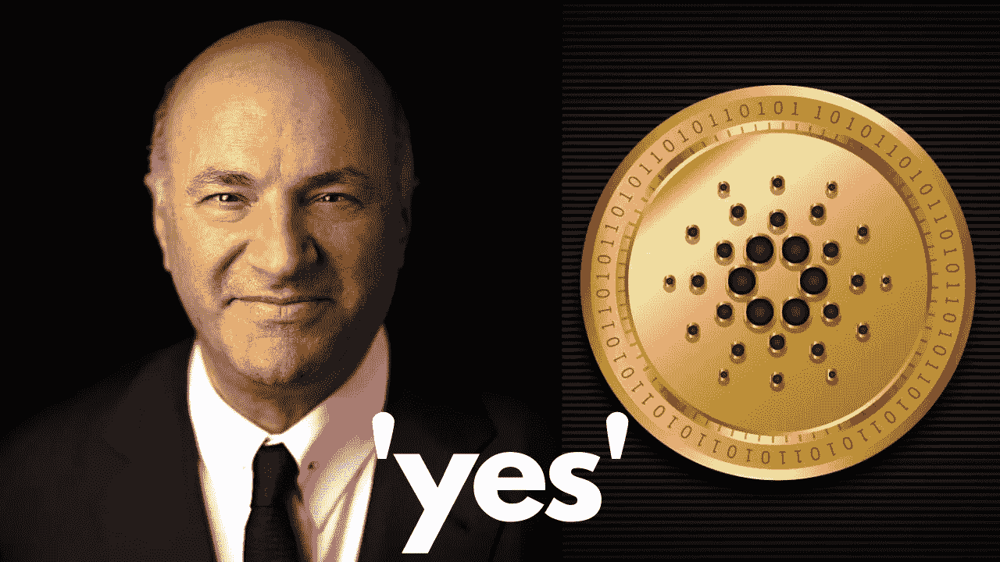
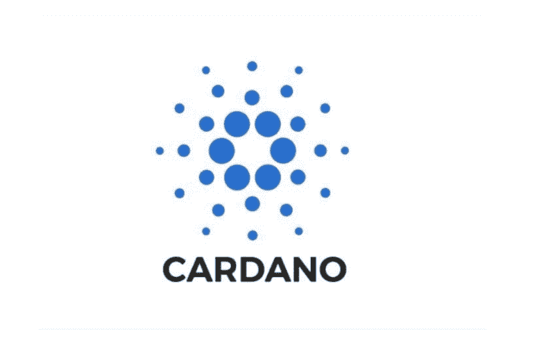
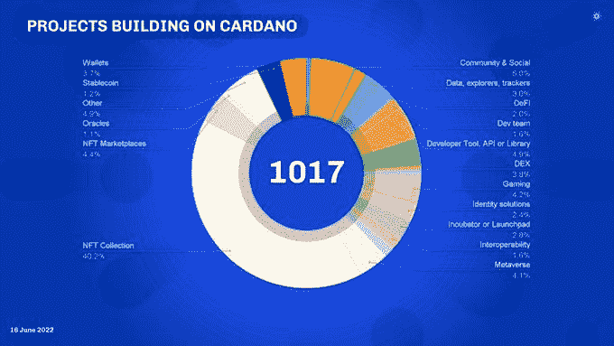

# 卡尔达诺瓦西里硬叉子更新-加密部队裸泳，因为人们失去了他们的衬衫

> 原文：<https://medium.com/coinmonks/cardano-vasil-hard-fork-update-crypto-forces-swimming-naked-as-people-loose-their-shirt-464492c981ed?source=collection_archive---------1----------------------->

# Vasil 升级——进展情况

## 非常接近，但还有一点距离。这是 Vasil 升级的最新进展

周五，致力于 Vasil 升级的核心输入输出全球(IOG)团队举行了定期的周末评估电话会议。今天(6 月 20 日星期一)是我们能够在下一个纪元边界之前促进 Cardano testnet 升级的最后日期，所以我们同意今天下午重新评估最新状态，考虑到我们的工程师在周末所做的工作。

IOG 工程团队非常接近完成核心工作，只有七个 bug 尚未完成硬分叉工作，目前没有一个被评为“严重”。经过一些考虑，我们同意今天不发送硬分叉更新提案到 testnet，以便有更多的时间进行测试。

到目前为止，我们已经设法通过了大部分(大约 95%)的普路托斯·V2 测试脚本。然而，我们仍然有一些未完成的项目需要运行，以确认一切都按预期工作。我们已经决定我们还需要几天的时间。这使我们落后于我们之前沟通的 mainnet 硬分叉的目标日期 6 月 29 日。

自 6 月初以来，我们已经成功运行了新节点的早期版本(包括扩散管道和新的普路托斯 v2 CIPs 以及其他增强功能)，作为半公开的 Vasil 开发人员测试网(Devnet)。我们现在有来自 27 个项目的大约 35 名开发人员测试他们的 DApps，并帮助识别任何问题，还有 16 个利益池运营商(spo)提供支持。我们还与一些领先的工具/API 提供商密切合作，包括 [Blockfrost](https://blockfrost.io/) 、Cardano 序列化库(EMURGO)和 Cardano 多平台库(dcSpark)。我们要特别指出 Mlabs 和 Dquadrant 在整个过程中提供的巨大支持。当谈到普路托斯代码的兼容性和功能性时，这个开发人员测试网阶段使我们处于一个很好的位置。这项有价值的工作将在接下来的几周内继续进行。

从几个角度来看，Vasil 是迄今为止最复杂的开发和集成项目。这是一个充满挑战的过程，不仅需要核心团队的大量工作，还需要整个生态系统的密切协调。

将与 SPO 和 DApp 开发社区的成员协商，根据 3 个关键标准做出硬分叉 Cardano 测试网的最终决定:

1.  节点上没有未解决的关键问题(包括分类账、CLI、共识等。)或我们的内部审计职能部门，
2.  基准和性能成本分析是可以接受的，并且
3.  机构群体(包括交易所和 DApp 项目)已得到适当通知，并有足够的时间准备 hard fork combinator 事件。

该项目继续按照这些标准进行。一旦我们可以轻松自信地勾选所有这些框，我们就可以前进，硬分叉 Cardano testnet，标志着 mainnet 硬分叉的最后倒计时。Cardano Foundation 集成团队领导这一过程，通常目标是给交易所 4 周时间来完成他们自己的集成/更新。这里倾向于遵循帕累托原则，目标是在 mainnet 硬分叉之前实现 80%的交易所合规性(按流动性)，从而最大限度地减少用户的不便，同时认识到不同的交易所可以工作于不同的时间表。

今天，国际组织和卡尔达诺基金会已经商定了一个新的目标日期，在 6 月底硬分叉测试网。一旦完成，我们将为交易所和 spo 留出四周时间来执行任何必要的集成和测试工作。这才合理，不应该操之过急。因此，现在的工作假设应该是在 7 月的最后一周发生 Cardano mainnet 硬分叉。

我们知道这个消息会让一些人失望。但是，我们非常谨慎，以确保我们正确地进行部署。

正如我们一直交流的那样，并且大多数社区成员都认识到，在软件开发中没有绝对的时间表。质量和安全仍然是最重要的。如果需要更多时间来获得正确的核心代码，并确保所有生态系统参与者(spo、DApp 项目、工具、交换等)。)是完全舒适的——那就这样吧。延长这个过程是唯一负责任的做法。

随着我们越来越接近 mainnet 上的 Vasil hardfork，IOG 和 Cardano Foundation 团队将继续与开发人员社区和交易所密切合作。并保持对社区的更新。感谢你们所有人的支持。

# 预计口袋里的被迫 BTC，ETH 销售作为市场人物谁在裸泳

在经历了激烈的抛售期，或者更确切地说是几个月后，加密市场终于迎来了急需的放松。最近 24 小时，[以太坊【ETH】](https://ambcrypto.com/category/ethereum-news/)涨了 14%，[比特币【BTC】](https://ambcrypto.com/category/bitcoin-news/)涨了 11%，清算金额确实跌到了 3.15 亿美元左右。

这种上涨发生在重大亏损期之后，就像这里的情况一样…

## 从灰烬中重生？

2021 年 2 月推出的[目的比特币交易所交易基金](https://ambcrypto.com/?s=Purpose+Bitcoin+ETF)多年来一直有资金流入。然而，鉴于市场的流血事件，ETF 在一天之内减持了超过 50%的股票。加拿大的目的比特币(BTC)交易所交易基金在周五收盘时卖出了惊人的 24，500 BTC，即他们在一天内卖出了 50%的持有量。一天之内要卖很多 BTC。

Source: Glassnode

从本文所附的图表中可以看出这种下降趋势，不过随着比特币市场的“复苏”，这种下降趋势确实再次出现。资金流入似乎与机构买家再次投资 crypto 的更广泛的短期趋势一致。

虽然它可能揭示了一个“改善的场景”，[亚瑟·海斯](https://ambcrypto.com/?s=Arthur+Hayes)，有一个不同的故事与社区分享。

在过去的 72 小时里，比特币的价格跌至接近 17600 美元的低点。

“成交量不错，较上周五下跌了近 20%。他补充道:“闻起来就像是被迫的卖家引发了止损挤兑。”。

Source: [Twitter](https://twitter.com/CryptoHayes/status/1538656661552115713/photo/1)

因此，尽管价格略有上涨，但这可能会在整个加密市场引发危险信号。此外，海斯预计，鉴于加密市场内的加密贷款市场的惨败，还会有几次强行出售。何[指点江山，](https://twitter.com/CryptoHayes/status/1538656664072912896)

> *“在卖家抛售手中的袋子后，mrkt 迅速在低交易量上反弹。鉴于加密货币贷款机构的风险管理状况不佳以及过于宽松的贷款条款，随着 mrkt 找出谁在裸泳，预计会有更多的 BTC 和瑞士联邦理工学院被迫出售。”*

# 鲨鱼池的凯文·奥利里解释了他买入比特币和以太网的原因，并表示从长远来看，高风险代币的崩溃将有助于加密市场

《鲨鱼池》的投资者凯文·奥利里——也被称为奇妙先生——并没有为加密货币的熊市担忧。如果有什么不同的话，他认为从长远来看，这将最终支撑起整个加密行业。

这位风险投资家解释说，他一直在双倍押注代币，包括比特币和以太网，以及各种 Web3 项目，尽管他承认并非每笔投资都是赢家。

> “我不卖任何东西，”奥利里告诉《内幕》。“从长远来看，你必须忍受它。你必须明白，你会遇到[波动](https://www.businessinsider.com/personal-finance/what-is-volatility?utm_medium=ingest&utm_source=markets)，而且有些项目不会成功。”

他的投资组合更广泛地反映了他对区块链科技的看好。他目前在数字资产领域拥有 32 个职位，包括索拉纳和区块链公司 Polygon。与此同时，奥利里支持的 WonderFi 刚刚成为多伦多证券交易所的第一个加密交易平台。

但他说，由于加密熊市冲击了估值，数字资产现在占他持股的 16%，低于六个月前的 20%。

# 密码部门的未来

奥利里指出，最近的加密崩溃，如 stablecoin Terra 和姐妹 token Luna 的崩溃，是教育投资者谨慎的事件，实际上有助于推动支撑数字资产的技术。

> “Luna 筹集了 300 多亿美元，”他说。“没有人会再用他们的主意了。(崩溃)教育每个人，这不是建立一个稳定的硬币的方法。这对教育和市场的成熟很重要。”

他补充说，在全球金融市场的背景下，即使数百亿美元从市场上消失，一些投资者亏损，代币的崩溃也不会改变现状。但是教训是合理的。

“这没什么，一个主权财富的舍入误差。这对投资者不利，但他们已经教育市场不要做什么。这是一件好事，”他说。

最终，这位经验丰富的投资者不仅押注于 crypto 或区块链，还押注于他看到的涌入该行业的人力资源。

“看看麻省理工学院的工程师毕业班，”奥利里说。“最聪明的人希望在(区块)链上工作。因此，你已经拥有了世界上大多数最好的智力资本来解决链条上的糟糕结果——为什么你不期待它能起作用？”

有超过 1000 个项目 [#BuildingOnCardano](https://twitter.com/hashtag/BuildingOnCardano?src=hashtag_click) ，生态系统还在继续增长。有 1000 多个项目相信卡尔达诺区块链及其社区。

SCEZ —智能合约变得简单—【https://smartcontractsez.com SCEZ 是一个创建智能合约、NFT、本地代币和卡达诺区块链交易的友好工具。一个完整的 REST api 解决方案，面向加密开发者、爱好者和企业家。

用 SCEZ 押你 ADA:
[https://smartcontractsez.com/pool](https://smartcontractsez.com/pool)
[https://smartcontractsez.com/stake-your-ada/](https://smartcontractsez.com/stake-your-ada/)

> 加入 Coinmonks [电报频道](https://t.me/coincodecap)和 [Youtube 频道](https://www.youtube.com/c/coinmonks/videos)了解加密交易和投资

# 另外，阅读

*   [印度最佳 P2P 加密交易所](https://coincodecap.com/p2p-crypto-exchanges-in-india) | [柴犬钱包](https://coincodecap.com/baby-shiba-inu-wallets)
*   [8 大加密附属计划](https://coincodecap.com/crypto-affiliate-programs) | [eToro vs 比特币基地](https://coincodecap.com/etoro-vs-coinbase)
*   [最佳以太坊钱包](https://coincodecap.com/best-ethereum-wallets) | [电报上的加密货币机器人](https://coincodecap.com/telegram-crypto-bots)
*   [交易杠杆代币的最佳交易所](https://coincodecap.com/leveraged-token-exchanges) | [购买 Floki](https://coincodecap.com/buy-floki-inu-token)
*   [3Commas 对 Pionex 对 Cryptohopper](https://coincodecap.com/3commas-vs-pionex-vs-cryptohopper) | [Bingbon 评论](https://coincodecap.com/bingbon-review)