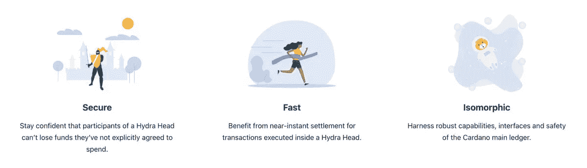

# 卡尔达诺:接下来是什么？

> 原文：<https://medium.com/coinmonks/cardano-what-is-next-1e1b6fa2f01f?source=collection_archive---------12----------------------->

# 对卡达诺生态系统的未来感到兴奋的 20 个理由。

现在是参与卡尔达诺的激动人心的时刻。

我们看到了数量惊人的活动，就像一个良好的分散式生态系统，很难保持下去。

1.六月硬叉带来:参考脚本(指向链上脚本而不是不断重载)。还有改进，如参考输入、内联基准、附属资料、核心解释器速度提高、扩散流水线。

TLDR: L1 吞吐量成为加密领域最佳之一。

2.P2P +八卦协议来了。今天，该网络由 spo、最终用户、IOG 中继站组成。后者便于 spo、终端用户、新节点之间的路由。

之后:新节点和最终用户发现没有中继的节点，网络变得完全有机和自我调节。

3.DJED 要来了。今天，我们有稳定的硬币，如通过 [@nomadxyz_](https://twitter.com/nomadxyz_) 和 [@Milkomeda_com](https://twitter.com/Milkomeda_com) 在 [@wingriderscom](https://twitter.com/wingriderscom) 上提供的$USDC。

很快$DJED 发布了，这是一个由 IOG 开发，COTI 发行的用于 Cardano 的去中心化算法 stablecoin。有科学支持

**对所有加密来说都很大。**

4.输入背书者。通过允许将事务分成预先构建的块，吞吐量呈指数级增长。

在可预见的未来，这个月的硬分叉衡量我们，但 IE 实际上是 L1 的“终结游戏解决方案”。

BTC (Prism)上的类似技术演示达到了超过 10k TPS。

5.戴普斯。越来越多的 dapps，在许多方面最好的还在后头。即将发布:

[@ ardan project](https://twitter.com/ArdanaProject)(稳定币生态系统)；

[@ CardanoMaladex](https://twitter.com/CardanoMaladex)[@ genius yieldo](https://twitter.com/GeniusyieldO)(次世代 dexes)；

[@ liqwidfinance](https://twitter.com/liqwidfinance)[@ aada finance](https://twitter.com/AadaFinance)(L+B)；

[@Indigo_protocol](https://twitter.com/Indigo_protocol) (合成)；

[@ book token _ io](https://twitter.com/BOOKtoken_io)(book NFTs)。

6.九头蛇。同构状态通道，最大化吞吐量，最小化延迟，并产生低成本或零成本。

提供了一种有效的离线处理交易(工作方式类似于 L1)和在线结算交易的方式。

[http://Hydra.family](http://hydra.family/)

7.奥比斯。以为我不用刮了吗？没有。 [@orbisproject](https://twitter.com/orbisproject) 正在为 Cardano 打造首个 ZK Rollup L2 解决方案。

Dapps 可以在继承 Cardano 安全性和去中心化的同时扩展吞吐量(包括以前不经济的用例，如游戏、高速索引等)。

8.大毒蛇的起源:共识协议的下一次迭代。

新用户可以从 genesis 块进行引导，不需要检查点或预先了解活动用户的数量。

这在以前是不可能的，因为它是权力的象征。现在我们有了权力的安全保证。

9.秘银。允许以不可信的全节点方式快速验证由随机挑选的多方(如股份池)签署的区块链的快照。

将改善代达罗斯同步时间，在某些方面允许全节点，如轻型钱包+移动 dapps。

10.秘密会议。在过去的两年里，我们看到了小的股份池挣扎。有很多关于参数的讨论，但是还没有改变。

我希望看到科学付诸实践的一件事是:没有单一权威的集体利益池。

【eprint.iacr.org/2021/742.pdf 

11.卡尔达诺 dapp 商店和认证。目前(除了 [@eternlwallet](https://twitter.com/eternlwallet) 中的早期版本)没有 dapps 的统一视图，很难知道该相信哪个。

一个 dapp 商店提供这个，加上认证和智能合同检查/审计，以显示哪些是值得信赖的。

12.伏尔泰。原始路线图的最后一个时代是治理。

Catalyst 正在全力以赴，选出了一组代表，链上治理工具即将推出。

未来几年，切断 IOHK 的弦将是所有 crypto 的一个重大时刻。

13.通天塔费。想象一下，你可以用任何货币在卡达诺支付交易费用。

例如，我用 100 美元 USDC 从你那里购买了产品 X，我没有支付$ADA 费用，而是支付了$0.15 $USDC。

spo 成为他们选择的货币的一种做市商。

14.钱包。有传言说 IOHK 很快会发布一款新的轻型钱包。

UX 一直是我们钱包里的一个问题，大多数人认为我们需要一个索拉纳幻影般的体验。

15.傅立叶。我们有 [@Milkomeda_com](https://twitter.com/Milkomeda_com) C1 作为 EVM 兼容 L2 到卡尔达诺。但是我们也有 [@fourier_labs](https://twitter.com/fourier_labs) 大楼。

这是一个基于 Haskell 的“高性能”本地 EVM 在普路托斯之上，可以处理 eUTxO 分类帐基于帐户的交易。

16.核心分散化。社区不会忽视隐藏在引擎盖下的东西，例如:

*   移植到其他语言和 OS 的节点(s/o[@ cardanosd](https://twitter.com/CardanoBSD))；
*   让我们避免类似 MM/Infura 的情况&分散节点到客户端的事务提交过程，例如 [@FreeLoaderz2022](https://twitter.com/FreeLoaderz2022) 。

[**部署日记**国家运营团队定期更新。https://world mobile . io/blog/post/Deployment-Diary/](https://worldmobile.io/blog/post/deployment-diary/)

17.马洛。一种用于在 Cardano 上写金融合同的特殊用途领域专用语言(这个词的实际意义不是赌博，它有时指的是退化)。

基本上，你选择或创建一份合同，填写条款，你就可以开始了。

[**马洛:卡尔达诺区块链的金融智能合约**马洛:创建、测试和运行金融协议。点对点、安全且可扩展的 DeFi 解决方案。Marlowe 让所有人都能接触到金融。https://Marlowe-finance . io/](https://marlowe-finance.io/)

18.债券+股票市场。

从账户上看，区块链借贷大多是针对资金池的。在卡达诺，NFT 债券将会很大。他们可以交易，这将是巨大的。

[@OptimFi](https://twitter.com/OptimFi) SPO 流动性债券允许 SPO 在资金池运营的早期阶段借款给 bootstrap 委托。

19.分类帐实时支持。也许有点奇怪，因为它并不在我们的生态系统中，但 [@Ledger](https://twitter.com/Ledger) Live wallet 很受欢迎，也很受欢迎。

最后，在它的内部启用对 Cardano 的支持对于许多 Cardano 用户来说将会非常方便。

20。这是一场革命！

原创线程由 [@cardano_whale](https://twitter.com/cardano_whale)

> 加入 Coinmonks [电报频道](https://t.me/coincodecap)和 [Youtube 频道](https://www.youtube.com/c/coinmonks/videos)了解加密交易和投资

# 另外，阅读

*   [BigONE 交易所点评](/coinmonks/bigone-exchange-review-64705d85a1d4) | [电网交易 Bot](https://coincodecap.com/grid-trading)
*   [氹欞侊贸易评论](https://coincodecap.com/anny-trade-review) | [CoinSpot 评论](https://coincodecap.com/coinspot-review)
*   [新加坡十大最佳加密交易所](https://coincodecap.com/crypto-exchange-in-singapore) | [购买 AXS](https://coincodecap.com/buy-axs-token)
*   [投资印度的最佳加密软件](https://coincodecap.com/best-crypto-to-invest-in-india-in-2021) | [WazirX P2P](https://coincodecap.com/wazirx-p2p)
*   [西班牙 5 大最佳文案交易平台](https://coincodecap.com/copy-trading-spain)
*   [Pionex 双投](https://coincodecap.com/pionex-dual-investment) | [AdvCash 审核](https://coincodecap.com/advcash-review) | [光宗耀祖审核](https://coincodecap.com/uphold-review)
*   [面向开发者的 8 个最佳加密货币 API](https://coincodecap.com/best-cryptocurrency-apis)