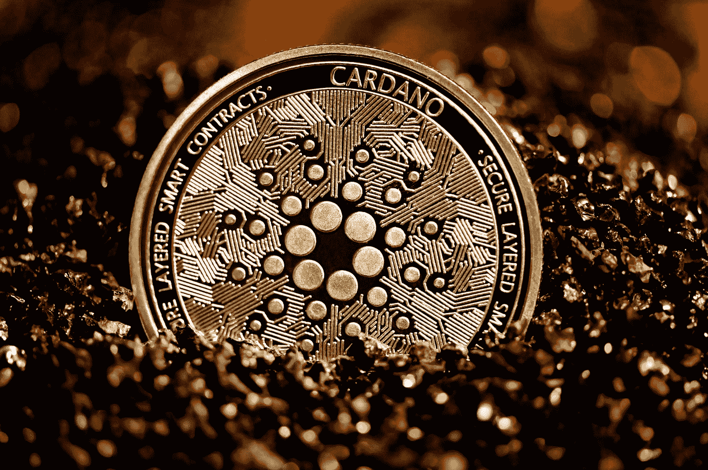
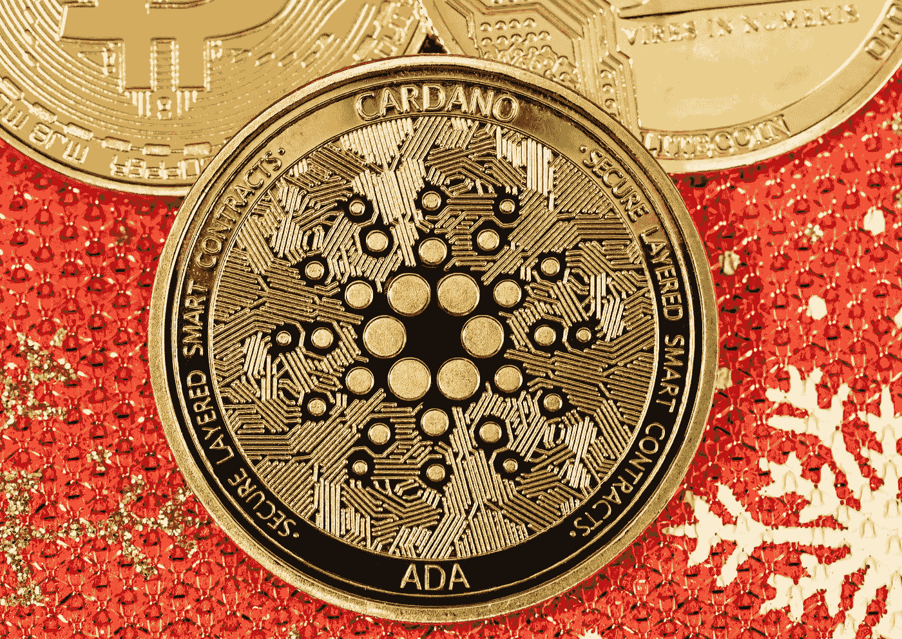

# 卡尔达诺的 ADA 令牌成为全球第三大加密货币(2021 年 8 月 27 日)

> 原文：<https://medium.com/coinmonks/cardanos-ada-token-becomes-the-third-largest-cryptocurrency-globally-aug-27-2021-5deeee4f87a5?source=collection_archive---------38----------------------->

一种不太为人知的加密货币与卡尔达诺区块链挂钩，刚刚超越币安硬币，成为世界第三大加密货币，因为它试图利用最近分散金融的激增。

Cardano 的 ADA 价格在 2021 年 8 月 23 日达到 2.97 美元的新高，使其市场估值超过 840 亿美元，超过了除比特币(BTC)和以太坊(ETH)以外的所有竞争对手。

ADA 在去年增长了 1400%以上，因为它打算利用以太坊现在领先的新技术开发推出新的支付系统。

这些更新和主要变化将于 2021 年 9 月 12 日生效。专家预计，随着世界其他地区意识到这种加密货币的价值，它将继续升值。

Photo by [Kanchanara](https://unsplash.com/@kanchanara?utm_source=medium&utm_medium=referral) on [Unsplash](https://unsplash.com?utm_source=medium&utm_medium=referral)

# 什么是卡尔达诺(阿达)

以太坊的联合创始人之一查尔斯·霍斯金森(Charles Hoskinson)于 2015 年开始开发 Cardano，两年后它成功上市。卡尔达诺寻求并实现了以太坊替代品的地位。这两个系统都包括相同的应用程序，如智能合同。

Cardano 将自己视为以太坊的升级版，并被称为第三代加密货币，与以太坊一起被视为第二代加密货币。Cardano 还打算在未来提供银行服务。

Cardano 是一个区块链平台，作为一个分散的应用程序(DApp ),具有多资产分类账和智能合同。卡尔达诺的数字货币以阿达·洛芙莱斯的名字命名，她是一位 19 世纪的伯爵夫人和英国数学家，被广泛认为是第一个计算机程序员。

根据管理层的说法，Cardano 正在分五个阶段建设:基础、分权、智能合同、扩展和治理。它是基于大毒蛇的利害关系证明协议。卡尔达诺基金会、IOHK 和 EMURGO 经营和发行卡尔达诺。

## 大规模反弹背后的原因

即将到来的“阿隆佐”更新是这种积极情绪的主要驱动力。开发团队在 Twitter 上宣布，公共测试网将很快推出。据投资者称，定于 9 月 12 日发布的最新升级版预计将改变游戏规则。

卡尔达诺被称为“以太坊黑仔”，其市场价值是索拉纳的四倍，但实际应用却很少。另一方面，日本监管机构已经允许 Cardano 在该国的交易所上市。这一判决被强调为间接尽职调查和合规的一个例子。

## 什么是智能合约？

Photo by [Pierre Borthiry](https://unsplash.com/@peiobty?utm_source=medium&utm_medium=referral) on [Unsplash](https://unsplash.com?utm_source=medium&utm_medium=referral)

智能合同是一种自动执行的合同，由买方和卖方之间的协议条件组成，直接编码成代码行。代码规范执行，所有交易都是可追踪和不可逆转的。

智能合同使交易和协议能够在各方之间匿名进行，而不需要中央机构、法律系统或外部执行机制。

## 为什么智能合约很重要？

Cardano 并不是唯一一个竞相建立智能合约功能以吸引 Defi 和其他平台的加密货币。其他几个区块链网络正试图尽快实现智能合约的目标，因为 Defi 系统每天都在创新高，目前的市值超过 1000 亿美元。

人们对智能合约中的区块链网络兴趣大增的另一个原因是，它为新参与者提供了很大的空间。目前，记录分散应用程序的以太坊组织和管理着 80%的 DApps。

由于人们已经预料到 Defi 系统将会淘汰大量成熟的行业，如赌博、借贷、贸易和许多其他行业，因此盈利的前景是巨大的。除此之外，分散式交易所、流动性开采、产量养殖和奖励平台的发展也在扩大增长潜力。

## 卡尔达诺的未来

Cardano 采用了谨慎而稳定的开发方法，但它实施了一些非常有效的方法，使其平台对世界其他地方非常有价值。根据团队的说法，他们认为在适当的测试和实现之后，事情将会走上正确的轨道。

Photo by [Quantitatives](https://unsplash.com/@quantitatives?utm_source=medium&utm_medium=referral) on [Unsplash](https://unsplash.com?utm_source=medium&utm_medium=referral)

这在加密货币市场上是不寻常的，因为大多数区块链技术更喜欢尽快发布他们的产品，然后提高他们的性能。从长远来看，Cardano 将更加安全可靠。霍金森从头开始创建 Cardano 的主要动机是克服第一批行动者比特币(BTC)和以太坊(ETH)经历的挑战。

以太坊目前控制了这项业务的很大一部分，但由于其处理速度缓慢和需求高，消费者可能会开始放弃它。在 Eth2 版本发布之前，人们将继续遭受其高额费用和网络拥塞的困扰。这就是 Cardano 的智能合同在允许公众使用他们的系统方面的用处。

> 加入 Coinmonks [电报频道](https://t.me/coincodecap)和 [Youtube 频道](https://www.youtube.com/c/coinmonks/videos)了解加密交易和投资

# 另外，阅读

*   [3 商业评论](/coinmonks/3commas-review-an-excellent-crypto-trading-bot-2020-1313a58bec92) | [Pionex 评论](https://coincodecap.com/pionex-review-exchange-with-crypto-trading-bot) | [Coinrule 评论](/coinmonks/coinrule-review-2021-a-beginner-friendly-crypto-trading-bot-daf0504848ba)
*   [莱杰 vs n rave](/coinmonks/ledger-vs-ngrave-zero-7e40f0c1d694)|[莱杰 nano s vs x](/coinmonks/ledger-nano-s-vs-x-battery-hardware-price-storage-59a6663fe3b0) | [币安评论](/coinmonks/binance-review-ee10d3bf3b6e)
*   [Bybit Exchange 审查](/coinmonks/bybit-exchange-review-dbd570019b71) | [Bityard 审查](https://coincodecap.com/bityard-reivew) | [Jet-Bot 审查](https://coincodecap.com/jet-bot-review)
*   [3 commas vs crypto hopper](/coinmonks/3commas-vs-pionex-vs-cryptohopper-best-crypto-bot-6a98d2baa203)|[赚取加密利息](/coinmonks/earn-crypto-interest-b10b810fdda3)
*   最好的比特币[硬件钱包](/coinmonks/hardware-wallets-dfa1211730c6) | [BitBox02 回顾](/coinmonks/bitbox02-review-your-swiss-bitcoin-hardware-wallet-c36c88fff29)