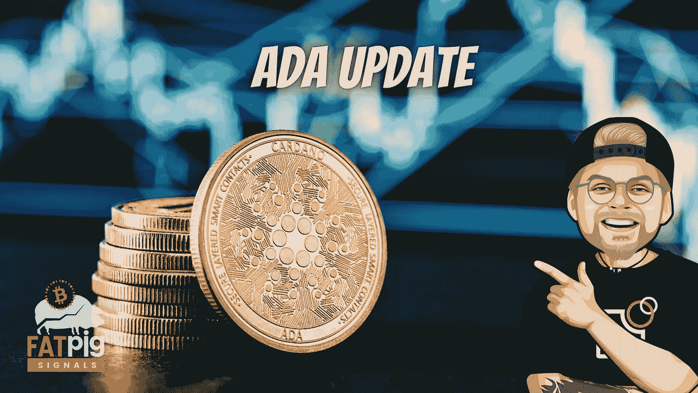

# 卡尔达诺的 DeFi 加速&周日 wap 今天开始

> 原文：<https://medium.com/coinmonks/cardanos-defi-picks-up-speed-sundaeswap-starts-today-89026a30a544?source=collection_archive---------5----------------------->

卡尔达诺再次引起关注。尤其是由于卡达诺股价的大幅上涨。这是因为在过去的几天里，它已经上涨了 30%以上。但 Altcoin 不仅性价比似乎不错。

根据 Messari 的数据，Cardano 在交易量上遥遥领先。它甚至领先于以太坊的 70.2 亿美元…