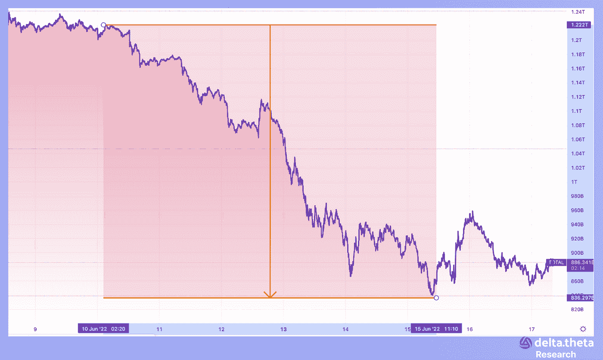

# 加密市场的大屠杀——每周评论

> 原文：<https://medium.com/coinmonks/carnage-at-crypto-markets-weekly-review-8d2eb11cedb3?source=collection_archive---------16----------------------->

将自上次发布以来的时间划分为两个阶段是有用的:6 月 6 日至 13 日和 6 月 13 日至 16 日。在第一阶段开始时，总加密市值指数为 1.274 万亿美元。该指数随后稳步下降，在第一阶段结束时达到 1.061 万亿美元。然后，在第二个时期，由于市场预期的急剧转变，该指数进一步暴跌至 8437 亿美元。在反弹至 9510 亿美元后，该指数在该时期结束时回落至 9000 亿美元以下。该指数一周下跌超过 30%。

比特币在上面提到的两个时期也有类似的轨迹。第一期开始时为 31 700 人，期末时降至 26 770 人。然后，在所有相同因素的影响下，数字黄金的价格暴跌至 20 177。在从 20 000 点的基本面支撑位小幅“反弹”后，比特币在 21 000 点附近交易。

以太坊的价格运动从第一期的 1900 开始，最后跌到 1450。在第二阶段，资产价格暴跌至 1029 点。第二期结束，以太坊一直在 1100 水平附近交易。

# 新闻

美国美联储[将其利率](https://www.theblock.co/linked/152448/circle-announces-new-euro-backed-stablecoin?utm_source=rss&utm_medium=rss)上调至 1.5%-1.75%，相当于上调 75 个基点。美联储表示，它还打算继续削减资产负债表。根据高盛(Goldman Sachs)的数据，交易员预测今年年底之前的区间为 3.25%-3.5%，这意味着货币政策收紧的速度将异常迅速和艰难。此举旨在对抗几十年来的高通胀。美联储此举代表了自 20 世纪 90 年代初以来的最高利率。会议结束一小时后，比特币(BTC)的交易价格约为 21 444 美元，高于决定宣布时的 21 076 美元。

加密贷款公司 Celsius [表示，它将暂停从其平台](https://www.bloomberg.com/news/articles/2022-06-15/celsius-withdrawal-freeze-is-crypto-s-latest-crisis)的提款，理由是市场条件极端。截至 5 月，亚历克斯·马辛斯基领导的公司拥有约 120 亿美元的资产和 170 万用户。在给客户的一份报告中，Celsius 补充道:“由于极端的市场条件，我们今天宣布，Celsius 暂停所有提款……我们今天采取这一行动，是为了使 Celsius 处于最不脆弱的地位，以便随着时间的推移履行其提款义务。”Celsius 的原生代币 Celsius token 价格受此消息影响大幅下跌，下跌 45%至每单位 0.21 美元。

比特币基地将裁员约 18%(超过 1000 人)，以度过加密货币市场的低迷期。首席执行官布莱恩·阿姆斯特朗表示，有必要“在经济低迷时期确保我们的健康”。他还表示，比特币基地发展太快，而且“招人过多”。该公司约有 5000 名员工，其中约 1100 人将被解雇。被裁员的员工将获得至少 14 周的遣散费，超过一年的每工作一年，将额外获得两周的遣散费，如果他们居住在美国，将获得 4 个月的医疗保险，4 个月的心理健康支持，并可以进入比特币基地的人才中心。比特币基地估计，与员工遣散费和其他解雇费相关的总重组成本在 4000 万至 4500 万美元之间。

美元硬币(USDC)发行商 Circle Internet Financial 随着[发行新的与欧元挂钩的稳定硬币](https://www.theblock.co/linked/152448/circle-announces-new-euro-backed-stablecoin?utm_source=rss&utm_medium=rss)而扩张。欧元硬币将于 6 月 30 日开始发售。新的稳定币将是一种“受监管的、欧元支持的稳定币，在相同的全额储备模式下发行，并建立在信任、透明和安全的相同支柱上，这些支柱使 USDC 成为世界上最受信任的数字货币之一”。一开始，欧元将作为 ERC-20 代币在区块链以太坊发行，然后将增加对其他区块链的支持。

# 期权市场条件

上周五通胀数据公布后，美联储面临来自统计数据的额外压力，被迫公开承认其对短期高通胀的错误预期，并将利率上调 0.75 个百分点。在利率决定发布之前，空中近中心执行利率的预期波动率超过 300%，为期权卖方提供了巨大的机会——溢价金额在两天内超过 4%。

*一个交易所交易记录的例子。*

在这种背景下，比特币和以太衍生品的交易量大幅增加，并创下年度新高。

根据 laevitas analytical service 的数据，比特币期权的日交易量超过 11 亿美元，其中以看跌期权为主。而以太坊的交易量超过 6 亿美元，且比例有利于看涨期权。今年区块链共识的预期变化，以及转向能耗较低的股权证明算法，支撑了对看涨期权的需求。

8 月份的期权价值 1.4 亿英镑(当天上涨 40%)，是会后交易量最大的。执行日期为 7 月 1 日的每周期权交易也很活跃——对比特币和以太的总兴趣超过 2.5 亿，一天内增加了 24%。

美联储会议和监管机构立场的变化对市场产生了重大影响，无论是传统货币还是加密货币。加息周期目前尚未确定。尽管口头声明，但最终决定受到新出现的统计数据的压力，可能会在最后一刻改变。市场动荡加剧，加密资产被宏观经济议程所挟持，失去了自主性和增长动力。在短期内，我们应该预计风险水平的重新评估和波动性的增加，这可能导致短期价格的大幅飙升。

# 货币市场——有经验的加密用户的扩展

我们的团队决定在每周报告中增加一个新的专栏——“货币加密货币汇率”。这些信息将使我们能够比较获得“有机”回报的不同方式之间的稳定币收益——向分散交易所、分散存款提供流动性，或通过出售期权(每周期限、中央罢工、通过看跌期权的稳定币、通过看涨期权的 ETH/BTC)时注入流动性。

> 加入 Coinmonks [电报频道](https://t.me/coincodecap)和 [Youtube 频道](https://www.youtube.com/c/coinmonks/videos)了解加密交易和投资

# 另外，阅读

*   [瓦济里克斯 NFT 评论](https://coincodecap.com/wazirx-nft-review)|[Bitsgap vs Pionex](https://coincodecap.com/bitsgap-vs-pionex)|[Tangem 评论](https://coincodecap.com/tangem-wallet-review)
*   [如何使用 Solidity 在以太坊上创建 DApp？](https://coincodecap.com/create-a-dapp-on-ethereum-using-solidity)
*   [币安 vs FTX](https://coincodecap.com/binance-vs-ftx) | [最佳(SOL)索拉纳钱包](https://coincodecap.com/solana-wallets)
*   [如何在 Uniswap 上交换加密？](https://coincodecap.com/swap-crypto-on-uniswap) | [A-Ads 审查](https://coincodecap.com/a-ads-review)
*   [加密货币储蓄账户](/coinmonks/cryptocurrency-savings-accounts-be3bc0feffbf) | [YoBit 审核](/coinmonks/yobit-review-175464162c62)
*   [Botsfolio vs nap bots vs Mudrex](/coinmonks/botsfolio-vs-napbots-vs-mudrex-c81344970c02)|[gate . io 交流回顾](/coinmonks/gate-io-exchange-review-61bf87b7078f)