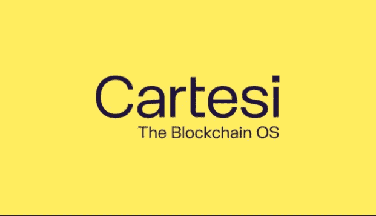
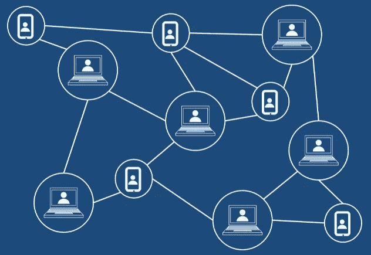
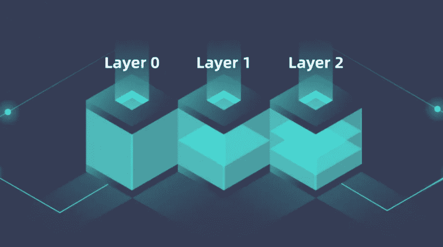
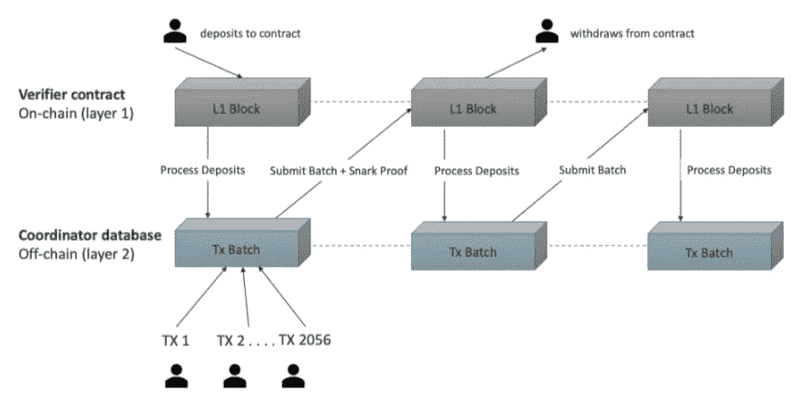

# 卡特西:区块链层、共识和汇总

> 原文：<https://medium.com/coinmonks/cartesi-blockchain-layers-consensus-and-rollups-9fc1073d3a9f?source=collection_archive---------30----------------------->

如果你进入加密世界已经有一段时间了，你可能会从你喜欢的加密新闻来源中听到这些术语，但是你可能不知道它们是什么以及为什么重要。如果你不知道，那就继续读下去，这样你就能对它们有所了解。

# 共识算法

共识算法是任何区块链的关键特征之一，没有它们，运行区块链的计算机就不能在存储块上达成一致，因此我们将只有一个普通的数据库。

共识算法可能很复杂，但其基础是区块链(又名验证器)的每台计算机必须遵循的一组规则，以便挖掘和存储网络接收的块。分布式系统(如区块链)不依赖于每个人都作为真理的单一来源而遵循的中央权威，网络的所有成员只需遵循来自该来源的指令，因此网络的工作很简单；但这种集权带来了一些问题，如腐败、垄断、审查、封闭或缺乏弹性，这就是为什么区块链分权是一种颠覆性的技术。相反，分布式系统需要与网络的大多数节点达成共识，为了采取行动，节点需要确保这些行动是正确的，而不是采取网络中恶意行为者引入的任何不良行动。网络中的每个节点都不知道网络中其他成员接收到的动作/信息是真是假，因此它们通过与网络中的大多数成员就该做什么达成协议来与网络中的其他成员协调(你可以阅读[拜占庭将军问题](https://en.wikipedia.org/wiki/Byzantine_fault)来更好地理解这个问题)。这就是共识算法的作用。

共识算法的一些类型是:

*   工作证明(PoW):基于证明提供给网络的信息的真实性所需的大量计算工作。已经被证明是非常安全的，但是也是缓慢和高能耗的。由第一代区块链网络使用，如比特币、以太坊或 Kadena。
*   赌注证明(PoS):基于作为真实性证明的验证者赌注(锁定令牌)的数量，验证者拥有的赌注越多，就越可信。已经被证明是非常快速和非常低的能量消耗，但是不像工作证明那样安全。二代区块链用的像以太坊 2、[卡特西](https://cartesi.io/)、近、波尔卡多、雪崩、埃尔隆德等。
*   其他类型的共识:索拉纳使用的历史证明(PoH)，以及更倾向于私人区块链的权威证明(PoA)。

# 区块链层

区块链首先是作为一个独立的层构建的，但也可以由一个位于另一个之上的不同层构建。这些层一起用于形成更复杂的区块链生态系统，提供改进的连通性、功能和可扩展性。

*   L1:这是区块链的最初实现，也是大多数人所知的区块链。可以作为独立网络部署和工作。一些例子是:比特币，以太坊，索拉纳，卡尔达诺，附近，埃尔隆德，幻影等。
*   L0:是位于 L1 层之下的一层，旨在互连不同的区块链，以便它们可以在所有互连的网络之间来回发送指令。最著名的例子是:波尔卡多特，宇宙，或雪崩。
*   L2:是位于 L1 层之上的一层，主要用于提供更强大的应用功能和提高事务处理速度。一些例子有: [Cartesi](https://cartesi.io/) ，Lighting Network(比特币)，Polygon，Skale 等。

也许未来会出现新的区块链层，但是现在这些是形成大多数项目的层。

# L2 和汇总

正如我们在上一节提到的，L2 区块链如[卡特西](https://cartesi.io/)可以提供更强大的功能，并显著提高 L1 区块链的交易速度。事情是这样的，L2·区块链与 L1·区块链一起工作，所以用户与 L2·区块链而不是 L1 互动，L2 区块链负责与 L1 区块链互动。因此，用户可以获得与 L2 更好的功能和规格进行交互的更好体验，但他们的数据最终会存储在 L1，因此可以获得两方面的好处:更好的功能、更快的交易速度和强大的安全性。

**但是，什么是汇总？**

Rollups 是一种 L2 机制，最初是为以太坊提出来缓解其可伸缩性问题的。简而言之，L2 区块链收到的交易被汇总，然后分批提交给 L1 区块链，因此每笔交易支付的费用要低得多。另外，当事务被发送到 L2 时，这一层可以非常快地向用户确认事务已经被正确地完成，并且随后 L2 透明地处理 L1 上的完成，因此用户获得比直接处理 L1 快得多的事务速度。

有两种主要类型的汇总:

*   乐观汇总:假设事务是正确的，事务被发送到乐观智能契约，并成批提交它们，而不执行任何计算，并提供很大的可伸缩性改进。如果检测到欺诈交易，rollup 执行所谓的欺诈证明，并使用第 1 层上可用的数据运行正确的交易计算。
*   零知识总结(ZK):这种方法可以生成加密证据，用于证明交易的有效性。每批交易都有自己的“有效性证明”,提交给主链。因为 ZK 需要生成加密证明比乐观汇总慢，但不需要争议机制来恢复欺诈交易。

# 乐观向上的 L2·区块链

Cartesi 是连接到以太坊的 L2 区块链(也可以连接到✌).的其他网络)Cartesi 使用利益证明(PoS)一致算法，正因为如此，每秒钟的交易量比以太坊本身多得多。除此之外， [Cartesi](https://cartesi.io/) 实现了一种乐观的累积机制，使用户能够以更低的成本与以太坊网络互动。

**简而言之，** [**Cartesi**](https://cartesi.io/) **为实现运行在以太坊…或其他网络上的 Web3 应用提供了高交易速度、低交易费用和极大的安全性。**

此外, [Cartesi](https://cartesi.io/) 在开发区块链应用程序时为您带来了 Linux 操作系统的强大功能。为了了解在 dApps 中使用 Linux 意味着什么，请阅读我们以前关于这个主题的文章，并了解 [Cartesi](https://cartesi.io/) 在这个生态系统中的真正潜力。

[文章:什么是 Cartesi，它是如何工作的，以及一些用例。](https://blockscope.medium.com/what-is-cartesi-how-it-works-and-some-use-cases-727a26b89175)

[文章:dApp 开发如何受益于 Cartesi？](https://blockscope.medium.com/how-dapp-development-benefits-from-cartesi-4b06d269ddfb)

想了解更多关于该项目的信息，请不要犹豫，访问卡特西网站和交流渠道。

 [## cartesi——第一个去中心化的安全区块链操作系统

### Cartesi 是第一个区块链 OS。它允许开发人员用 Linux 和标准的…

cartesi.io](https://cartesi.io/)  [## 卡特西

### Cartesi 是区块链上的第一个操作系统，他们的第二层解决方案集成了 Linux 和标准编程…

medium.com](https://medium.com/cartesi) 

> 加入 Coinmonks [电报频道](https://t.me/coincodecap)和 [Youtube 频道](https://www.youtube.com/c/coinmonks/videos)了解加密交易和投资

# 另外，阅读

*   [Bookmap 点评](https://coincodecap.com/bookmap-review-2021-best-trading-software) | [美国 5 大最佳加密交易所](https://coincodecap.com/crypto-exchange-usa)
*   最佳加密[硬件钱包](/coinmonks/hardware-wallets-dfa1211730c6) | [Bitbns 评论](/coinmonks/bitbns-review-38256a07e161)
*   [新加坡十大最佳加密交易所](https://coincodecap.com/crypto-exchange-in-singapore) | [购买 AXS](https://coincodecap.com/buy-axs-token)
*   [红狗赌场评论](https://coincodecap.com/red-dog-casino-review) | [Swyftx 评论](https://coincodecap.com/swyftx-review) | [CoinGate 评论](https://coincodecap.com/coingate-review)
*   [投资印度的最佳密码](https://coincodecap.com/best-crypto-to-invest-in-india-in-2021)|[WazirX P2P](https://coincodecap.com/wazirx-p2p)|[Hi Dollar Review](https://coincodecap.com/hi-dollar-review)