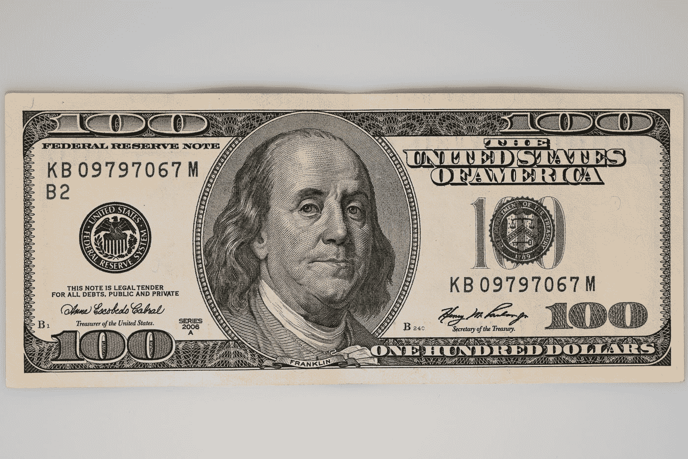
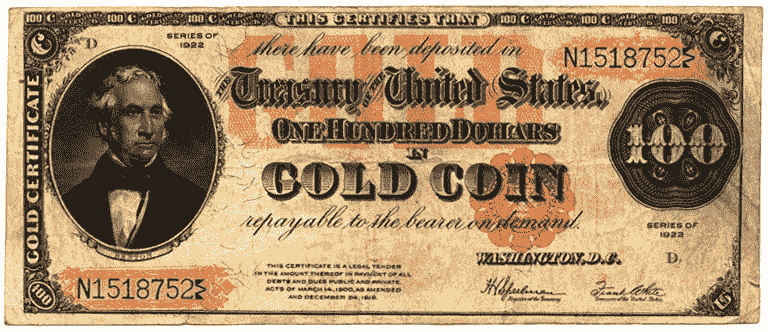
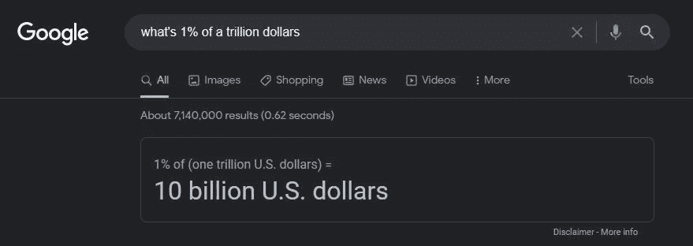
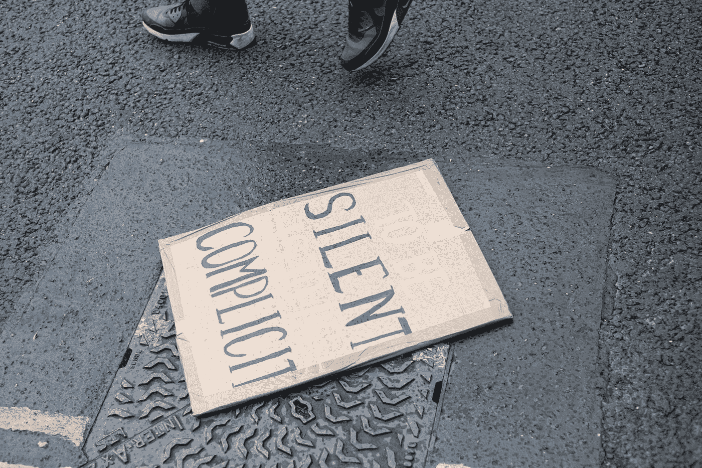

# 现金已死——为加密让路

> 原文：<https://medium.com/coinmonks/cash-is-dead-make-way-for-crypto-8fa2452aa8fe?source=collection_archive---------55----------------------->

## 叫[量化宽松](https://en.wikipedia.org/wiki/Quantitative_easing)，也不管用。

> “我认为，对我们的自由来说，银行机构比常备军更危险……”——托马斯·杰斐逊

Photo by [Bermix Studio](https://unsplash.com/@bermixstudio?utm_source=medium&utm_medium=referral) on [Unsplash](https://unsplash.com?utm_source=medium&utm_medium=referral)

## 美元没有任何支撑

如果你仔细阅读，你会看到小字是这样写的:

> "这张钞票是法定货币."

Photo by [engin akyurt](https://unsplash.com/@enginakyurt?utm_source=medium&utm_medium=referral) on [Unsplash](https://unsplash.com?utm_source=medium&utm_medium=referral)

法定货币只是另一种说法——*如果你也相信，我就相信这是一种交换手段。*

然后这个系统完全由信念支撑，没有其他。美元被贬得一文不值。带着印记什么的。就像巫术一样。你把这个咒语交给别人，他们现在就在你的咒语之下，听从你的命令。

## 这是美国银行纸币过去常说的话:

Photo: [Public Domain](https://upload.wikimedia.org/wikipedia/commons/1/17/Us-gold-certificate-1922.jpg).

你可以走进银行，把这张钞票换成实物黄金。如果你现在尝试那样做，银行会笑的。

## 金本位制的取消扼杀了美元

这给了私有化公司美联储银行通过量化宽松无限印钞的机会。

它的工作方式很简单:你一直在印大量的钱。

每当有经济困难的时候。任何有猜测的时候。每当有恐惧的时候。

然后你不允许任何人审计美联储。然后你印了很多钱，当人们没看见的时候。你把它抽到那里，给美国政府利息。没有美国人民的同意。

这造成了一种经济好转的感觉。暂时的。唯一的问题是，这会导致通货膨胀，进而导致失业。这导致了严重的贫困。全国范围内。

据推测，新冠肺炎促使美联储印刷了超过 20 万亿美元的“救济基金”利率为 1%。

让谷歌来计算吧。

Photo taken from Google by author.

仅 T4 一项，美联储就从新冠肺炎救助中获利 2000 亿美元。

你认为谁应该偿还这笔利息？

The answer is right here, folks. And what a relief for the Fed. After printing all that money.

你注意到油价高得令人难以置信了吗？

你有没有注意到你不能像以前那样购买食品杂货了？

你注意到汽车价格上涨了吗？

你有没有注意到自从 Y2K 以来，你的工资一直保持不变？

Photo by [Ehimetalor Akhere Unuabona](https://unsplash.com/@theeastlondonphotographer?utm_source=medium&utm_medium=referral) on [Unsplash](https://unsplash.com?utm_source=medium&utm_medium=referral)

## 每次你需要的东西价格上涨，你的工资就会下降

仅仅是比较而言。

你已经很多年没有加薪了。但美联储做到了。政府有。公司已经。他们以人类为食。那意味着你被降职了。除非你大声说出来。或者离开激烈的竞争。

## 这台机器继续靠穷人为生

普通美国人在一天结束时，在考虑所有税收后，包括你为产品本身支付的税收，在你工资的 18%留作税收后，你为一切支付大约 50%的税。

你正在努力把你一半的钱给一个一点也不关心你的系统。

那让你有什么感觉？

## 问问 2009 年投资比特币的人吧

他们会告诉你，他们很高兴能控制自己的钱，而且钱不在银行手里。他们现在富有了。因为他们相信更好地使用他们的钱，而不是把钱交到一个非常强大的网络手中，这个网络的人真的一点也不关心人类。

Photo by [Pierre Borthiry](https://unsplash.com/@peiobty?utm_source=medium&utm_medium=referral) on [Unsplash](https://unsplash.com?utm_source=medium&utm_medium=referral)

## 加密货币让控制权回到你手中

你会因此得到奖励，赌上你的硬币。

 [## 股份池委托

### ada 持有人可以通过两种方式获得回报:将他们的股份委托给其他人管理的股份池，或者…

cardano.org](https://cardano.org/stake-pool-delegation/) 

## 以下是开始的方法

去一个像币安或者 T2 比特币基地这样的加密交易所，买一些比特币。然后买一些选择的代用币。我坚信[卡达诺](http://www.cardano.org)。

## 待久一点

不要犯很多人犯的错误，认为密码是一个泵和转储，快速致富的计划。这些人来自华尔街，他们对此一无所知。他们造成了大部分的波动。避免这一切的方法是买一些硬币，然后把它留下。

立桩。它会随着时间的推移而增加，在 5-10 年的时间里你会积累很多。取决于你买多少。

仅仅是赌注池奖励，你就能获得大约 6%的回报。你在世界上其他任何地方都找不到。

## 这里有一个关于加密的精彩介绍给那些对它一无所知的人

这是查尔斯·霍金森写的，他是卡尔达诺的创始人，以太坊的联合创始人。

现在投资，确保您的海滨退休生活。

*好好思考。感觉很好。好好活着。*

*-W.V .卡尔顿*