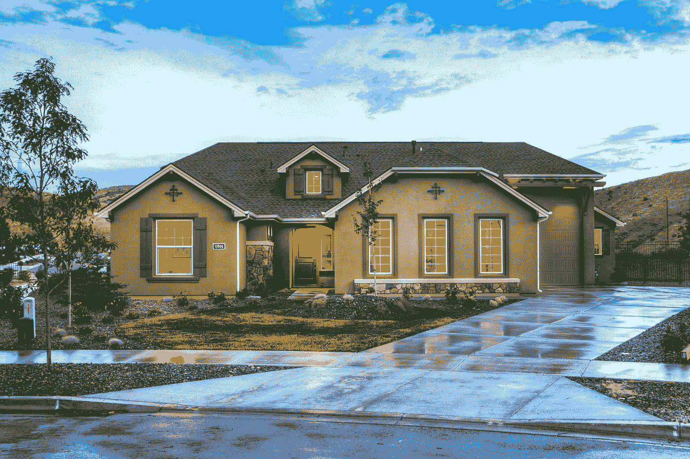

# 套现再融资

> 原文：<https://medium.com/coinmonks/cash-out-refinance-31f9d700bf1a?source=collection_archive---------46----------------------->

# 什么是套现再融资？

你知道你可以用新的抵押贷款代替旧的抵押贷款，即使新的抵押贷款比你现有的贷款数额更大吗？这就是所谓的套现再融资，它被用来帮助借款人使用他们的房屋抵押贷款来获得一些现金。

# 套现再融资是如何运作的？

*   找一个愿意和你合作的贷款人。向他们提交任何必要的文件。
*   贷方将评估以前的贷款条件，偿还贷款的余额，以及你的信用状况。
*   贷方在进行承销分析后给你一个报价。
*   如果你想继续提供，你得到一个新的贷款，还清你目前的贷款，并锁定你到一个新的每月付款计划。

你也可以套现再融资投资物业。它的工作方式与主要住宅的再融资相同:

*   以投资房产的价值申请一笔新的贷款。
*   还清贷款的现有余额。
*   差额由你用现金支付。
*   把现金用在你想做的任何事情上，无论是购买另一处投资房产，对房产进行改造，还是把现金留在手头。

# 套现再融资案例研究

斯卡莱特和她的新婚丈夫阿卡什一直在攒钱买房。他们已经存了大约 10 万美元。他们获得 40 万美元的抵押贷款，购买 50 万美元的房屋。随着时间的推移，他们没有像预期的那样迅速还清抵押贷款，仍然欠着大约 40 万美元。好消息是市场强劲，他们的房产价值没有跌破 50 万美元。他们还对房屋进行了大量改进，并获得了价值 10 万美元的房屋净值。Scarlette 和 Akash 希望利用低利率和再融资，因此他们与贷款人进行了交谈，并获得了一笔新贷款，贷款额为他们房屋当前价值的 80%(60 万美元)。

如果你想知道他们为什么想再贷款 120，000 美元，那是因为他们打算利用套现再融资，以现金形式获得股权。他们可以选择将这些现金用于当前的抵押贷款，以减少债务，或者用这些钱来建造更多的房屋进行改善(也许是一个里诺厨房)，甚至购买一处投资性房产。

# 底线

套现再融资是一种帮助人们获得现金的技术，方法是获得一笔价值高于其先前抵押贷款余额的新抵押贷款，并以现金形式向他们支付差额。问题是，采用这种策略的人通常必须为他们新的套现抵押贷款支付更高的利率。由贷款人根据个人的信用状况、银行标准和房产的贷款价值比来决定一个人能得到多少现金。

> 加入 Coinmonks [电报频道](https://t.me/coincodecap)和 [Youtube 频道](https://www.youtube.com/c/coinmonks/videos)了解加密交易和投资

# 另外，阅读

*   [Coldcard 评论](https://coincodecap.com/coldcard-review) | [BOXtradEX 评论](https://coincodecap.com/boxtradex-review)|[uni swap 指南](https://coincodecap.com/uniswap)
*   [比特币基地评论](/coinmonks/coinbase-review-6ef4e0f56064) | [德里比特评论](/coinmonks/deribit-review-options-fees-apis-and-testnet-2ca16c4bbdb2) | [FTX 评论](/coinmonks/ftx-crypto-exchange-review-53664ac1198f)
*   [Coinmetro 评论](https://coincodecap.com/coinmetro-review) | [VirgoCX 评论](https://coincodecap.com/virgocx-review)
*   [法国四大最佳加密副本交易平台](https://coincodecap.com/copy-trading-platforms-france)
*   [从 WazirX 切换到 CoinDCX 的 5 个理由](https://coincodecap.com/reasons-to-switch-from-wazirx-to-coindcx)
*   [联合国硬币评论](https://coincodecap.com/unocoin-review) | [最佳加密赌注硬币](https://coincodecap.com/best-crypto-staking-coins)