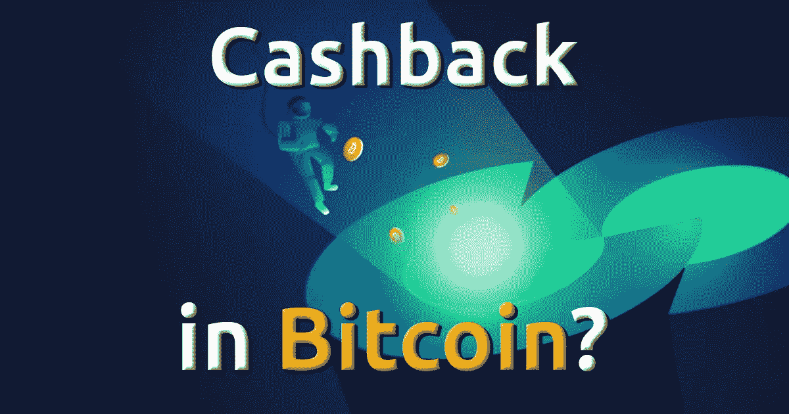
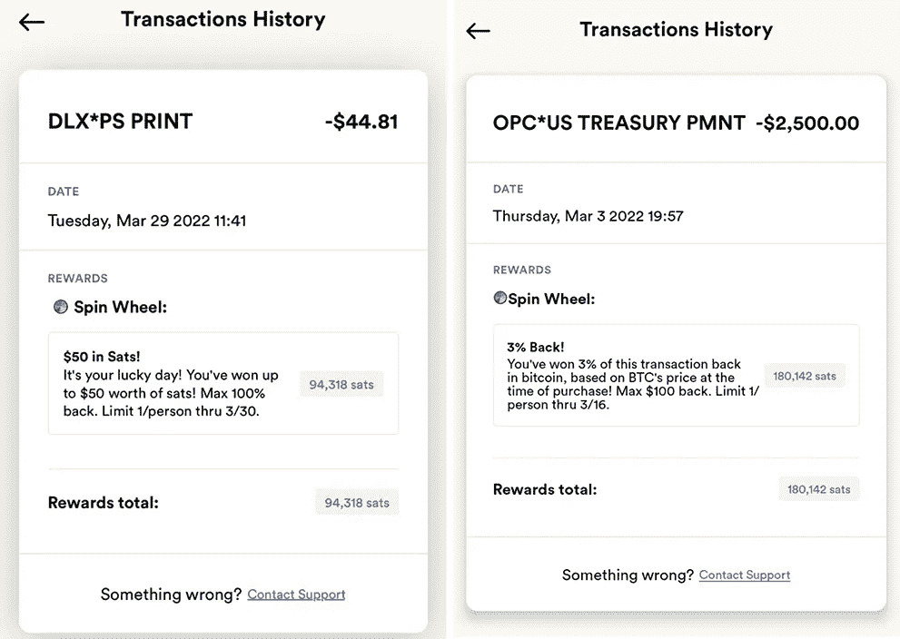
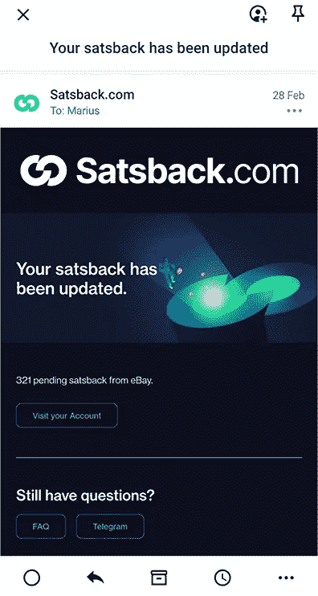
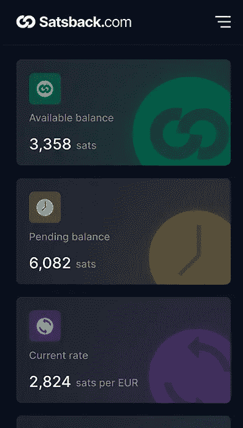
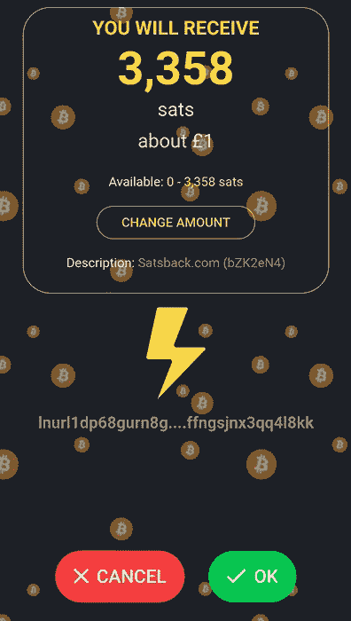

# 比特币返现？

> 原文：<https://medium.com/coinmonks/cashback-in-bitcoin-41bb60c6eb6f?source=collection_archive---------45----------------------->

在我看来，无论是谁想出了比特币返现的概念，都有点天才。

这是一种向人们介绍比特币的强大、智能和有趣的方式。

当使用信用卡消费时，人们已经习惯于获得现金返还、航空里程或其他奖励，但获得绝对稀缺的金钱奖励是完全不同的另一回事。

如果你在比特币 Twitter 上花了一些有意义的时间，并且你不像我一样住在美国，当你看到人们发布他们用 Fold 借记卡支付的返现和奖励时，你可能会遭受严重的 FOMO。

我的意思是，看看这些例子，告诉我你为什么不能得到 FOMO？说真的。

Rewards posted on Twitter by Fold debit card users

非常令人沮丧的是，我们这些美国以外的人不能像这些人一样，在支付日常支出时获得比特币的返现和奖励。

但事实是，我们可以，只是在较小的水平上，这仍然比什么都没有好，对吗？

让我快速向您介绍一下，在网上购物时，如何获得比特币返现。

**第一步**

首先，您需要注册 Satsback，可以使用下面的链接:

 [## 在网上购物时赚取免费比特币| Satsback.com

### Satsback 是现金返还和忠诚度奖励的演变-最简单和最安全的方式开始节省比特币…

satsback.com](https://satsback.com/register/1RMdZWrqBma6Q7vy) 

声明:第一年，注册我的链接的人购买的所有商品，我都会得到推荐奖励，而不会产生额外的费用。

**第二步**

注册 Satsback 后，登录您的帐户，点击右上角的三个栏，然后选择商店。

商店页面打开后，选择您的国家，然后使用搜索栏开始搜索您想要的商家。

如果你找不到你想要的商家，那么你有两个选择来找到一个与你要找的商家相似的商家。

您可以在搜索栏中输入您正在寻找的产品/服务(如服装或度假)，也可以按类别(如外出日或婴儿和儿童)对商家进行分类。

**第三步**

一旦你找到你想要的商家，点击他们，然后按下“现在用 satsback 购物”绿色按钮。

这将把你直接重定向到商家的网站，在那里你将像往常一样进行购买。

一旦你支付了你的购买，satsback 会通知你关于你的未决资金&会让你知道你的返现何时可以提取。

通常情况下，至少需要 2 周的时间，待定资金才可以提取。

这仅仅是因为 Satsback 等待商家确认你的订单没有被退回或退款，这才有意义。

您可以查看您的可用余额和待处理余额，方法是点击右上角的 3 行，然后选择“仪表板”。

Dashboard page on Satsback

一旦您的返现可以提取，您将在您的仪表板上看到，您所要做的就是，再次点击右上角的 3 行，选择支出，然后按下“支出”按钮。

然后，你必须等待几秒钟，等待 Satsback 生成发票，你可以选择用你的比特币闪电网络钱包复制或直接打开发票。

根据你使用的钱包，接受资金的屏幕看起来会略有不同，但你所要做的只是确认你即将收到的付款，瞧。

Receiving payment in Wallet of Satoshi

现在，这不像使用折叠借记卡那样有趣和有益，但是，如果你不能使用它，这真的比什么都没有要好。

但是，请想象一下，当您可以使用 Fold 借记卡，并通过 Satsback 从商家在线购物时，情况会是怎样？

如果你足够幸运，已经用 Fold 借记卡支付了东西，下次你需要在线购物时，为什么不通过 Satsback 在商家的网站上找到并使用 Fold 借记卡支付呢？

这是一些严重的 sat 奖励，因为你在网上购物的路上做了很少的额外工作。

用 DCA 押 sat 固然很好，但用比特币来奖励你本来会买的东西，感觉更有回报，至少对我来说是这样。

我希望你觉得这篇文章有趣并且有帮助，并且很高兴在你的比特币积累之旅中发现了另一个可以使用的工具。

如果你做了，一定要在这里关注我，并在下面留下评论，让我知道你是如何找到整个体验的，如果你最终尝试了它，我不明白为什么你不会。

感谢阅读！🧡

> 加入 Coinmonks [电报频道](https://t.me/coincodecap)和 [Youtube 频道](https://www.youtube.com/c/coinmonks/videos)了解加密交易和投资

# 另外，阅读

*   [Bitget 评论](https://coincodecap.com/bitget-review) | [双子星 vs BlockFi](https://coincodecap.com/gemini-vs-blockfi) cmd| [OKEx 期货交易](https://coincodecap.com/okex-futures-trading)
*   [AscendEx Staking](https://coincodecap.com/ascendex-staking)|[Bot Ocean Review](https://coincodecap.com/bot-ocean-review)|[最佳比特币钱包](https://coincodecap.com/bitcoin-wallets-india)
*   [霍比评论](https://coincodecap.com/huobi-review) | [OKEx 保证金交易](https://coincodecap.com/okex-margin-trading) | [期货交易](https://coincodecap.com/futures-trading)
*   [网格交易机器人](https://coincodecap.com/grid-trading) | [Cryptohopper 审查](/coinmonks/cryptohopper-review-a388ff5bae88) | [Bexplus 审查](https://coincodecap.com/bexplus-review)
*   [7 个最佳零费用加密交易平台](https://coincodecap.com/zero-fee-crypto-exchanges)