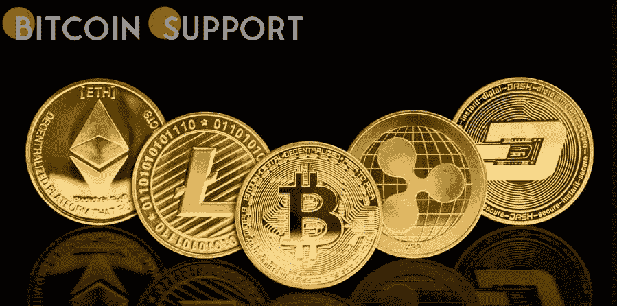

# 返现的未来:公司使用加密返现奖励购买信用卡

> 原文：<https://medium.com/coinmonks/cashbacks-future-companies-use-crypto-back-rewards-for-card-purchases-babfe3082036?source=collection_archive---------36----------------------->

**Visit our website:-** [**https://bitcoinsupports.com/**](https://bitcoinsupports.com/)

企业开始为信用卡交易提供加密货币支持优惠，从业务费用到每月订阅费不等。长期以来，信用卡和借记卡购物获得现金返还一直是信用卡用户的一项特权。然而，随着项目开始为购卡添加加密货币回馈奖励，加密货币已经进入了舞台。

BlockFi 于 2021 年发布了 Visa 支持的比特币奖励卡，以欢迎新用户进入加密行业。用户可以用比特币(BTC)获得 1.5%的回报，而不是用卡返现或里程。

同年，Venmo 实现了允许用户用他们的返现奖励购买加密货币的机制。“返现加密”是一种允许信用卡客户将其返现收入用于加密资产的计划，如 BTC、以太坊(ETH)、莱特币(LTC)和比特币现金(BCH)。一些企业开始跟随潮流，在传统的返现机制中加入新的加密奖励。让我们来看看两个已经开始为购卡提供加密货币奖励的项目。支付网络 Paystand 宣布推出一种带有加密奖励的商务支出卡。商家可以使用信用卡取回比特币，而不必兑换积分。当用户使用这种方法为他们的企业购物时，他们可以自动获得 BTC。Paystand 的首席执行官兼联合创始人杰里米·阿尔蒙德(Jeremy Almond)表达了他对新产品的兴奋之情。“我们相信区块链技术和加密货币是金融的未来，我们很高兴能够帮助企业参与数字经济并在其中发展，”他说。

2020 年，一家名为普路托斯的公司开始为耐克购买提供 3%的加密货币返还。最近，该公司表示，它正在扩大其加密回馈计划，以包括网飞，Spotify，Disney+等订阅的支付。

除此之外，公司透露隐背奖励将提高到 8%。这意味着当客户使用他们的卡进行购买时，他们会自动积累加密货币。

**访问我们的网站:-**[**https://bitcoinsupports.com/**](https://bitcoinsupports.com/)

**免责声明:以上为作者观点，不应视为投资建议。读者应该自己做研究。**

> 加入 Coinmonks [电报频道](https://t.me/coincodecap)和 [Youtube 频道](https://www.youtube.com/c/coinmonks/videos)了解加密交易和投资

# 另外，阅读

*   [Bookmap 点评](https://coincodecap.com/bookmap-review-2021-best-trading-software) | [美国 5 大最佳加密交易所](https://coincodecap.com/crypto-exchange-usa)
*   最佳加密[硬件钱包](/coinmonks/hardware-wallets-dfa1211730c6) | [Bitbns 评论](/coinmonks/bitbns-review-38256a07e161)
*   [新加坡十大最佳加密交易所](https://coincodecap.com/crypto-exchange-in-singapore) | [购买 AXS](https://coincodecap.com/buy-axs-token)
*   [红狗赌场评论](https://coincodecap.com/red-dog-casino-review) | [Swyftx 评论](https://coincodecap.com/swyftx-review) | [CoinGate 评论](https://coincodecap.com/coingate-review)
*   [投资印度的最佳密码](https://coincodecap.com/best-crypto-to-invest-in-india-in-2021)|[WazirX P2P](https://coincodecap.com/wazirx-p2p)|[Hi Dollar Review](https://coincodecap.com/hi-dollar-review)