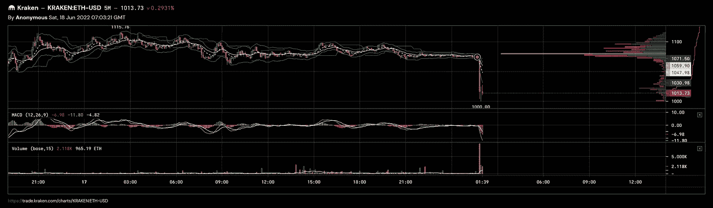

# 抓住一把落下的刀——这意味着退出市场——看跌

> 原文：<https://medium.com/coinmonks/catching-a-falling-knife-this-means-get-out-of-the-market-bearish-e56c143516b4?source=collection_archive---------41----------------------->

这是一个我有 80-90%现金的时期。我也该退出了。准备好，伙计们，这是经济衰退。我现在有敞开的短裤，我们可以看到更低的地方。18k，16k，我不知道——但是是的。

be shorting and/or go to cash folks, it’s going to get worse

看涨背离被打破了，就是这样。没有任何证据支持这一点。

so long, market. hello, recession!

> 加入 Coinmonks [电报频道](https://t.me/coincodecap)和 [Youtube 频道](https://www.youtube.com/c/coinmonks/videos)了解加密交易和投资

# 另外，阅读

*   [在美国如何使用 BitMEX？](https://coincodecap.com/use-bitmex-in-usa) | [BitMEX 回顾](https://coincodecap.com/bitmex-review)
*   [最佳期货交易信号](https://coincodecap.com/futures-trading-signals) | [流动性交易所评论](https://coincodecap.com/liquid-exchange-review)
*   [南非的加密交易所](https://coincodecap.com/crypto-exchanges-in-south-africa) | [BitMEX 加密信号](https://coincodecap.com/bitmex-crypto-signals)
*   [MoonXBT 副本交易](https://coincodecap.com/moonxbt-copy-trading) | [阿联酋的加密钱包](https://coincodecap.com/crypto-wallets-in-uae)
*   [雷米塔诺评论](https://coincodecap.com/remitano-review)|[1 英寸协议指南](https://coincodecap.com/1inch) | [购买 Floki](https://coincodecap.com/buy-floki-inu-token)
*   [MoonXBT vs Bybit vs 币安](https://coincodecap.com/bybit-binance-moonxbt) | [Arbitrum:第二层解决方案](https://coincodecap.com/arbitrum)