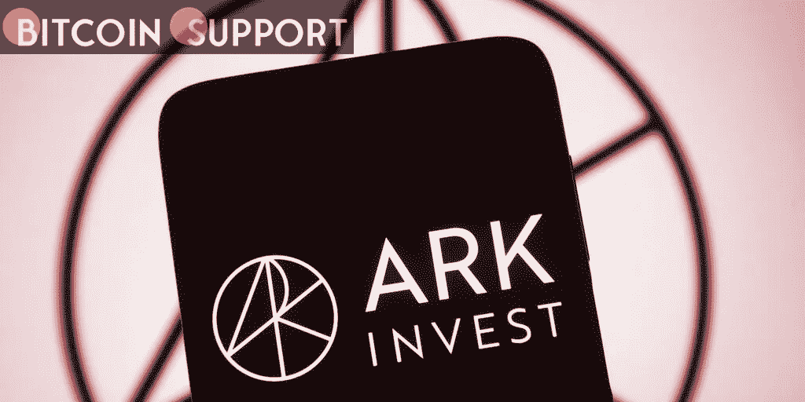

# 凯西·伍德(Cathie Wood)运营的 Ark Invest 已经从使用贝宝(PayPal)转向使用比特币友好型现金应用

> 原文：<https://medium.com/coinmonks/cathie-woods-ark-invest-abandons-paypal-in-favour-of-the-bitcoin-compatible-cash-app-eda36d1d600e?source=collection_archive---------43----------------------->

**Visit our website:-** [**https://bitcoinsupports.com/**](https://bitcoinsupports.com/)

伍德表示，Venmo 本质上是 Cash 应用的克隆，该应用的收入是 Venmo 的两倍多，同时拥有近一半的用户群。加密投资公司 Ark Invest 的创始人凯西伍德(Cathie Wood)出售了该公司所有的贝宝资产，并对利用比特币闪电网络的现金应用支付系统的长期增长表示出更高的信心。

伍德在 4 月 9 日结束的迈阿密比特币 2022 大会上讨论了她的公司的决定。

闪电网络(LN)是比特币的第二层解决方案，旨在使交易更快、更实惠。PayPal 的金融科技业务 Venmo 与 Block(之前是 Square)的现金应用直接竞争。https://twitter.com/milessuter/status/1513235434221944840

伍德在 4 月 8 日接受美国消费者新闻与商业频道采访时表示，她选择 Cash App 而不是 PayPal，是因为它更完整地整合了数字资产钱包。虽然 Venmo 已经开始接受比特币(BTC)，但她表示“它更多的是现金 App 的追随者。”

“我们经常押注于我们预期谁会赢……我们在风险规避阶段整合资产时选择了 Block 而不是 PayPal。”

Wood 接着表示，她的公司对 Cash App 的信心源于她所认为的有机用户开发，“与 Venmo 更自上而下的方法相反。”

Wood 认为，总的来说，散户投资者已经将加密货币市场驱动到了这一步，正如她所陈述的:

**“我相信大多数机构投资者目前并没有以最优的方式进行定位。零售在这方面真正起到了带头作用。”根据 app tracker Business of Apps 的数据，Venmo 目前拥有 7000 万用户，利润为 8.5 亿美元，而 Cash App 在 2021 年拥有 4400 万用户，利润为 20.3 亿美元。它们在创收潜力上的巨大差异，可能也是 Ark 对这两个品牌进行评估的一个因素。

由于 Ark Invest 对 Cash App 的乐观态度，其比特币产品负责人 Miles Suter 于 4 月 7 日宣布，美国用户将能够自动将其直接转账的一定比例投资于比特币。伍德是比特币的狂热支持者，她在采访中重申了自己的预测，BTC 将在 2030 年达到 100 万美元。

**访问我们的网站:-**[**https://bitcoinsupports.com/**](https://bitcoinsupports.com/)

**免责声明:以上为作者观点，不应视为投资建议。读者应该自己做研究。****

> 加入 Coinmonks [电报频道](https://t.me/coincodecap)和 [Youtube 频道](https://www.youtube.com/c/coinmonks/videos)了解加密交易和投资

# 另外，阅读

*   [加密货币储蓄账户](/coinmonks/cryptocurrency-savings-accounts-be3bc0feffbf) | [YoBit 审核](/coinmonks/yobit-review-175464162c62)
*   [Botsfolio vs nap bots vs Mudrex](/coinmonks/botsfolio-vs-napbots-vs-mudrex-c81344970c02)|[gate . io 交流回顾](/coinmonks/gate-io-exchange-review-61bf87b7078f)
*   [CoinFLEX 评论](https://coincodecap.com/coinflex-review) | [AEX 交易所评论](https://coincodecap.com/aex-exchange-review) | [UPbit 评论](https://coincodecap.com/upbit-review)
*   [AscendEx 保证金交易](https://coincodecap.com/ascendex-margin-trading) | [Bitfinex 赌注](https://coincodecap.com/bitfinex-staking) | [bitFlyer 点评](https://coincodecap.com/bitflyer-review)
*   [Bitget 回顾](https://coincodecap.com/bitget-review)|[Gemini vs block fi](https://coincodecap.com/gemini-vs-blockfi)cmd |[OKEx 期货交易](https://coincodecap.com/okex-futures-trading)