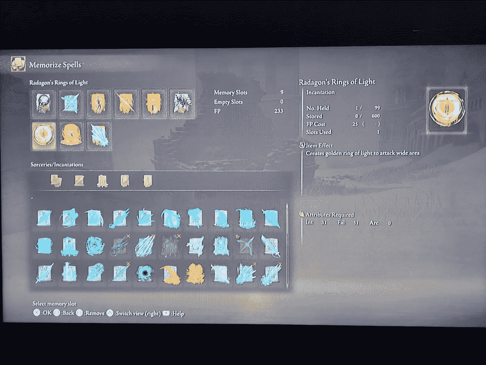

# 孤独的洞穴，狄奥多里克斯和其他接骨木戒指

> 原文：<https://medium.com/coinmonks/cave-forlorn-theodorix-and-other-bobbles-in-elden-ring-a91be5474233?source=collection_archive---------3----------------------->

我玩得非常开心！

好的，在我开始学习策略之前，我想花一点时间告诉你一些有用的咒语，我认为你应该拥有或掌握它们。

1.  拉达冈的光环，当你想接近敌人而又不想接近他们时，这很方便。我认为唯一的缺点是…