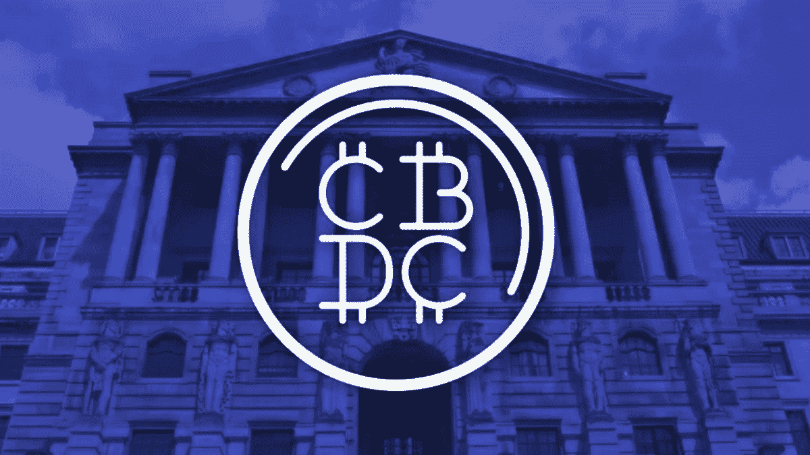

# CBDC 不适合我，也不应该适合你。

> 原文：<https://medium.com/coinmonks/cbdc-is-not-for-me-and-should-not-be-for-you-either-9a44dfca11b6?source=collection_archive---------14----------------------->

~dwulf

CBDC Central Bank Digital Currencies

为什么会有人想把他们的财富投资到 CBDC？那么什么是 CBDC 呢？中央银行数字货币是由中央银行发行的数字代币，类似于加密货币。心甘情愿地将自己的财富投入 CBDC，这纯粹是疯狂的行为，与 DeFi 和加密货币的去中心化背道而驰。

为什么它们是坏事？

首先，CBDC 帐户取消了用户的分散控制，并将这种控制转移给 CBDC 和任何控制 CBDC 网络的人(提示，不是你，用户)。

这尤其糟糕，因为 CBDC 控制着投入其中的所有财富的方方面面。复杂情况，如对财富的控制，包括对向特定钱包转账的限制，特别是对向不受第三方批准的保管人(不是用户)控制或监控的自我保管加密钱包转账的限制；转账的限制和上限，以适应不得转账超过 10，000 美元的旅行规则，对您可以将您的财富转移给谁的限制，任何和所有未授权的用户，他们没有 KYCed 并已向批准的第三方托管人交出他们的身份，同样不是您的用户，以及随意冻结、减少或擦除您的余额的能力。

老实说，我看不出把任何财富和隐私交给 CBDC 有什么好处，因为已经有分散的制度，允许一个人对自己的财富拥有完全的主权，而不需要或要求提交任何 KYC 身份证明。在区块链的世界里，这是关于认证而不是识别。

**这一切对 CBDC 来说都是坏事，还能有什么战略理由参与 CBDC 吗？**

我想不偏不倚，客观的回答这个。但我希望记录在案的是，我认为出于绝大多数原因，包括尤其是你的秘密或法定财富的完整性，与 CBDC 扯上关系是不明智的。

可能会有这样的情况，你可能会被迫携带一个 CBDC 账户，该账户授权 KYC/反洗钱，并对你在 CBDC 金库中持有的所有财富拥有绝对控制权。这可能是强加给你的，因为对于一个民族国家来说，签发刺激支票、退税或支付罚金更容易。如果情况确实如此，我会建议指定不超过 1%的秘密财富持有量，以便能够参与 CBDC 生态系统。我总是对启用 sudo 控制的闭门 CBDC 系统持怀疑态度。

其他 99%的密码都在国家的范围之外，在一个冰冷的、有空气间隙的硬件密码钱包里。把它们放在那里，保守秘密，保证安全。

这种策略将允许您遵守国家法令，同时仍然保持对您的大部分加密资产的控制和完整性。如果事情失去控制，或者你的 CBDC 账户被查封，你的大部分加密资产都将被冻结。

**解决办法是什么？**

既然你有选择权，那就干脆*退出*，*不参加*CBDC。已经有现成的解决方案，可以让你参与数字经济，同时让你对自己的资本拥有完全的主权。

比特币就是这样，在此基础上建立了其他几个可编程网络，如以太坊和波尔卡多特等等。

简单与你被允许拥有的控制和隐私水平成反比。如果一个加密解决方案是愚蠢的简单，那么它几乎可以保证拥有或控制你的加密元素。

在某些情况下，它必须控制您的加密，例如，集中式加密交换需要访问您的私钥来进行交换。一个很好的经验法则是进行兑换，并立即将硬币/代币从集中兑换处的钱包转移到你(且只有你)拥有私人钥匙控制权的钱包中。

不可否认，这需要更多的自律，请记住，直到你的硬币/代币被正式转移，它们都受到交易所的控制。所以大部分时间把你的大部分财富放在冷钱包里总是很重要的。

**结论**

知道 CBDC 是 100%可选的，目前。保持 Monero 和受控 Polkadot 验证器来建立您的冷钱包财富，是一个最佳的布局。如果一个人必须踏入 CBDC 世界，那就要小心翼翼地对待你可能会失去的财富。模仿 CBDC 的漂亮特征，并为 DeFi 项目(Acala、Astar、Nodle 等)建造它们。).

现在，比以往任何时候都更应该让所有用户成为他们自己 100%财富的纯粹主权者，不管是加密的还是法定的，而不是你的钥匙，不是你的硬币。

> 照顾好你的生意，否则生意会照顾你。

> *加入 Coinmonks* [*电报频道*](https://t.me/coincodecap) *和* [*Youtube 频道*](https://www.youtube.com/c/coinmonks/videos) *了解加密交易和投资*

# 另外，阅读

*   [顶级付费加密货币和区块链课程](https://coincodecap.com/blockchain-courses)
*   [MXC 交易所评论](/coinmonks/mxc-exchange-review-3af0ec1cba8c) | [Pionex vs 币安](https://coincodecap.com/pionex-vs-binance) | [Pionex 套利机器人](https://coincodecap.com/pionex-arbitrage-bot)
*   [如何在印度购买比特币？](/coinmonks/buy-bitcoin-in-india-feb50ddfef94) | [WazirX 评论](/coinmonks/wazirx-review-5c811b074f5b)
*   [联合国硬币评论](https://coincodecap.com/unocoin-review) | [最佳加密赌注硬币](https://coincodecap.com/best-crypto-staking-coins)