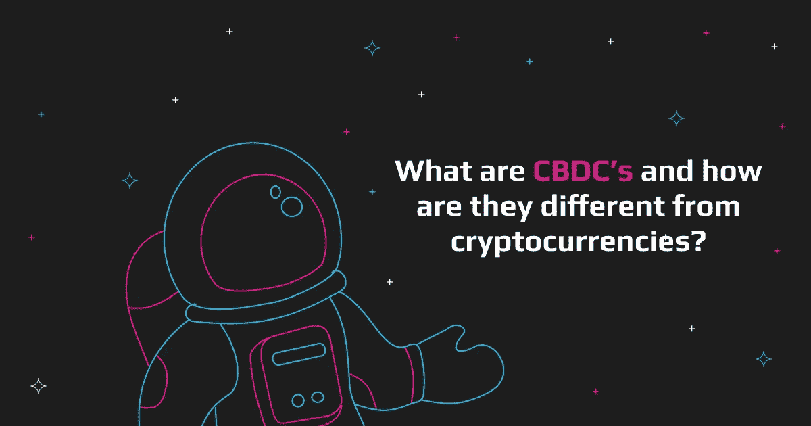
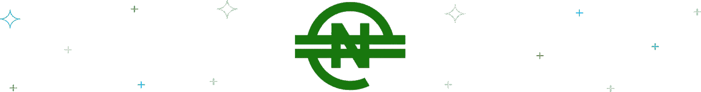
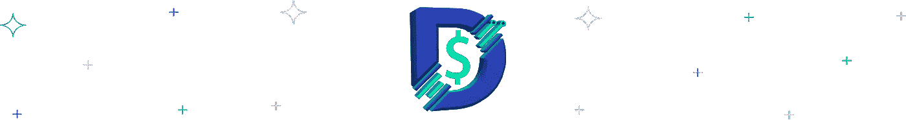
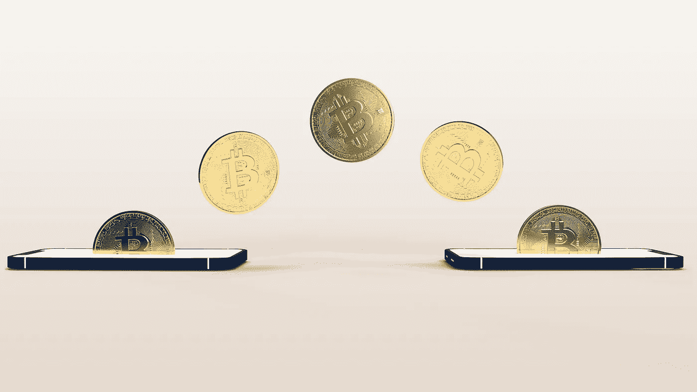

# CBDC 或中央银行数字货币:它们与加密有何不同？

> 原文：<https://medium.com/coinmonks/cbdc-or-central-bank-digital-currencies-how-do-they-differ-from-crypto-c3bd06793bb1?source=collection_archive---------27----------------------->

多年来，加密货币一直是头条新闻，但另一种类型的数字货币正在慢慢获得牵引力——CBDC，或中央银行数字货币。这些都是由国家中央银行创造的，并有可能在日常交易中使用。那么，它们与加密货币有什么不同呢？

# 什么是数字货币？

数字货币是一种以数字形式存在的货币。它类似于传统货币，但它没有硬币或纸币这样的实物形态。它通常存储在数字钱包中，可用于在线购买商品和服务。互联网为个人提供了跨境开展业务的能力，但货币体系仍有相当大的限制性。加密货币是数字货币的一种。他们使用加密技术来保护他们的交易，并控制新单位的创建。

# 数字货币是如何运作的？

数字货币是通过一个叫做挖掘的过程创造出来的。挖掘是验证交易记录并将其添加到称为区块链的公共分类账中的过程。矿工在区块链中验证和添加交易的工作会得到数字货币的奖励。交易完成后，它会被广播到运行数字货币软件的计算机网络中。然后，矿工们竞相核实并把交易加入区块链。第一个验证并添加交易的矿工将获得数字货币奖励。

为了理解数字货币是如何工作的，有必要考察一下区块链。区块链本质上是一个分散的分类账，管理网络上的每一笔交易。这个分类帐是分散的，因为它在网络上的所有计算机之间共享和维护。通俗地说，区块链是一个分布在计算机网络中的数字数据库，目的是确保数据的完整性。

存储在区块链上的数据是不可变的，这意味着它不能被更改。这是因为每个数据块都链接到前一个数据块，并且包含该数据块的加密哈希。如果数据块中的任何数据发生变化，该数据块的哈希也会发生变化。因为每个后续块都包含前一个块的散列，所以很明显有些东西被篡改了。

# 数字货币有多少种？

数字货币有三种类型:交易型、投资型和公用型。交易数字货币是用于购买商品和服务的货币。投资数字货币是指那些购买时打算持有以备未来价格升值的货币。公用事业数字货币是那些用于访问特定区块链应用程序的货币，如分布式云存储或社交网络。

最广泛使用的两种数字货币是比特币和以太坊。比特币是最初的数字货币，于 2009 年首次发行。以太坊于 2015 年推出，是一款支持智能合约的可编程区块链。目前有超过 18，000 种数字货币存在。

# 什么是央行数字货币？

由中央银行发行的数字货币。中央银行数字货币(CBDC)是法定货币的数字形式。中央银行发行的中央银行跟单信用证可用于电子支付。它们旨在结合法定货币和加密货币的最佳特征。CBDCs 被视为降低纸币印刷和流通成本的潜在途径。它们还可以让央行更容易实施货币政策。

CBDCs 作为一种支付手段已被世界上许多国家所接受。这些国家的中央银行发行了自己的中央银行跟单信用证，这是其各自管辖范围内的法定货币。

CBDCs 可以通过为人们提供一种新的交易方式来帮助经济发展。它们还有助于降低交易成本，提高交易速度。使用 CBDCs 也有助于降低银行成本，提高银行效率。

# 现有的数字货币

除了像比特币和以太坊这样受欢迎的加密货币，数百种其他数字货币也被创造出来。像 XRP，卡尔达诺，波尔卡多特和恒星这样的替代硬币，像 e-Naira 和 DCash 这样的 CBD，等等。

# 埃奈拉

e-Naira 是尼日利亚中央银行创造的一种数字货币，提供一种以 Naira 计价的独特货币形式。与现金支付相比，电子奈拉既是一种交换手段，也是一种价值储存手段，为零售交易提供了更好的支付前景。e-Naira 有一个独特的操作结构，使其有别于其他种类的央行货币。

电子奈拉是尼日利亚官方货币尼日利亚奈拉的电子版本。它的推出是为了减少国家对现金的依赖，促进金融包容性。电子 naira 可用于在线支付商品和服务费用，以及在银行账户间转账。尼日利亚的一些企业也接受这种支付方式。

# 沙美元

沙币是一种数字货币，由巴哈马中央银行于 2020 年 10 月推出。沙元旨在取代标准的巴哈马元。沙币可用于各种交易，由授权的金融机构发行。巴哈马的所有居民都可以通过移动应用程序或物理支付卡访问数字钱包。它的推出是为了提高支付的速度、效率和安全性。

# DCash

DCash 是东加勒比中央银行发行的数字货币。巴哈马群岛、多米尼加联邦、多米尼加共和国、格林纳达、牙买加、圣卢西亚、圣文森特和格林纳丁斯以及特克斯和凯科斯群岛都使用这种语言。东加勒比中央银行(ECCB)是东加勒比国家组织(OECS)成员国的货币管理机构。ECCB 的数字货币 DCash 是该地区最先进和最安全的电子支付系统之一，在 ECCB 设计的专有平台上运行。

source: unsplash.com

# 即将到来的数字货币

有许多数字货币正在开发中，并有可能在未来得到广泛应用。这些货币都有不同的特点和好处，使它们对用户有吸引力。

# 数字卢比

数字卢比是印度储备银行(RBI)提议发行的数字货币。它旨在减少经济中现金的使用，并促进数字支付。几年来，印度央行一直在研究发行数字卢比的可能性，但尚未决定是否发行。

# 电子克朗数字货币

克朗是瑞典政府为了取代现金而提出的数字货币。任何拥有瑞典银行账户和智能手机的人都可以使用它。瑞典央行将发行面向公众的克朗。

# 数码元

数字元是中国政府提议的数字货币。它也被称为电子元或人民币。数字元旨在取代实体元，它将与中国元挂钩。

# 数字卢布

数字卢布是俄罗斯政府提议的数字货币。它旨在作为一种国家货币和支付商品和服务的手段。数字卢布将由俄罗斯中央银行发行，并由俄罗斯联邦储备支持。

推出数字卢布是俄罗斯政府减少对美元和其他外币依赖计划的一部分。数字卢布将与现有的俄罗斯卢布一起使用，并可兑换成其他货币。

# 澳币稳定币

澳元稳定币是一种与澳元挂钩的数字资产。澳元稳定是由澳大利亚政府的充分信任和信用支持的。澳新银行集团(ANZ)与加密保管人 Fireblocks 合作，创造了一种与澳元挂钩的稳定货币，称为$ADC。

# 加密货币和数字货币有什么区别？

加密货币在很大程度上被定义为一种不需要任何中介的交换手段。这是因为(除了区块链之外)没有任何当局控制交易中使用的资金或管理该系统。另一方面，银行数字货币是去中心化的，但根本不是货币。

相反，它们旨在取代银行中的法定货币，因此被称为“数字货币”。与加密货币不同，银行数字货币不受波动性的影响，也不被用作价值储存手段。相反，它们被设计成一种支付手段，可以像法定货币一样用于购物或支付服务费用。

# 如何以最优惠的价格交换密码？

为了在交换密码时获得最佳价格，货比三家并比较不同交易所的价格是很重要的。考虑每个交易所收取的费用也很重要。一些交易所对所有交易收取固定费用，而另一些交易所则按交易额的一定百分比收取费用。考虑交易所的声誉也很重要。众所周知，有些交易所比其他交易所更可靠。如果你想要一个可靠的平台，在那里你可以以最好的价格交换你的密码，你应该尝试一下。您还可以在此查看这些受支持的交换机及其报价[。](https://swapzone.io/)

> 加入 Coinmonks [电报频道](https://t.me/coincodecap)和 [Youtube 频道](https://www.youtube.com/c/coinmonks/videos)了解加密交易和投资

# 另外，阅读

*   [3 商业评论](/coinmonks/3commas-review-an-excellent-crypto-trading-bot-2020-1313a58bec92) | [Pionex 评论](https://coincodecap.com/pionex-review-exchange-with-crypto-trading-bot) | [Coinrule 评论](/coinmonks/coinrule-review-2021-a-beginner-friendly-crypto-trading-bot-daf0504848ba)
*   [莱杰 vs n rave](/coinmonks/ledger-vs-ngrave-zero-7e40f0c1d694)|[莱杰 nano s vs x](/coinmonks/ledger-nano-s-vs-x-battery-hardware-price-storage-59a6663fe3b0) | [币安评论](/coinmonks/binance-review-ee10d3bf3b6e)
*   [Bybit Exchange 评论](/coinmonks/bybit-exchange-review-dbd570019b71) | [Bityard 评论](https://coincodecap.com/bityard-reivew) | [Jet-Bot 评论](https://coincodecap.com/jet-bot-review)
*   [3 commas vs crypto hopper](/coinmonks/3commas-vs-pionex-vs-cryptohopper-best-crypto-bot-6a98d2baa203)|[赚取秘密利息](/coinmonks/earn-crypto-interest-b10b810fdda3)
*   最好的比特币[硬件钱包](/coinmonks/hardware-wallets-dfa1211730c6) | [BitBox02 回顾](/coinmonks/bitbox02-review-your-swiss-bitcoin-hardware-wallet-c36c88fff29)