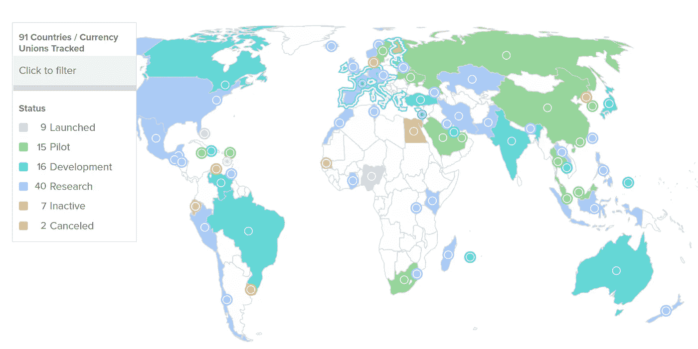

# Tether 的首席技术官表示，CBDCs 将不会对私人 stablecoin 市场产生影响

> 原文：<https://medium.com/coinmonks/cbdcs-will-have-no-impact-on-the-private-stablecoin-market-according-to-tethers-cto-84317f171a12?source=collection_archive---------79----------------------->

**Visit our website:-** [**https://bitcoinsupports.com/**](https://bitcoinsupports.com/)

根据 Tether 首席技术官 Paolo Ardoino 的说法，CBDCs 将主要取代老式支付系统，并使用私有区块链作为当代成本可控的技术基础设施。Tether 的首席技术官 Paolo Ardoino 认为，央行数字货币(CBDCs)的全球进步对私人 stablecoins 的功能几乎没有影响。

Ardoino 在一篇 Twitter 帖子中对日益激烈的关于 CBDCs 及其在当前支付系统中的潜在功能的辩论发表了自己的意见。他补充称，CBDCs 将仅用于取代 SWIFT 等老派的集中支付网络，大多数交易都在私人区块链进行。

他接着说，鉴于大多数现代交易都是数字化的，中央银行不是要将法定货币数字化，这一点已经做到了。CBDCs 的主要目的是利用私有区块链作为一种现代化的、成本可控的数字基础设施，由 CBDCs 处理大部分银行转账和信用卡/借记卡交易。https://twitter.com/paoloardoino/status/1501826379817664517 Tether 的首席技术官声称，即使在政府发行数字货币的时代，像 USDT 这样的私人 stablecoins 仍将继续发挥重要作用，因为私人 stablecoins 允许用户在链之间转移，并且可以在他们选择的许多区块链上使用，而 CBDCs 则不能。https://twitter.com/paoloardoino/status/1501826381331709952 在众多参议员呼吁对稳定的硬币市场进行监管后，美国爆发了一场辩论。

据《大西洋 CBDC 追踪》报道，86 个国家正在积极开发自己的主权数字货币，自 2020 年 5 月以来增长了 100%。86 个国家中有 9 个已经启动了它们的社区发展中心，还有 15 个处于原型阶段。

**Visit our website:-** [**https://bitcoinsupports.com/**](https://bitcoinsupports.com/)

中国在世界主要经济体的 CBDC 竞赛中处于领先地位，全功能的数字人民币正在全国范围内进行测试。法国和瑞士等几个欧洲国家已经开始跨境测试，但美国尚未正式制定任何数字货币计划。

**访问我们的网站:-**[**https://bitcoinsupports.com/**](https://bitcoinsupports.com/)

**免责声明:以上为作者观点，不应视为投资建议。读者应该自己做研究。**