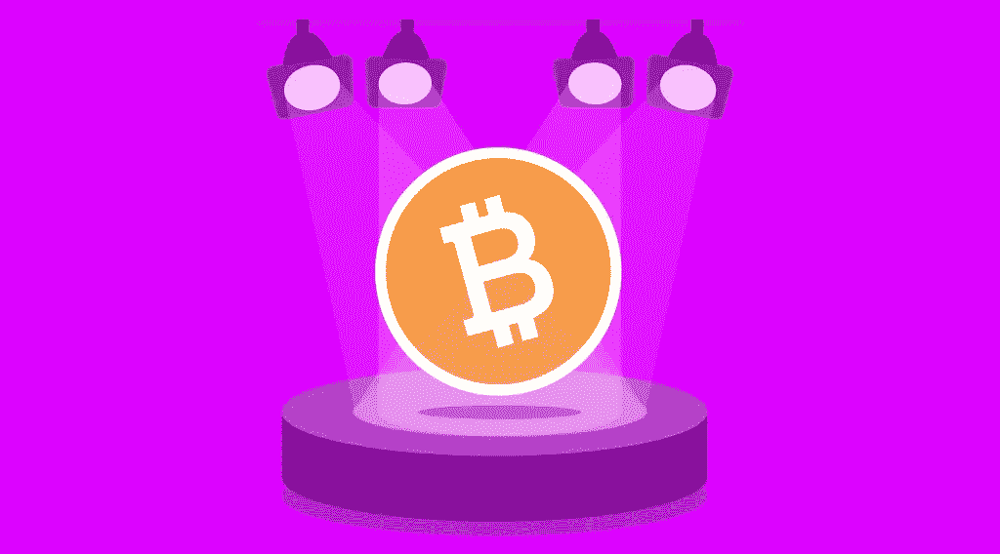

# 名人和加密货币:著名的加密支持者

> 原文：<https://medium.com/coinmonks/celebrities-and-cryptocurrency-famous-crypto-supporters-5c5aeeb2bb84?source=collection_archive---------26----------------------->

众所周知，埃隆·马斯克是加密货币最著名的粉丝之一，也是真正的加密名人。特斯拉的创始人表示，数字货币排除了政府干预，这意味着它更可靠，不受政治和腐败因素的影响。然而，不到一周前，埃隆·马斯克、SpaceX 和特斯拉公司被起诉，索赔 2580 亿美元，声称他们是支持加密货币 Dogecoin 的诈骗计划的一部分。美国公民凯西·强生起诉马斯克和他的公司，声称他与 Dogecoin 的创造者合谋推广硬币。这只是名人如何通过支持或拒绝加密货币引起争议的一个例子。还有其他名人公开他们对数字资产的友好态度吗？你永远不会相信，但有许多著名的加密支持者。在新的 [StealthEX](https://stealthex.io/) 文章中阅读更多关于名人和加密货币的信息。

# 名人和加密货币

# 瑞安·雷诺兹赞赏这次辩论

好莱坞明星演员瑞安·雷诺兹是 MNTN 平台的兼职首席创意官，该平台为营销机构和各种品牌提供广告软件。在最近接受媒体采访时，他谈到了自己对加密货币的态度。这位演员指出，如果有必要，他们公司准备关注超级碗 LVI 级别的用户。

雷诺兹指的是 2 月份的事件，当时 2022 年 LVI 超级碗看到了来自 Crypto.com、比特币基地和 FTX 等加密行业代表的创纪录数量的视频。比特币基地尤其引人注目——它以 1400 万美元购买了一个 60 秒的广告位，并发布了一个由黑色背景和二维码组成的广告。据比特币基地产品总监 Surojit Chatterjti 称，实验的结果是用户点击代码中加密链接的流量创下纪录。

雷诺兹还指出，今天，公司设法以积极的态度向大众展示加密货币。根据他的说法，加密货币“长期以来一直是一个主要参与者”，所以他“对进一步增长并不感到惊讶。”雷诺兹的估计得到了统计数据的支持。去年对于加密货币行业来说是相当成功的:有一段时间，加密市场的总市值超过了 3 万亿美元。

据 Deadpool star 报道，随着越来越多的公司对加密货币、不可替代的代币和元宇宙感兴趣，数字资产行业只会进一步发展。

这名演员拒绝回答记者关于他是否拥有加密货币的问题。他只是笑了笑，说他“不想对此发表评论”，但指出“关于加密货币的讨论”非常有价值。

其他名人也紧随雷诺兹之后，有些人甚至与加密货币有着更密切的联系。

# 史努比·道格是 NFT 的支持者

美国著名说唱歌手史努比·道格(Snoop Dogg)比其他许多名人更晚来到加密货币，但他却用他惯常的表情做到了这一点。在一个陌生的市场上，他已经成为粉丝们的指路明灯。

今年 4 月，知名加密货币交易平台 Crypto.com 发布了一款 NTF drop“与狗狗一起的旅程”，它将史努比·狗狗早年的记忆与受 NFT 运动启发的艺术结合在一起，其中包括一首原创曲目“NFT”——这是一首受该运动启发的即时经典。这种空投可持续 48 小时。

# 马克·库班将加密比作网络的发展

亿万富翁马克·库班和达拉斯小牛队的老板密切关注着加密市场。去年早些时候，他说区块链技术的发展让他想起了“互联网的早期”，现在的区块链公司类似于 Broadcast.com 这样的互联网先驱。今年 5 月，他在推特上说，“加密正在经历互联网经历的平静期”，这意味着当前的加密冬天以及比特币和替代币价格的整体下跌。

库班本人是一个狂热的加密货币投资者，并自称以太坊最大化主义者。他拥有一些加密货币和不可替代代币(NFT)，并投资了几家区块链公司。

# 莱昂内尔·梅西推广加密代币

传奇的阿根廷足球运动员莱昂内尔·梅西是巴黎圣日耳曼足球俱乐部的一部分，该俱乐部为球迷提供了购买 PSG 代币的机会，使他们有权参与决定与俱乐部未来有关的问题。梅西几次出现在专门为这一倡议举办的宣传活动上，这位明星的名字已经成为许多球迷的决定性因素——俱乐部的令牌卖得很好。

一位知情人士周二告诉路透社，今年 3 月，梅西签署了一份价值超过 2000 万美元的协议，以推广数字粉丝令牌公司 Socios.com。Socios 已经与 130 多家体育组织签署了协议，包括创建代币，其中包括许多顶级足球俱乐部，如巴黎圣日耳曼、巴塞罗那、尤文图斯和曼城。

# 瑞茜·威瑟斯彭在奇怪的推特帖子中呼吁“广告”加密

2022 年 1 月，瑞茜·威瑟斯彭用一条关于“加密钱包”和“数字”身份的奇怪推文迷惑了她的粉丝。

这位好莱坞明星分享了这篇帖子，写道:“在(不久的)将来，每个人都将拥有一个并行的数字身份。头像、加密钱包、(以及)数字商品将成为常态。”在此之后，一些用户认为威瑟斯彭是加密货币的广告，一名推特用户称其为“骗局艺术”。

# 马克·扎克伯格的目标是元宇宙

世界上最大的社交网络的创始人马克·扎克伯格计划在 2019 年发布 Libra 加密货币，但遭到了美国和国际监管机构的反对。两年后，他想出了一个变通办法，决定把社交网络变成一个元宇宙。虚拟身份的实验是可以预期的，但是到目前为止一切都太混乱了。扎克伯格支持加密货币，甚至可能拥有它们。他计划广泛使用 NFT 代币的功能。

# 马特·达蒙因为加密广告被嘲笑

2021 年 10 月，Crypto.com 首播了一部名为《财富偏爱勇敢者》的视频广告，主演是马特·达蒙。

达蒙在一份声明中说:“Crypto.com 是一个加密货币平台，它与我一样致力于为全球人民提供控制未来所需的工具。”“他们已经建立了一个易于使用的加密平台，并以人为本。”

《加密与 NFT 平台》的广告于 10 月份首次播出，但在周日的一场 NFL 比赛中播出后，于 1 月份迅速走红。后来，随着数字货币价值崩溃，加密冬天的到来，这位演员在高调支持加密货币后面临更大的反弹。

# 金·卡戴珊的糟糕经历

美国女演员金·卡戴珊也决定追随时尚潮流，开始为以太坊 Max (EMAX)做广告。然而，这种体验并不完全成功——这种加密货币的开发者原来是骗子，这位名人甚至与英国立法者有过矛盾，但只是稍微受了点惊吓就逃脱了。

# 史蒂文·西格尔成了罪犯的受害者

美国著名演员史蒂文·西格尔也早些时候成为罪犯的受害者。他从 Bitcoin2Gen 的开发者那里收到了一笔可观的款项，现在拒绝支付 33 万美元的罚款。

# 帕丽斯·希尔顿宣传 NFT

美国电影女演员兼时装模特帕丽斯·希尔顿(Paris Hilton)在最大的 altcoin 价值 1000 美元时投资了 ETH back。她钱包里的硬币数量不知道。希尔顿积极推广 NFT 代币，甚至给她的宠物取名为“Crypto Hilton”和“Ether Reum”。她还为名为 MoonPay 的加密初创公司捐了一大笔钱。

# 芒努斯·卡尔森试图将国际象棋界引入 Cryptos

挪威棋手芒努斯·卡尔森积极参与将加密货币引入国际象棋比赛的活动。他认为自己的目标之一是让国际象棋界熟悉加密货币和 NFT。不久前，卡尔森在一场比特币国际象棋比赛中赢得了 0.6 BTC。

# MoonPay 加密初创公司吸引了知名人士

名人投资过加密货币吗？是的，很多人有。2022 年 4 月，MoonPay crypto project 从世界知名投资者那里获得了超过 8700 万美元的投资，其中包括贾斯汀比伯、格温妮丝·帕特洛、史努比·道格、德雷克、伊娃·朗格利亚、杰森·德鲁罗、凯特·哈德森、帕丽斯·希尔顿和马修·麦康纳等名人。

这家总部位于迈阿密的公司成立于 2018 年，其软件允许用户使用信用卡、银行转账或移动钱包(如 Apple Pay 和 Google Pay)等传统支付方式买卖加密货币。

MoonPay 还向其他企业出售其技术，包括加密网站 Bitcoin.com 和不可替代的令牌 NFT 市场 OpenSea，这是一种被首席执行官伊万·索托-赖特称为“加密即服务”的模式

# 名人投资加密货币:不胜枚举…

对加密货币持友好态度的名人名单还远未完成。我们看到许多知名人士已经投资了加密货币或正在考虑这样的投资，考虑到围绕比特币或以太坊这样的资产的炒作，这似乎是唯一符合逻辑的。你个人认为哪些项目具有投资吸引力，为什么？

最后，如果你决定购买一些加密硬币，转到[即时加密交易所 stealth x](https://stealthex.io/)。这项服务免注册，不将用户的资金存放在平台上。

去[偷 X](https://stealthex.io/?from=btc&to=eth&amount=0.1) 就行了。它会自动引导您进入 Exchange 加密窗口。

1.  选择您想要交换的货币。比如 [BTC](https://stealthex.io/coin/btc) 到 [ETH](https://stealthex.io/coin/eth) 。
2.  输入您的加密钱包地址。
3.  把押金寄到 StealthEX 生成的地址。
4.  收到存款后，您将把兑换的资金寄到第 2 步中提供的地址。

你也可以用你的借记卡或信用卡购买 ETH。为此，您需要打开购买窗口，而不是交换窗口。

在 [Medium](https://stealthex-io.medium.com/) 、 [Twitter](https://twitter.com/Stealthex_io) 、 [Telegram](https://t.me/StealthEX) 、 [YouTube](https://www.youtube.com/channel/UCeES_XBesX76ge7xf1meuSw) 和 [Reddit](https://www.reddit.com/user/Stealthex_io) 上关注我们，获取 [StealthEX.io](https://stealthex.io/) 更新和关于密码世界的最新消息。对于所有请求，请通过 support@stealthex.io 给我们发消息。

*此处表达的观点和意见仅代表作者个人。每一次投资和交易都有风险。做决定时，你应该进行自己的研究。*

**非常欢迎您来参观**[**StealthEX exchange**](https://stealthex.io/)**看看**有多快多方便。

*原载于 2022 年 6 月 22 日*[*https://stealthex . io*](https://stealthex.io/blog/2022/06/22/celebrities-and-cryptocurrency-famous-crypto-supporters/)*。*

> *加入 Coinmonks* [*电报频道*](https://t.me/coincodecap) *和* [*Youtube 频道*](https://www.youtube.com/c/coinmonks/videos) *了解加密交易和投资*

# 另外，阅读

*   [3 商业评论](/coinmonks/3commas-review-an-excellent-crypto-trading-bot-2020-1313a58bec92) | [Pionex 评论](https://coincodecap.com/pionex-review-exchange-with-crypto-trading-bot) | [Coinrule 评论](/coinmonks/coinrule-review-2021-a-beginner-friendly-crypto-trading-bot-daf0504848ba)
*   [莱杰 vs n rave](/coinmonks/ledger-vs-ngrave-zero-7e40f0c1d694)|[莱杰 nano s vs x](/coinmonks/ledger-nano-s-vs-x-battery-hardware-price-storage-59a6663fe3b0) | [币安评论](/coinmonks/binance-review-ee10d3bf3b6e)
*   [加密交易机器人](/coinmonks/crypto-trading-bot-c2ffce8acb2a) | [Bingbon 评论](https://coincodecap.com/bingbon-review)
*   [Bybit 交易所评论](/coinmonks/bybit-exchange-review-dbd570019b71) | [Bityard 评论](https://coincodecap.com/bityard-reivew) | [Jet-Bot 评论](https://coincodecap.com/jet-bot-review)
*   [3 commas vs crypto hopper](/coinmonks/3commas-vs-pionex-vs-cryptohopper-best-crypto-bot-6a98d2baa203)|[赚取加密利息](/coinmonks/earn-crypto-interest-b10b810fdda3)