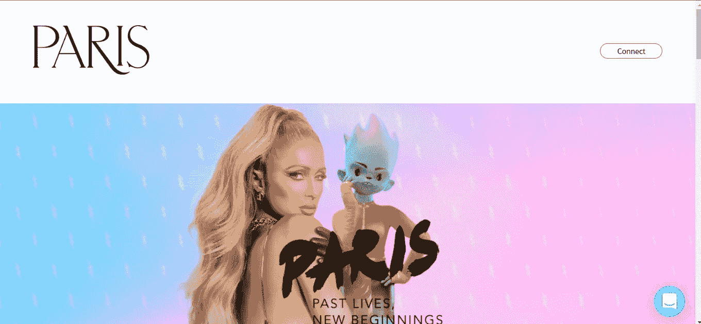
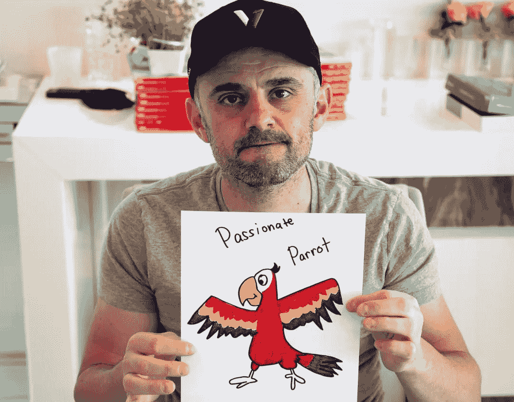
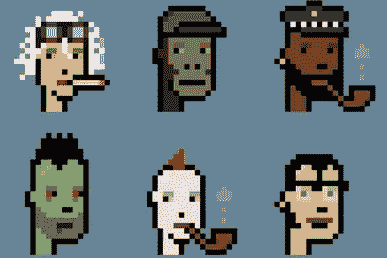
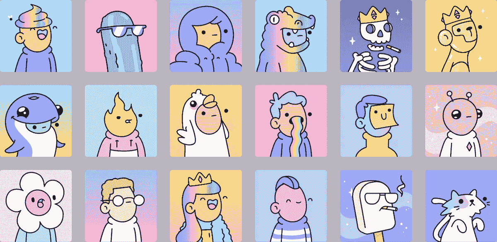
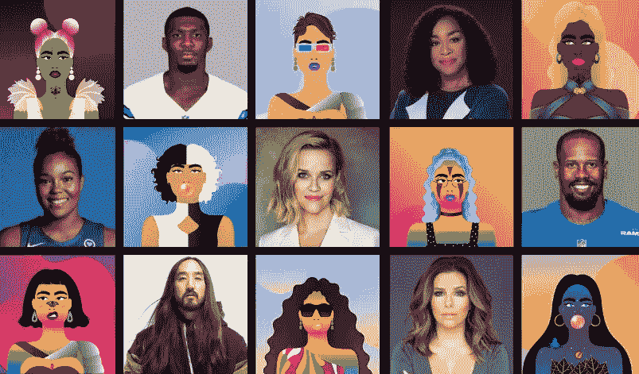
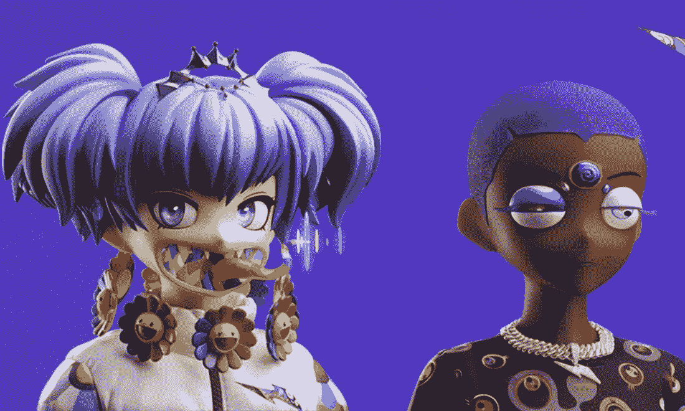

# 名人和 NFT

> 原文：<https://medium.com/coinmonks/celebrities-and-nfts-f4f2360c1322?source=collection_archive---------15----------------------->

最近，越来越多的名人开始涉足 NFT 空间，创建自己的收藏或与 NFT 的创作者建立联系。

> 根据 Nonfungible.com NFT 数据公司[的一份报告，自 2021 年以来，NFT 的交易额已经上升到超过 170 亿美元。](https://nonfungible.com/market-tracker)

一条推文或帖子将名人的 NFTs 推广给成千上万的粉丝，促使他们购买他们的产品，这使得 NFT 空间的人气和价格爆炸。

让我们来看看拥有元宇宙相关产品的知名品牌:

## **阿姆**

阿姆成为最新一位以令人瞠目结舌的 42.5 万美元购买 NFT 无聊猿游艇俱乐部**、**“埃米纳佩”的名人。

去年，他还在 Nifty Gateway 上推出了他的第一套 NFT(包括数字动作人物、阿姆视频中的角色和原创乐器曲目)，并筹集了 180 万美元。

**肖恩·蒙德兹**

肖恩·蒙德兹加入了 NFT 市场 OpenSea，并与 Genies 一起推出了基于他的专辑“Wonder”的 NFT，他还在 10 分钟内完成了约 100 万美元的数字产品销售。

 [## 🎸肖恩·蒙德兹| 3D | NFT

### 编辑描述

youtube.com](https://youtube.com/shorts/8XSefjX4HW4?feature=share) 

**格里姆斯**

Grimes 是第一批从自己的数字艺术收藏中赚到数百万美元的名人之一。她收藏的 10 件作品使格莱姆斯成为最畅销的 NFT 创作者之一

**巴黎希尔顿**

帕丽斯·希尔顿把她的第一个 NFT 扔给了超级塑料，一家乙烯基玩具和数字收藏品公司。

她在 2021 年 4 月以 110 万美元的价格出售了“标志性的加密女王 NFT”。该系列共有 141 件作品。

[https://nft.parishilton.com/](https://nft.parishilton.com/)

**史努比狗狗**

史努比·狗狗发布了他的 NFT 收藏，名为“狗狗之旅”，包括史努比的回忆，NFT 启发的艺术作品，名为“NFT”的原创曲目和“史努比·狗狗硬币”

**林赛·罗韩**

2021 年 2 月，林赛·罗韩在 Rarible 上推出了自己的 token，据报道售价为 5 万美元。她还在 Fansforever 上发布了单曲《摇篮曲》作为 NFT。此外，林赛以 1.5 万美元的价格卖出了一幅蠢朋克的 NFT。

# 现在让我们看看名人购买的最著名的 NFT。

*Source: VeeFriends | Gary Vaynerchuk*

## [VeeFriends](https://veefriends.com/) :

*   马什梅洛
*   史蒂夫·青木
*   比尔
*   加里·维纳查克，VeeFriends 的创造者
*   罗根·保罗

Source:[https://en.wikipedia.org/wiki/File:Cryptopunks_general.jpg](https://en.wikipedia.org/wiki/File:Cryptopunks_general.jpg)

## [隐朋克](https://www.larvalabs.com/cryptopunks):

*   塞蕾娜·威廉姆斯
*   海蒂·克鲁姆
*   罗根·保罗
*   杰森·德鲁罗
*   肖恩·科里·卡特

Source:NFT NOW

## [涂鸦](https://doodles.app/):

*   加里维
*   恶作剧
*   Treeverse

Source:boardroom

## [女人的世界](https://worldofwomen.art/):

*   胡达·卡坦
*   瑞茜·威瑟斯彭
*   珊达·瑞姆斯
*   困扰银行
*   塞巴斯蒂安·博尔热

Source:nftnewspro

## [克隆人 X](https://opensea.io/collection/clonex) :

*   安东尼·佩提斯
*   彼得·克劳奇
*   贾斯汀·比伯
*   史努比狗狗
*   青木

## [无聊猿游艇俱乐部](https://boredapeyachtclub.com/):

*   帕丽斯·希尔顿
*   小内马尔
*   史努比狗狗
*   提姆巴兰
*   埃米纳姆
*   贾斯汀·比伯

总的来说，人们会更加信任由大公司推广或拥有的项目，我们仍然处于这个新领域的开端。

你想从哪个名人那里买 NFT？

> 加入 Coinmonks [电报频道](https://t.me/coincodecap)和 [Youtube 频道](https://www.youtube.com/c/coinmonks/videos)了解加密交易和投资

# 另外，阅读

*   [Bookmap 评论](https://coincodecap.com/bookmap-review-2021-best-trading-software) | [美国 5 大最佳加密交易所](https://coincodecap.com/crypto-exchange-usa)
*   最佳加密[硬件钱包](/coinmonks/hardware-wallets-dfa1211730c6) | [Bitbns 评论](/coinmonks/bitbns-review-38256a07e161)
*   [新加坡十大最佳加密交易所](https://coincodecap.com/crypto-exchange-in-singapore) | [购买 AXS](https://coincodecap.com/buy-axs-token)
*   [红狗赌场评论](https://coincodecap.com/red-dog-casino-review) | [Swyftx 评论](https://coincodecap.com/swyftx-review) | [CoinGate 评论](https://coincodecap.com/coingate-review)
*   [投资印度的最佳密码](https://coincodecap.com/best-crypto-to-invest-in-india-in-2021)|[WazirX P2P](https://coincodecap.com/wazirx-p2p)|[Hi Dollar Review](https://coincodecap.com/hi-dollar-review)
*   [加拿大最佳加密交易机器人](https://coincodecap.com/5-best-crypto-trading-bots-in-canada) | [库币评论](https://coincodecap.com/kucoin-review)