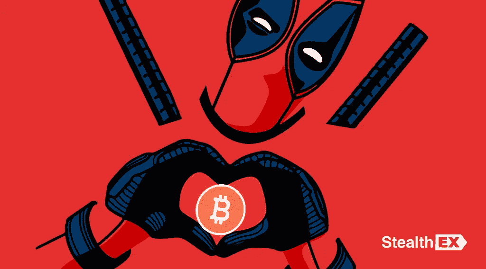

# 加密货币中的名人:著名的加密支持者

> 原文：<https://medium.com/coinmonks/celebrities-in-cryptocurrency-famous-crypto-supporters-4631602cfe5?source=collection_archive---------31----------------------->

众所周知，埃隆·马斯克(Elon Musk)是加密货币最著名的粉丝之一。特斯拉的创始人表示，数字货币排除了政府干预，这意味着它更可靠，不受政治和腐败因素的影响。

还有其他名人公开他们对加密货币的友好态度吗？这样的人很多。在新的 [StealthEX](https://stealthex.io/) 文章中阅读更多关于著名加密支持者的信息。

# 瑞安·雷诺兹欣赏关于加密货币的辩论

好莱坞明星演员瑞安·雷诺兹是 MNTN 平台的兼职首席创意官，该平台为营销机构和各种品牌提供广告软件。最近在接受媒体采访时，他谈到了自己对加密货币的态度。这位演员指出，如果有必要，他们公司准备关注超级碗 LVI 级别的用户。

雷诺兹指的是上周的事件，当时 2022 年 LVI 超级碗看到了来自 Crypto.com、比特币基地和 FTX 等加密行业代表的创纪录数量的视频。比特币基地尤其引人注目——它以 1400 万美元购买了一个 60 秒的广告位，并发布了一个由黑色背景和二维码组成的广告。据比特币基地产品总监 Surojit Chatterjti 称，实验的结果是用户点击代码中加密链接的流量创下纪录。

Reynold 还指出，今天，公司设法以积极的态度向大众展示加密货币。根据他的说法，加密货币“长期以来一直是一个主要参与者”，所以他“对进一步增长并不感到惊讶。”雷诺兹的估计得到了统计数据的支持。去年对于加密货币行业来说是相当成功的:有一段时间，加密市场的总市值超过了 3 万亿美元。

据《星报》报道，随着越来越多的公司对加密货币、不可替代的代币和元宇宙感兴趣，数字资产行业只会进一步发展。

这名演员拒绝回答记者关于他是否拥有加密货币的问题。他只是笑了笑，说他“不想对此发表评论”，但指出“关于加密货币的讨论”非常有价值。

其他名人也紧随雷诺兹之后，有些人甚至与加密货币有着更密切的联系。

# 史努比·道格是 NFT 的支持者

美国著名说唱歌手史努比·道格(Snoop Dogg)比其他许多名人更晚来到加密货币，但他却用他惯常的表情做到了这一点。在一个陌生的市场上，他已经成为粉丝们的指路明灯。

# 莱昂内尔·梅西推广加密代币

传奇的阿根廷足球运动员莱昂内尔·梅西是巴黎圣日耳曼足球俱乐部的一部分，该俱乐部为球迷提供了购买 PSG 代币的机会，使他们有权参与决定与俱乐部未来有关的问题。梅西几次出现在专门为这一倡议举办的宣传活动上，这位明星的名字已经成为许多球迷的决定性因素——俱乐部的令牌卖得很好。

# 马克·扎克伯格的目标是元宇宙

世界上最大的社交网络的创始人马克·扎克伯格计划在 2019 年发布 Libra 加密货币，但遭到了美国和国际监管机构的反对。两年后，他想出了一个变通办法，决定把社交网络变成一个元宇宙。虚拟身份的实验是可以预期的，但是到目前为止一切都太混乱了。扎克伯格支持加密货币，甚至可能拥有它们。他计划广泛使用 NFT 代币的功能。

# 金·卡戴珊的糟糕经历

美国女演员金·卡戴珊也决定追随时尚潮流，开始为以太坊 Max (EMAX)做广告。然而，这一经历并不完全成功——这种加密货币的开发者被证明是骗子，这位明星甚至与英国立法者有过矛盾，但却带着轻微的恐惧逃脱了。

# 史蒂文·西格尔成了罪犯的受害者

美国著名演员史蒂文·西格尔也早些时候成为罪犯的受害者。他从 Bitcoin2Gen 的开发者那里收到了一笔可观的款项，现在拒绝支付 33 万美元的罚款。

# 帕丽斯·希尔顿宣传 NFT

美国电影女演员兼时装模特帕丽斯·希尔顿(Paris Hilton)在最大的 altcoin 价值 1000 美元时投资了 ETH back。她钱包里的硬币数量不知道。希尔顿积极推广 NFT 代币，甚至给她的宠物取名为“Crypto Hilton”和“Ether Reum”。

# 芒努斯·卡尔森试图将国际象棋界引入 Cryptos

挪威棋手芒努斯·卡尔森积极参与将加密货币引入国际象棋比赛的活动。他认为自己的目标之一是让国际象棋界熟悉加密货币和 NFT。不久前，卡尔森在一场比特币国际象棋比赛中赢得了 0.6 BTC。

这份对加密货币友好的“明星”名单还远未完成。我们看到很多知名人士已经投资了加密货币，或者正在考虑这样的投资。你认为哪些项目具有投资吸引力，为什么？

最后，如果你决定购买一些加密硬币，转到[即时加密交易所。这项服务免注册，不将用户的资金存放在平台上。](https://stealthex.io/)

去[偷 X](https://stealthex.io/?from=btc&to=eth&amount=0.1) 就行了。它会自动引导您进入 Exchange 加密窗口。

1.  选择您想要交换的货币。比如 [BTC](https://stealthex.io/coin/btc) 到 [ETH](https://stealthex.io/coin/eth) 。
2.  输入您的加密钱包地址。
3.  把押金寄到 StealthEX 生成的地址。
4.  收到存款后，您会将兑换的资金发送到步骤 3 中提供的地址。

你也可以用你的借记卡或信用卡购买 ETH。为此，您需要打开购买窗口，而不是交换窗口。

在 [Medium](https://stealthex-io.medium.com/) 、 [Twitter](https://twitter.com/Stealthex_io) 、 [Telegram](https://t.me/StealthEX) 、 [YouTube](https://www.youtube.com/channel/UCeES_XBesX76ge7xf1meuSw) 和 [Reddit](https://www.reddit.com/user/Stealthex_io) 上关注我们，获取 [StealthEX.io](https://stealthex.io/) 更新和关于加密世界的最新消息。对于所有请求，请通过 support@stealthex.io 给我们发消息。

*此处表达的观点和意见仅代表作者个人。每一次投资和交易都有风险。做决定时，你应该进行自己的研究。*

非常欢迎你来参观 T21 的交易所，看看它有多快多方便。

> *加入 Coinmonks* [*电报频道*](https://t.me/coincodecap) *和* [*Youtube 频道*](https://www.youtube.com/c/coinmonks/videos) *了解加密交易和投资*

# 另外，阅读

*   [Bookmap 评论](https://coincodecap.com/bookmap-review-2021-best-trading-software) | [美国 5 大最佳加密交易所](https://coincodecap.com/crypto-exchange-usa)
*   最佳加密[硬件钱包](/coinmonks/hardware-wallets-dfa1211730c6) | [Bitbns 评论](/coinmonks/bitbns-review-38256a07e161)
*   [新加坡十大最佳加密交易所](https://coincodecap.com/crypto-exchange-in-singapore) | [收购 AXS](https://coincodecap.com/buy-axs-token)
*   [红狗赌场评论](https://coincodecap.com/red-dog-casino-review) | [Swyftx 评论](https://coincodecap.com/swyftx-review) | [CoinGate 评论](https://coincodecap.com/coingate-review)
*   [投资印度的最佳加密软件](https://coincodecap.com/best-crypto-to-invest-in-india-in-2021)|[WazirX P2P](https://coincodecap.com/wazirx-p2p)|[Hi Dollar Review](https://coincodecap.com/hi-dollar-review)
*   [加拿大最佳加密交易机器人](https://coincodecap.com/5-best-crypto-trading-bots-in-canada) | [库币评论](https://coincodecap.com/kucoin-review)
*   [火币的加密交易信号](https://coincodecap.com/huobi-crypto-trading-signals) | [HitBTC 审查](/coinmonks/hitbtc-review-c5143c5d53c2)
*   [如何在 FTX 交易所交易期货](https://coincodecap.com/ftx-futures-trading) | [OKEx vs 币安](https://coincodecap.com/okex-vs-binance)