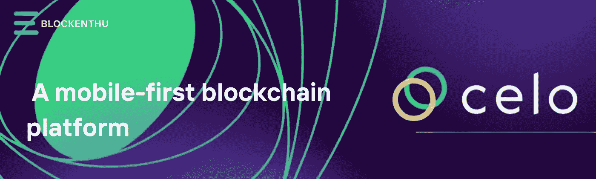
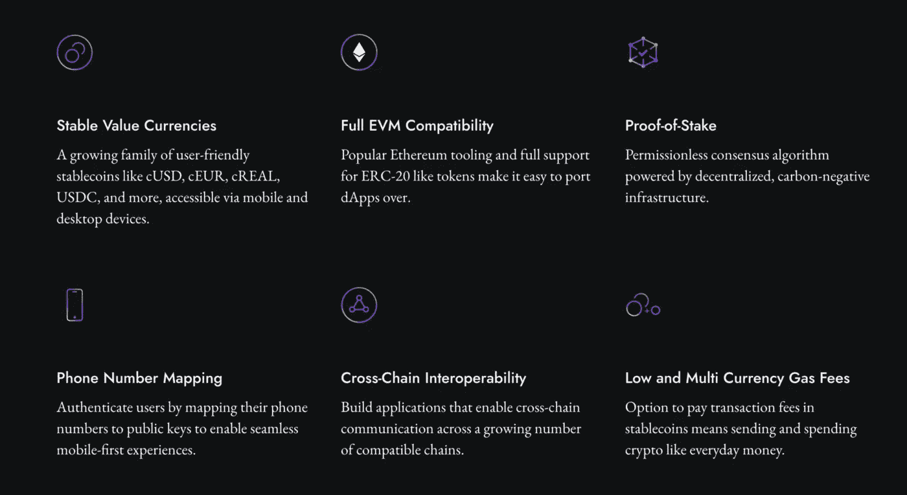
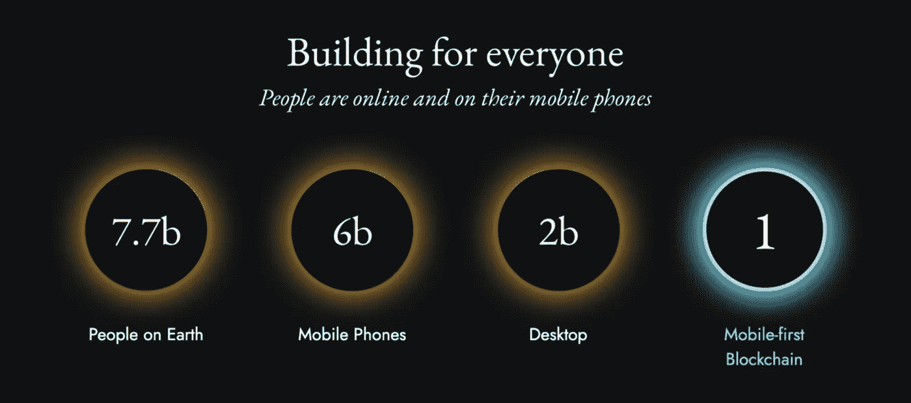
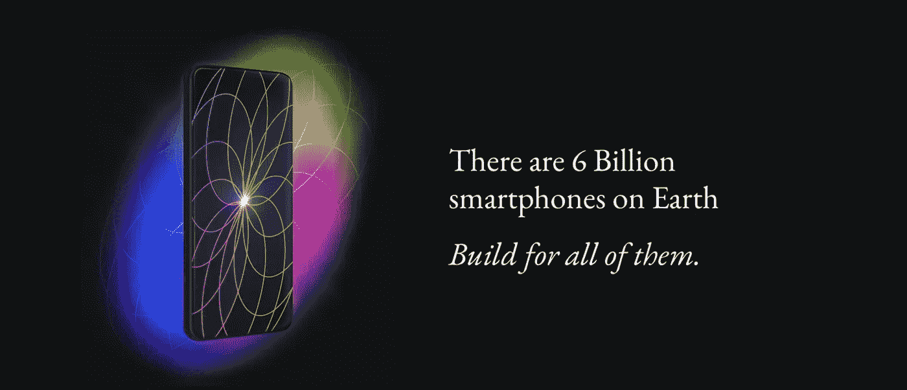
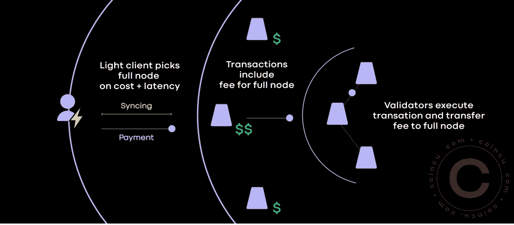

# CELO:移动优先的区块链平台

> 原文：<https://medium.com/coinmonks/celo-a-mobile-first-blockchain-platform-69d288d5e24?source=collection_archive---------25----------------------->

# 一个允许轻松访问金融 Dapps 的开放平台

Celo 是一款区块链，旨在通过用户友好的界面将加密货币直接传送到你的手机上。许多人拥有智能手机，他们中的许多人使用 Paytm、Cash App 和 Gpay 等应用程序作为数字钱包，向朋友和其他用户转账。然而，这些程序是由**的中央实体**运行的，对你的账户和交易限额有很大的控制权。

使用这些程序的好处是它们使用起来非常简单。例如，Paytm 可以快速设置，甚至不需要你在使用它之前将它连接到你的银行账户。 **Celo** 在许多方面都试图服务于同一个市场，同时将比特币的所有好处带给典型的智能手机用户。

# Celo 简介

Celo 是一款**智能手机第一区块链**，为任何拥有智能手机的人提供 DeFi 工具和服务。它打算通过将 DeFi 的显著优势扩展到目前使用的 60 亿部手机来打破界限。

Celo 使用您的电话号码作为您钱包的公钥，以便于向您手机上的联系人汇款。全球有数十亿智能手机用户，但其中只有一小部分使用加密货币。

**在许多国家，银行和个人理财机会并不可靠。** Celo 是一款区块链，包含智能合约和分散式应用程序，让用户能够利用分散式融资(DeFi)和无信任交易的潜力。

对于网络燃气发电成本和 Celo 控制协议投票，平台采用原生硬币 CELO。碳抵消是 Celo 最初获得批准的提案之一，这使其股权证明网络成为第一个碳中和的区块链。

# CELO 是如何工作的？

为了运行其平台，Celo 网络依赖于三个贡献者:

**轻客户端** —在用户移动设备上运行的 Celo 网络应用，如 Celo 的移动钱包。

**验证器节点** —参与 Celo 共识机制、验证交易并生成新块的计算机。

**全节点** —充当验证器节点和移动钱包之间的链接的计算机，接受来自轻客户端的请求并将交易传输到验证器节点。

值得注意的是，Celo 的协议要求验证器节点由 CELO 令牌持有者选举产生。

# 拜占庭容错(BFT):

Celo 的核心是一种被称为拜占庭容错(BFT)的利益相关治理机制，它保持分布式计算机网络的同步。

为了给区块链供电并对修改进行投票，验证节点必须**首先投入至少 10，000 个 CELO 令牌**，这意味着任何拥有 CELO 的人都可以协助运行网络。

目前，在任何给定的时间，只有 100 个验证器节点是活动的，这是由完整的节点决定的，并且每个节点都会因为验证交易而获得一块块奖励。

轻型客户端支付的费用用于奖励完整节点。

**cUSD & cEUR**

Celo 运营稳定资产的能力，如 **cUSD、cEUR** 提供了加密交易的效率和透明度，同时降低了这些资产的波动性。

Celo 使用程序化储备**，一种由 CELO** 和比特币(BTC)或以太币等其他加密货币组成的超额储备，以自动确保每个 cUSD 的价值等于一美元(ETH)，每个 cEUR 的价值等于一欧元(ETH)。这意味着 cUSD & cEUR 可以以与 CELO 相同的价格出售，反之亦然。

Celo 计划在未来允许 CELO 持有者提议并投票决定模仿其他国家货币(如日元)的稳定货币的形成。

# 谁建造了 CELO

Celo 成立于 2018 年，总部位于美国加州旧金山湾区。其三位创始人分别是**马雷克·奥尔谢夫斯基**、**雷内·雷因斯伯格、**和**塞普·卡姆瓦尔。**

Celo 的团队成员来自麻省理工学院、斯坦福大学、谷歌、Square、Circle、Visa、GoDaddy、世界银行、美联储银行、哈佛大学、宾夕法尼亚大学法学院、剑桥大学、美国司法部、美国银行、Capital One、Twitter、Give Directly 和盖茨基金会。

Celo 的推广和保存是不同实体的工作重点。据该公司称，Celo 基金会是一个与 mainnet 一起推出的非营利组织，而 Celo 繁荣联盟是一个由使命一致的组织组成的生态系统。

# Celo 解决方案

> ***移动-先接近***

Celo 资产是为移动设备创建的。因此，Celo 经常被视为移动优先运动的先驱。它的轻量级移动客户端和电话验证协议允许用户通过他们的移动设备发送、消费、下注和赚取 T21 加密货币。

**发展解决方案**

Celo 使得为手机创建分散的应用程序和资产变得简单，这些应用程序和资产可以毫不费力地在连锁店、运营商和国家之间移动。Celo 的 EVM 兼容性使得创建和移植 dApps 更加容易。坚固性允许你编码。

Celo 不仅兼容原生移动 dApps，还兼容 **MetaMask** 等知名以太坊开发者工具。它还支持多对多的跨链通信。你有能力建造必要的桥梁。

> *迪菲和塞洛·达普斯*

Celo 允许您直接向联系人发送加密货币，而不必担心通常为 42 个字符长的加密钱包地址。Ubeswap 和 Moola 是基于 Celo 构建的两个 Defi 解决方案。虽然 Ubeswap 的移动优先分散式交易所旨在使 DeFi 的访问民主化，但 Moola 是一个基于 Celo 的移动优先资产借贷平台。

> *令牌组学*

**CELO** 目前排名第 64th】最大的加密货币，目前交易价格为**3.59 美元(272 印度卢比)，截至 2022 年 4 月 10 日**。而随着市场规模超过**15 亿美元**。目前有 4 . 33 亿枚代币在流通

CELO 有限量的 10 亿代币，其中 6 亿在 2020 年 4 月 mainnet 开通时可用。

剩余的 40%供应将通过费用和奖励逐步交付，根据早期投资者获得其股票的方式，不同的授予时间表将会到位。

此外，高达 1.2 亿 CELO 将被放置在储备，以确保货币的真实性和价格稳定。作为一种稳定的货币，CUSD 被认为是 Celo 用户的一种便捷支付方式，他们不必担心自己所持资产的价值发生变化。

# 把所有的放在一起

Celo 协议是一个移动优先的协议，它在尽可能保持包容性的同时，解决了比特币采用的障碍。此外，该协议鼓励一种新的货币生态，包括当地和地区货币、社会红利、滞期费和自然资本支持的货币。

# 加入我们，轻松进入 WEB 3.0

> *我们的社区*

# WHATSAPP

 [## BLOCKENTHU

### WhatsApp 群邀请

chat.whatsapp.com](https://chat.whatsapp.com/FTKme4XzkOU73ZDv99Oatj) 

# 电报

 [## ⚡·布洛克登胡·⚡

### 可以马上查看并加入@blockenthu。

t.me](https://t.me/blockenthu) 

# 商务化人际关系网

 [## Blockenthu | LinkedIn

### LinkedIn 上有 564 名粉丝。“面向大众的 Web 3.0 福利”加密和区块链| BlockEnthu 是社区…

www.linkedin.com](https://www.linkedin.com/company/blockenthu/) 

# INSTAGRAM

[https://www.instagram.com/blockenthu/](https://www.instagram.com/blockenthu/)

使用印度最安全的外汇货币

 [## CoinDCX -加密交易所|购买、出售和交易比特币和顶级替代币

### CoinDCX 是印度最大、最安全的加密货币交易所，在这里你可以买卖比特币和其他…

coindcx.com](https://coindcx.com/) 

# blockenthu # ETH # BTC # coincxpathbreaker # FILECOIN #比特币#以太坊#索拉纳#CELO

> 加入 Coinmonks [电报频道](https://t.me/coincodecap)和 [Youtube 频道](https://www.youtube.com/c/coinmonks/videos)了解加密交易和投资

# 另外，阅读

*   [CoinDCX 点评](/coinmonks/coindcx-review-8444db3621a2) | [加密保证金交易交易所](https://coincodecap.com/crypto-margin-trading-exchanges)
*   [红狗赌场评论](https://coincodecap.com/red-dog-casino-review) | [Swyftx 评论](https://coincodecap.com/swyftx-review) | [CoinGate 评论](https://coincodecap.com/coingate-review)
*   [Bookmap 评论](https://coincodecap.com/bookmap-review-2021-best-trading-software) | [美国 5 大最佳加密交易所](https://coincodecap.com/crypto-exchange-usa)
*   [如何在 FTX 交易所交易期货](https://coincodecap.com/ftx-futures-trading) | [OKEx vs 币安](https://coincodecap.com/okex-vs-binance)
*   [CoinLoan 审查](https://coincodecap.com/coinloan-review) | [YouHodler 审查](/coinmonks/youhodler-4-easy-ways-to-make-money-98969b9689f2) | [BlockFi 审查](https://coincodecap.com/blockfi-review)
*   《XT.COM 评论》的|
*   [SmithBot 评论](https://coincodecap.com/smithbot-review) | [4 款最佳免费开源交易机器人](https://coincodecap.com/free-open-source-trading-bots)