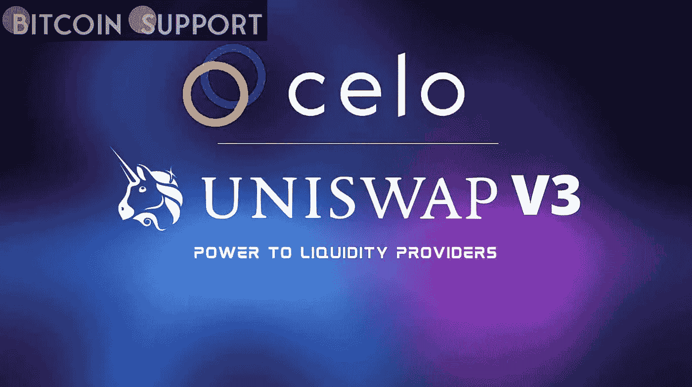
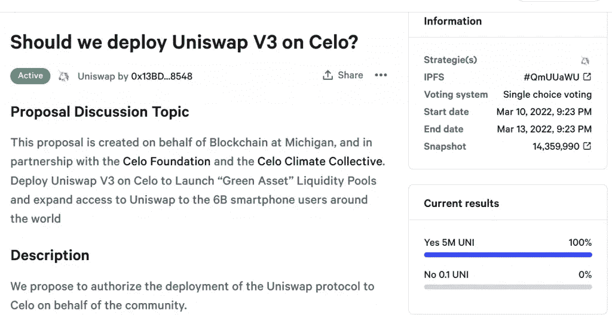

# Celo 计划在其本地区块链上实施 Uniswap V3

> 原文：<https://medium.com/coinmonks/celo-plans-to-implement-uniswap-v3-on-its-local-blockchain-dd72f3df9b11?source=collection_archive---------32----------------------->

**Visit our website:-** [**https://bitcoinsupports.com/**](https://bitcoinsupports.com/)

在 Uniswap 的协助下，Celo 的目标是鼓励绿色使用案例，并通过绿色资产支持令牌重新平衡其资金。

在 Uniswap 治理论坛上，一项新的机构群体提案被提交，以在 Celo 区块链上部署该协议，这是一个移动优先、碳中和、以太坊虚拟机兼容的网络。

这个新概念是由密歇根大学区块链倡议代表与 Celo 基金会和 Celo Climate Collective 合作开发的。当 Uniswap 实施后，大约有 60 亿移动电话用户可以使用它。Uniswap 和其他分散式交换目前通过 MetaMask 移动应用中的应用内浏览器提供支持。

除了为 Uniswap 提供 1000 万美元的财政奖励外，Celo 基金会还将投资 1000 万美元用于 Uniswap 专用的用户奖励和赠款。部署的主要目标是建立绿色资产流动性池，由自然资本资产支持，如令牌化碳信用额。此外，基金会打算在不久的将来将土地和森林等自然资产引入 Celo。Celo 基金会打算通过使用自然黑资产和 Uniswap 的分散系统来重新平衡其储备。目前，该基金会依靠集中交易所来实现再平衡；然而，现有的交易所不接受绿色资产，强调了 Uniswap 的重要性。该组织一直在努力推动采用自然资本支持的货币，并认为他们最近与 Uniswap 的合作将有助于他们实现这一目标。该提案将于周日投票表决。根据对当前投票的初步调查，该倡议获得了 100%的支持。一旦部署，Celo 基金会打算扩大 Uniswap 支持的绿色使用案例的数量。

**Visit our website:-** [**https://bitcoinsupports.com/**](https://bitcoinsupports.com/)

Celo 是一个发展中的区块链，强调环境、社会和治理(ESG)目标。另一方面，Uniswap 是 DeFi 生态系统中的市场领导者，促进了数十亿次的日常交易。此外，DeFi 协议通过建立一个 altcoin 交换接口，促进了向乌克兰政府的捐赠。

**访问我们的网站:-**[**https://bitcoinsupports.com/**](https://bitcoinsupports.com/)

**免责声明:以上为作者观点，不应视为投资建议。读者应该自己做研究。**