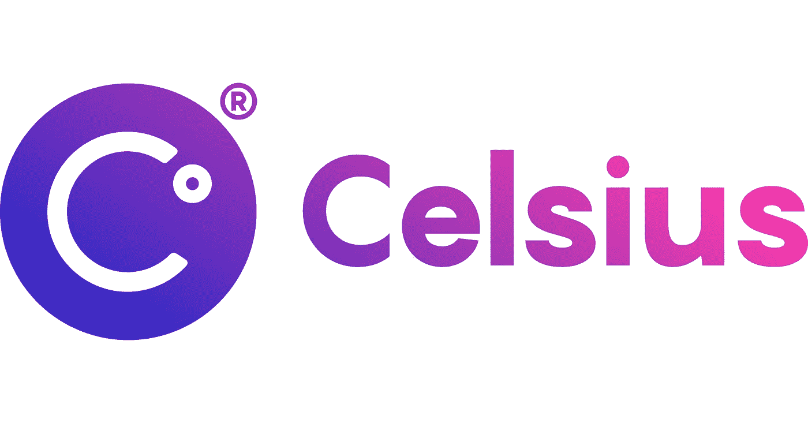
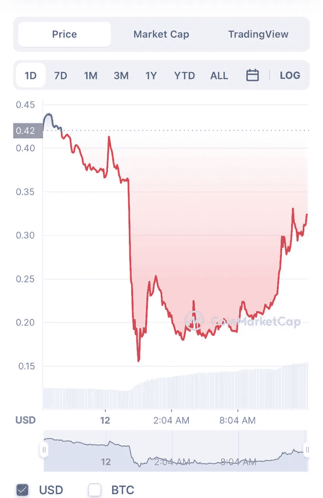

# 第一部分:持续崩溃的 Web 3 崩溃

> 原文：<https://medium.com/coinmonks/celsius-and-the-web-3-crash-that-keeps-crashing-7fe9bc5427fd?source=collection_archive---------29----------------------->

如果你今天还没有检查你的加密文件夹…帮你自己一个忙，走出去，触摸一些草，呼吸一些新鲜空气。由于被称为 Celsius Network 的 Web 3 平台，最初由 Luna 崩溃引发的加密崩溃变得更加严重。

根据他们的网站，170 万人把 Celsius 称为他们的 Crypto 之家。Celsius 允许用户在他们的一体化平台上购买、借用、交换和获得密码，该平台据称是透明的，并提供“军事级”安全性。然而，Celsius 网络的主要吸引力在于，它向用户提供了将加密资产存放在该平台上的高利率。用户还可以通过使用平台的原生 CEL 令牌来解锁更高的利息等级和借款利率。Celsius 能够维持这种商业模式的方式是，在其平台上吸收用户存款，然后以更高的利率借给其他实体。然后，Celsius 能够将差价收入囊中，并获得巨额利润。这在理论上完全行得通，尤其是在市场强劲的时候。

不幸的是，我们正处于近年来最糟糕的熊市之一，事实证明，Celsius 可能一开始就没有一个良好的商业模式。

在 Medium 上发布的一份备忘录中，Celsius 宣布:

“由于极端的市场条件，今天我们宣布 Celsius 暂停所有账户之间的提款、互换和转账。我们今天采取这一行动是为了随着时间的推移，使 Celsius 能够更好地履行其提款义务。”

Celsius 管理着 120 亿美元的资产，但今年受到了一些冲击，因为它对 Terra Luna 有很大的敞口，还受到了 Badger DAO 黑客和 Stake Hound private key 惨败的影响。鉴于市场的低迷，许多用户在过去几周内已经从 Celsius 提取了资金，以便清算或自我保管。此次银行挤兑导致 Celsius 面临流动性危机，该平台实际上已经资不抵债。

该平台的财务状况昨晚实际上进入了自由落体状态，因为 Celsius 暂停用户提现的消息在加密领域引发了冲击波。更不用说本地的摄氏币 CEL 在一夜之间从 42 美分跌至近 17 美分，直到撰写本文时才稳定在 33 美分左右。

Celsius 处于这种境地有多种原因，但其中一个因素是，其管理的大部分资产都被押在了 ETH: stETH。当 ETH 以这种方式被持有时，就不能随意撤回而不招致巨额罚款。该平台已经处于脆弱的地位，随着宏观经济条件的恶化，许多用户开始猜测，由于其如此多的资产被冻结在 stETH，Celsius 将无法在银行挤兑的情况下兑现提款，这正是所发生的情况。由于无法提取资金，Celsius 社区有理由感到恐慌，蔓延效应导致加密市场进一步恶化，比特币和以太坊创下了今年的历史新低。

这是加密领域非常黑暗的时期，许多人正经历着巨大的财务压力。花些时间喘口气，看看你的朋友们。我们不知道这种情况会持续多久，但隧道的尽头会有一线光明。

感谢您的阅读。

查看我的 Web 3 之旅:

[https://twitter.com/wasifmrahman](https://twitter.com/wasifmrahman)

在 LinkedIn 上关注我:

 [## Wasif Rahman -营销伙伴关系总监- Ex Populus | LinkedIn

### 查看 Wasif Rahman 在全球最大的职业社区 LinkedIn 上的个人资料。Wasif 有 4 个工作列在他们的…

www.linkedin.com](https://www.linkedin.com/in/wasif-rahman-91114a85/) 

看看我的 Web 3 淋浴想法:

 [## 瓦西夫·拉赫曼-中号

### 阅读瓦西夫·拉赫曼在媒介上的作品。Web 3 德根 Ex Populus 营销伙伴关系总监。每天…

medium.com](/@wasifmrahman) 

> 加入 Coinmonks [电报频道](https://t.me/coincodecap)和 [Youtube 频道](https://www.youtube.com/c/coinmonks/videos)了解加密交易和投资

# 另外，阅读

*   [面向开发者的 8 个最佳加密货币 APIs】](https://coincodecap.com/best-cryptocurrency-apis)
*   [7 个最佳零费用加密交换平台](https://coincodecap.com/zero-fee-crypto-exchanges)
*   [最佳网上赌场](https://coincodecap.com/best-online-casinos) | [期货交易机器人](/coinmonks/futures-trading-bots-5a282ccee3f5)
*   [分散交易所](https://coincodecap.com/what-are-decentralized-exchanges) | [比特 FIP](https://coincodecap.com/bitbns-fip) | [宾邦评论](https://coincodecap.com/bingbon-review)
*   [用信用卡购买密码的 10 个最佳地点](https://coincodecap.com/buy-crypto-with-credit-card)
*   [加拿大最好的加密交易机器人](https://coincodecap.com/5-best-crypto-trading-bots-in-canada) | [比特 vs 币安](https://coincodecap.com/bybit-binance-moonxbt)