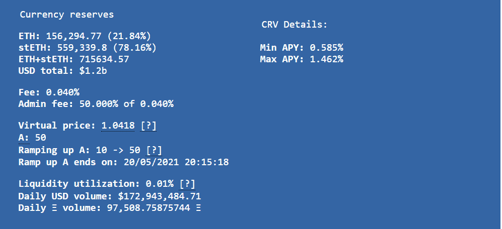
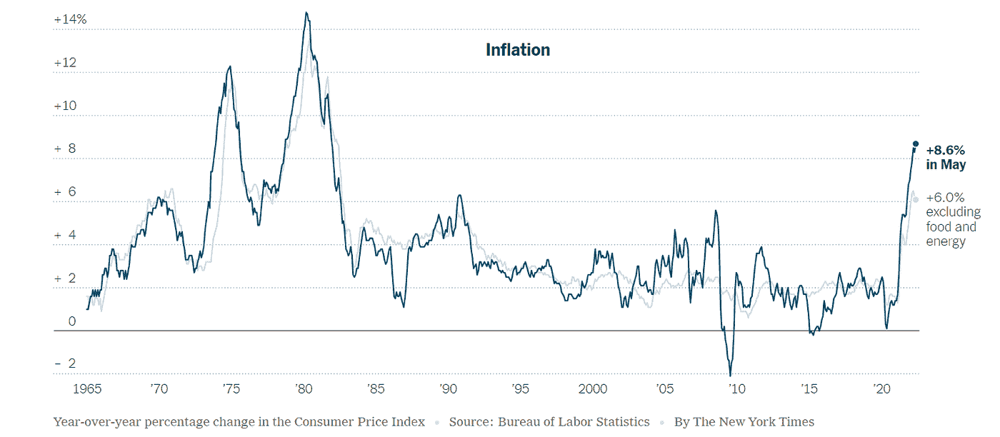
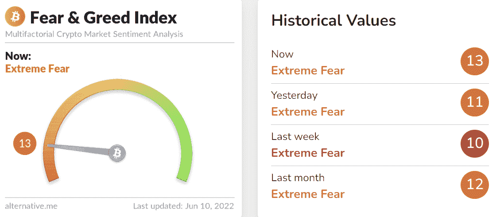
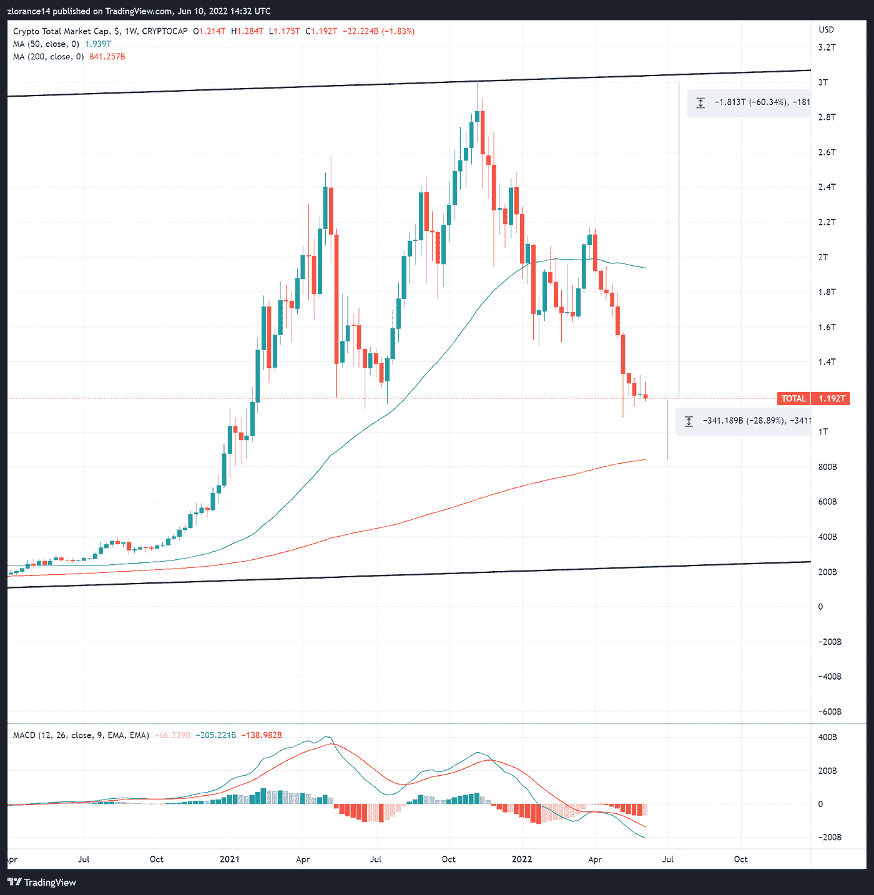
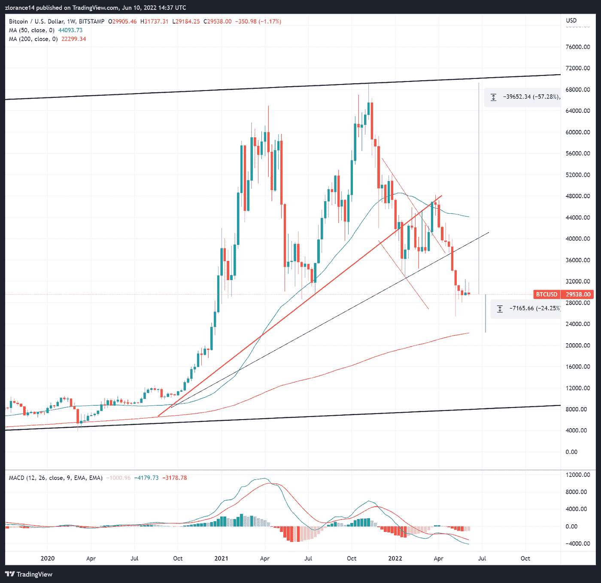
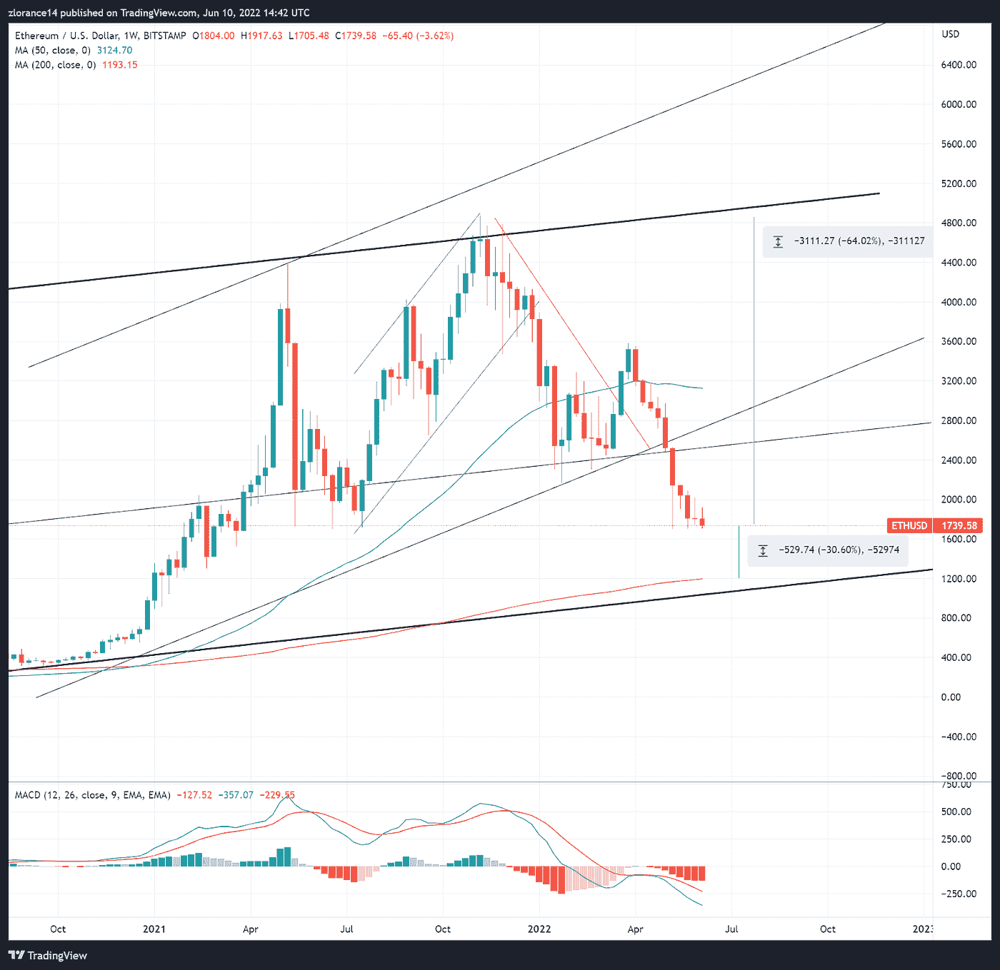
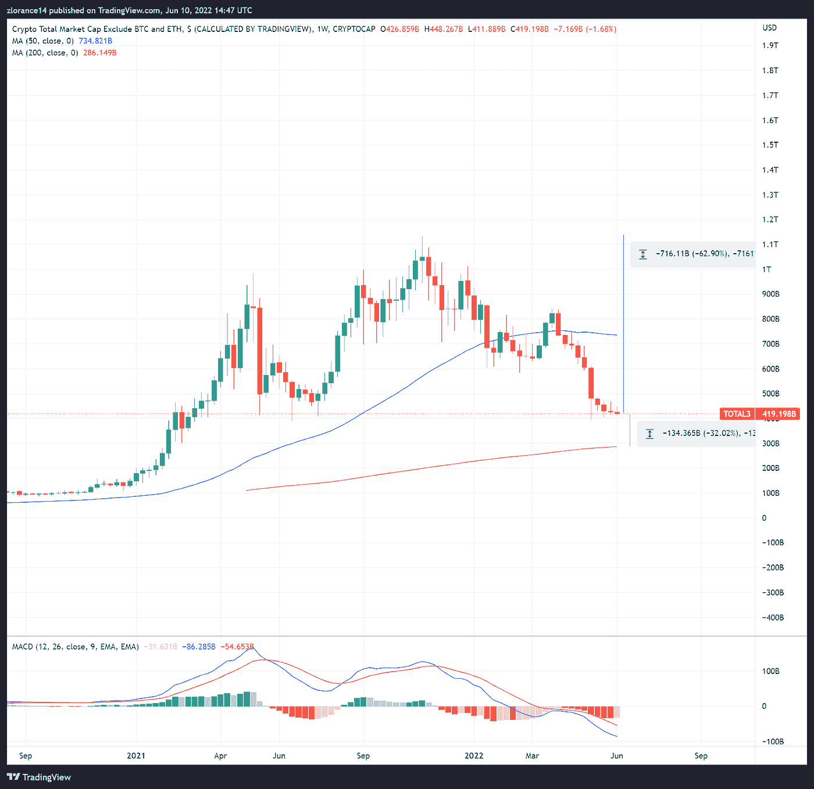
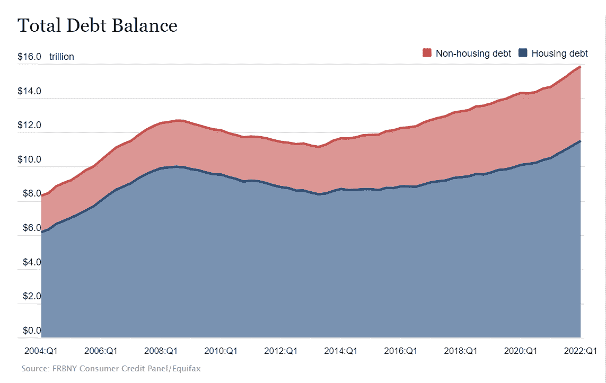

# Celsius (CEL)破产可能引发清算浪潮| RTWM 1.36

> 原文：<https://medium.com/coinmonks/celsius-cel-insolvency-could-create-wave-of-liquidations-rtwm-1-36-750855cadfba?source=collection_archive---------1----------------------->

# RekTimes 每周市场

***2022 年 6 月 10 日:*** 因主要加密交易所[celes Network(CEL)](https://celsius.network/)加密货币市场酝酿流动性危机。该交易所最近的以太坊头寸已经破产，缺乏流动性来支付利息、客户提款和弥补黑客攻击造成的资金损失。这里的关键是，Celsius 不得不出售丽都金融的 stETH token，这是一个与 ETH 1:1 挂钩的 token，但在等待合并时流动性不足。

我们将提供对情况的分析，并帮助筛选噪音，以确定应该将注意力放在哪里。一如既往，底部将提供市场基本面的简要更新。

**关键要点——摄氏温度在下降，市场知道这一点**

摄氏温度实际上只有 27%是液体。剩下的 73%被锁在 staked ETH 等待合并的成功实施。因此，目前 Celsius 每周提取约 50，000 ETH，这一提取速度将使他们在短短五周内耗尽流动性。此时有两件事可能会让公司迅速从资不抵债走向破产/违约:

*   以太坊转向 PoS 的延迟
*   斯特思的重大“脱钩”

**第十个令牌**

重要的是要立即澄清，stETH 实际上不能 depeg。这一点也不像展现的 Terra UST 危机。Staked ETH (stETH)由利多金融直接发行，与 Staked ETH 存款 1:1。stETH 和 ETH 之间的汇率是一个二级市场，与支持实际持有的 ETH 的价值无关。

利多实质上是让参与者既能享受押注 ETH 的好处，又能通过收费更快地找到流动性。随着这些交易所的市场价格上涨，这在 stETH 创造了套利机会。因此，如果 stETH 跌破 ETH，押注长期赎回的投资者可以折价买入 stETH。这是假设利多金融实际上持有所有必要的 ETH。根据所有定义，stETH 是导数的一种形式。然而，这并不是无风险的交易。

**摄氏流动性问题**

由于 Celsius 将在短短五周内耗尽流动性，该交易所可以利用其钱包中的资产作为紧急流动性。Celsius 在 Aave 上持有 445，000 个 stETH 代币，以及许多其他资产，汇总如下[此处](https://twitter.com/MikeBurgersburg/status/1532922901854310400):

Celsius 可以通过两种方式利用 stETH 的主要头寸:出售 stETH 以换取 ETH，或者以 stETH 头寸为抵押借款来偿还客户。Celsius 将面临的第一个问题是缺乏可赎回的链上流动性。例如，在撰写本文时，Curve 只有 1.56 亿 ETH，而 stETH 有 5.59 亿。Celsius 将不得不支付额外费用来提前退出其 stETH 位置。

第二种选择本身就很危险。在这个市场中，加密作为抵押品只会贬值，并带来更高的清算风险。相对于不断下跌的估值，借贷变得越来越昂贵。其他主要参与者也知道这一点，例如 Alameda Capital 据称抛售了 50，000 stETH，以对 Celsius 施加更多压力。

**到底看什么**

stETH 有足够大的参与者来制造一场人为的银行挤兑，彻底摧毁 Celsius。目前，由于市场状况，参与者感到恐惧和不理性。如果阿拉米达这样的实体对 stETH:ETH“挂钩”施加压力，这可能会进一步损害 Celsius 可以用作抵押品的价值，并摧毁任何利用杠杆收购廉价 stETH 的套利交易者，从长期来看，这应该是一项“无需动脑筋的交易”。

杠杆和缺乏流动性是这里的问题，如果 Celsius 被清算或违约，可能会造成更大的市场压力。在这种情况下，他们将被迫出售自己的资产，包括从 ETH & LINK 到 WBTC 的所有资产。

关于这个话题的更多信息，请查看来自 Twitter 用户@ otteroooo 和@SmallCapScience 的两个深入主题，我们将它们作为这种情况的基础:

**延伸阅读 *—*** *在知道*

*   链环(link)发布新路线图，立桩([链环](https://blog.chain.link/chainlink-staking-roadmap/))
*   以太坊成功完成与 rops ten Testnet([block works](https://blockworks.co/ethereum-ropsten-testnet-successfully-merged-to-proof-of-stake/))的证据合并
*   2022 年 5 月，美国通胀率继续上升，同比增长 8.6%

# 秘密经济与市场

最近的通货膨胀数据，加上零售购买力的下降，不断给市场带来下行压力。自 5 月初以来，股市出现了小幅反弹，但都没有达到显著水平。未来几周到几个月，市场看起来仍将走向一个重要的投降期。

与上周相比，市场情绪略有下降，下降一点至 13，仍处于“极度恐惧”状态。

完整的恐惧和贪婪指数图表如下所示:

[恐惧&贪婪指数](https://alternative.me/crypto/fear-and-greed-index/)

**总市场**

Total Crypto Market 成功地将之前的每周蜡烛变成了绿色蜡烛——连续八周以来的第一次。此后，该市场跌至 1.9 万亿美元，较历史高点下跌了 60.34%。这一区域形成了相对较强的支撑，与 2021 年 7 月的底部保持一致。这里的突破无疑会让市场总价值低于 1 万亿美元。

200 毫安大约比当前水平低 28%。

**总加密市值******如下:****

****

****比特币(BTC)****

**在最新的美国通胀数据于 2022 年 6 月 10 日下跌后，比特币上周的小幅上涨已经被完全抹去。比特币的估值徘徊在 29，500 美元左右，比历史高点下跌了 57%，在达到主要的长期支持之前，有可能跌至 22，500 美元。**

**比特币短期反转仍有可能，尽管这完全取决于高素质投资者的情绪和风险分配。**

****[**比特币/美元周线图**](https://www.tradingview.com/chart/PtQkJAD5/?symbol=BITSTAMP%3ABTCUSD) **如下:******

********

******以太坊(ETH)******

****过去两周，以太坊面临的抛售压力远远大于比特币。ETH 上周的表现逊于市场，本周仍处于下滑趋势。像 Celsius 这样的大规模投资者不得不清算头寸以保持偿付能力，这一事实于事无补。尽管合并越来越近，但市场正在消化进一步的投降。****

****如果以太坊确实在 2022 年夏天实现了 PoS，它有可能完全逆转市场——特别是对于以太坊生态系统内的替代硬币。不过，在这一点上，合并的时间表纯粹是猜测。****

****以太坊在过去七个月下跌了 64%，在达到 200 毫安之前还有 30%的下跌空间。****

******[**以太币/美元周线图**](https://www.tradingview.com/chart/PtQkJAD5/?symbol=BITSTAMP%3AETHUSD) **如下图:********

********

******真实总替代币市场(不包括比特币、以太坊)******

****过去几周，比特币对美元、BTC 和瑞士法郎的抛售势头有所放缓。尽管如此，altcoins 已经发布了现在将连续 10 周的红色蜡烛，本周也应该会结束。****

****自去年 11 月以来，真正的 Altcoin 总市场下跌了近 63%，在 200 MA 之前又损失了 1340 亿美元(-30%)。****

******[**真币总市值**](https://www.tradingview.com/chart/PtQkJAD5/?symbol=CRYPTOCAP%3ATOTAL3) **如下图:********

****************

# ****市场分析****

****随着市场持续面临一周又一周的抛售压力，许多 web3 公司、项目和协议都在为流动性而挣扎。比特币基地已经证明了其最近冻结招聘的问题，而 Terra Luna 的倒闭导致了之前一个 400 亿美元项目的失败。****

****现在，crypto exchange Celsius 表现出相当的疲软，很可能不会是这场加密经济衰退的最后一场。随着市场因糟糕的通胀数据而再次下跌，加密可能是一种合适的通胀对冲工具的说法几乎被否定了。除了承担风险的机构之外，市场积累和增长的资本很少。****

****例如，随着家庭债务飙升至创纪录水平，美国人几乎破产。随着美国通货膨胀率飙升至 8.6%，零售商面临着巨大的价格压力。这将可支配收入排除在等式之外，甚至可能导致个人将资产变现。****

********

****预计市场将在未来几周内大幅波动，无论是上涨还是下跌，并脱离当前区域。长期概率表明中长期市场价格较低——取决于你的定义。****

****一如既往，这不是专业的财务建议，而是对每周市场状况的免费可消化分析。在管理投资组合或做出投资决策时，请做好自己的尽职调查。祝你下周好运。****

******RekTimes 更新******

****对于 2022 年第三季度的 RekTimes，有很多事情正在酝酿之中。对于这里所有作者页面的关注者来说，很快会有一个大惊喜。此外，第 3 季度，团队本身和我们的合作伙伴关系都在扩大！预计月底会有更新。****

****就内容而言，在接下来的几周内，它将会慢慢增加。当我们展望未来时，期待更多的研究报告、教育内容和更广泛的宏观作品。****

******即将更新的文章:******

*   ****Chainlink 的新路线图:Staking LINK**—6 月 13 日发布******
*   ****提案报告更新(ample forth)—**6 月 15 日发布******
*   ****RekTimes 每周市场 1.37—**6 月 17 日发布******

*****长期项目*****

*   ****Q2 总结报告—**7 月 1 日发布******
*   ****新兴的加密经济:加密经济和现实世界应用概述—**2022 年第三季度******
*   ****MOBI 考察—**2022 年第三季度******

********

******如果你喜欢这篇文章，请务必关注本页，我们会在每周发布时通知你******

****[**在 Twitter 上关注作者**](https://twitter.com/zacharias_eth)****

****[**在 Twitter 上关注 rek times**](https://twitter.com/rektimes)****

****************

****[驼鹿&玛莎手工艺品](https://www.publish0x.com/editPost/mooseandmarsha.com)****

********

> ****加入 Coinmonks [电报频道](https://t.me/coincodecap)和 [Youtube 频道](https://www.youtube.com/c/coinmonks/videos)了解加密交易和投资****

# ****另外，阅读****

*   ****[十大最佳加密货币博客](https://coincodecap.com/best-cryptocurrency-blogs) | [YouHodler 评论](https://coincodecap.com/youhodler-review)****
*   ****[AscendEx 保证金交易](https://coincodecap.com/ascendex-margin-trading) | [Bitfinex 赌注](https://coincodecap.com/bitfinex-staking)****
*   ****[最好的卡达诺钱包](https://coincodecap.com/best-cardano-wallets) | [冰棒副本交易](https://coincodecap.com/bingbon-copy-trading)****
*   ****[印度最佳 P2P 加密交易所](https://coincodecap.com/p2p-crypto-exchanges-in-india) | [柴犬钱包](https://coincodecap.com/baby-shiba-inu-wallets)****
*   ****[8 大加密附属程序](https://coincodecap.com/crypto-affiliate-programs) | [eToro vs 比特币基地](https://coincodecap.com/etoro-vs-coinbase)****
*   ****[最佳以太坊钱包](https://coincodecap.com/best-ethereum-wallets) | [电报上的加密货币机器人](https://coincodecap.com/telegram-crypto-bots)****