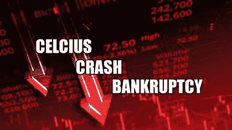

# 摄氏怎么了？

> 原文：<https://medium.com/coinmonks/celsius-crash-what-happened-with-celsius-70eb6abcff39?source=collection_archive---------8----------------------->

Source photo [crash celsius — Bing images](https://www.bing.com/images/search?view=detailV2&ccid=RWJVruTz&id=0A1A2B7A26F0C7043A1612E18C1261A665E7B15F&thid=OIF.wDlK6WloGTd9Fd93fZ8Txg&mediaurl=https%3a%2f%2fwww.fintwit.news%2fimages%2f2022.06%2foriginal%2f1200_62a6dbf8dc76de2b2d181529.png&cdnurl=https%3a%2f%2fth.bing.com%2fth%2fid%2fR.456255aee4f3d0bf2ca710b49131e613%3frik%3d%26pid%3dImgRaw%26r%3d0&exph=675&expw=1200&q=crash+celsius&simid=6959353326576&FORM=IRPRST&ck=C0394AE9696819377D15DF777D9F13C6&selectedIndex=6&ajaxhist=0&ajaxserp=0)

## 什么是摄氏度？

Celsius 是一个贷款和借款平台，自 2017 年开始运营。在 Celsius 平台上，客户可以选择通过存储加密资产来赚取收入，或者将它们用作贷款抵押。

客户还可以购买 Celsius 自己的 CEL token，这使他们能够获得更高的保证利率和更低的借款…