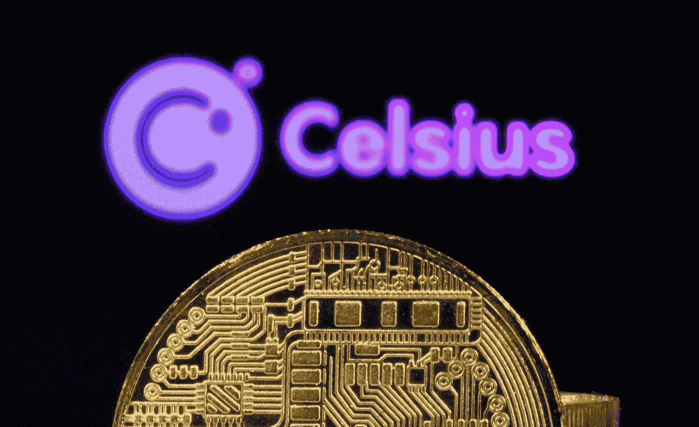

# 摄氏网络崩溃…摄氏网络怎么了？如何安全投资加密货币熊市——2022 年？

> 原文：<https://medium.com/coinmonks/celsius-network-crash-what-happened-to-celsius-network-adc363387c21?source=collection_archive---------2----------------------->

> 被称为“加密货币的人民家园”的摄氏网络阻止用户走出他们的“家园”。眼看近期股市暴跌，他们停止了提款。有吨 FUD 周围的摄氏度和这篇文章将有所有的事情你需要知道的银行运行的情况，他们有现在。FTX CEL 的空头头寸融资率也创下历史新高。



Celsius Network Bank run — How it will affect the Crypto Bear Market 2022

```
· [Reasons for Celsius Bank run](#b7b7)
  ∘ [1\. Lost Funds in DeFi Hacks & Liquidity issues with stETH](#18c0)
  ∘ [2\. Excessive Leveraging and massive liquidations](#4a86)
  ∘ [3\. Competitors Spreading FUD](#9c8b)
  ∘ [4\. Alameda Research’s Revenge](#3377)· [Early Signals — What you should have known before using Celsius](#a6b0)
  ∘ [1\. Net Outflows](#98ce)
  ∘ [2\. Borrowing to pay withdrawals](#887a)
  ∘ [3\. CEO Alex Mashinsky and his wife dumping $CEL](#315e)
  ∘ [4\. Terms and Conditions](#f792)· [Impact on the Crypto Market](#11da)
  ∘ [Bitcoin](#c3ab)
  ∘ [Ethereum](#f2a4)
  ∘ [Other L1 tokens](#284b)· [How to invest in Crypto Safely in 2022](#e90f)
```

# **摄氏银行挤兑原因**

## **1 .DeFi 黑客的资金损失与 stETH** 的&流动性问题

在 DeFi 黑客行动中，摄氏公司损失了巨额资金。以下是所涉项目清单:

*   在 LUNA UST 事件中失去主播 UST
*   损失了 7000 万美元
*   在 Badgerdao 黑客行动中损失 5000 万美元

首先是卢娜·UST·德佩格号失事，根据 T4·南森的分析，发现 UST·德佩格号和其他 6 只“鲸鱼”的钱包都与摄氏度有关。尽管事实上，摄氏度否认了一个巨大的损失，在卢娜 UST 事件，对链数据显示不同。

其次，包括 stETH 在内，几个利用储户资金进行投资的项目都遭遇了黑客袭击。考虑到当前的市场形势，stETH 的价格已经被“鲸鱼”们大量卖出，而卖出 stETH 的流动性却非常低。摄氏度控股约 70%的 ETH 存款作为 stETH，造成摄氏度成为非流动性时，stETH 有 45%的滑动[插入 otterooo 源曲线照片]。在 Badgerdao 的黑客行动中，摄氏公司又损失了 5000 万美元，情况对摄氏公司来说更糟。


Celsius’ stETH holdings | Curve stETH/ETH pool liquidity

## 2.过度杠杆化和大规模清算

> 大家可以在这里查看摄氏度持有的加密货币[。](https://www.theblock.co/post/151624/celsius-rivals-move-to-distance-themselves-from-its-staked-ether-woes)

比特币:

摄氏是地球上最大的比特币机构持有者之一，超过了 Microstrategy 和 Tesla。到 2022 年 4 月，它手头上就有 15 万 BTC。不过，这两家公司的杠杆率都过高，都在向 Maker 和 Tether 贷款。他们还参与未披露的 DeFi 活动，并可能耕种，以提供高 APY。为了给加密货币提供利息，摄氏公司以储户加密货币债务为抵押。6 月 13 日，celestial 获得了一笔价值 2.78 亿美元的 DAI 贷款(抵押品为 17，919 BTC)，变现价格为 2.25 万美元。为了防止公司清盘，他们一直在缓慢地向贷款头寸添加抵押品。通过在头寸上增加 7200 BTC，他们成功地将清算价格压低至 6 月 16 日的 14000 美元。另一方面，celestial 正在将 wBTC 和 ETH 转移到交易所，以便套现并偿还储户或贷款，这可能会导致这两种货币的价格猛涨。

以太坊:

Celsius 在 ETH 上也很活跃。他们先是在猎犬事件中损失了 35，000 ETH，然后陷入了现在的 stETH 流动性不足的局面。他们在 stETH 拥有大约 73%的 ETH，这些 ETH 在合并之前是不流动的，因为合并后用户可以提取他们持有的 ETH。stETH 现在的流动性如此之差，以至于你几乎不能以一个合理的价格将其兑换成 ETH，所以很可能 Celsius 需要在 OTC 市场上碰碰运气。

根据 parsec finance 的消息，如果不增加额外的抵押品，价值近 5 亿美元的 ETH 将面临 1150 美元的清算。

随着加密市场如此迅速地下滑，价值数百万美元的硬币正在被清算，这扩大了倾销。恐慌的卖家和贷款人撤回了他们的硬币，并随着 FUD 在 twitter 上的传播加入了抛售。最终导致破产。

> 交易新手？试试[密码交易机器人](/coinmonks/crypto-trading-bot-c2ffce8acb2a)或者[复制交易](/coinmonks/top-10-crypto-copy-trading-platforms-for-beginners-d0c37c7d698c)

## 3.传播 FUD 的竞争对手

在过去的几个月里，[多个账号](https://twitter.com/therealplanc/status/1538225727115509760?s=21&t=7njT3h9ahu87N32bD7jjUQ)一直在 Twitter 上传播负面消息，包括天鹅比特币的 CEO。从那里开始，摄氏温度的提取量显著增加。

## 4.阿拉米达研究公司的复仇

在最近的卢纳 UST 事件中，阿拉米达研究公司、Jump、Jane Street 和 Celsius 的消息在 5 月 10 日传出，表明他们将帮助卢纳基金会卫队筹集额外的 1B 美元，以使 UST 与其挂钩。就在第二天，Alex Mashinsky 在 Twitter 上发布声明称，Celsius“没有参与任何 LUNA 救助”。链上的数据显示，摄氏是出售他们的 UST，前面运行的“大男孩”一样，阿拉米达研究。这些机构(阿拉米达，FTX，3 箭资本，银河数码，跳转资本)被卡住持有 UST 和锁定卢纳，每个损失数亿美元。

阿拉米达研究公司在注意到 Celsius 持有一大袋 stETH 后，猛烈地抛弃了 stETH，导致 stETH 缺乏流动性

Twitter 帖子还将 stETH 转储指向 Alameda Research，这些是 Alameda 做的[事情](https://twitter.com/therealplanc/status/1536572204728524800?s=21&t=aYotveeE5rCC4HG_iNbJLQ):

*   倾倒大量 stETH
*   向 Voyager(Celsius 的竞争对手)投资 7500 万美元
*   赞助大型社交媒体账户


On Chain Data — Alameda Research swap stETH to ETH

# 早期信号——在使用摄氏温度之前你应该知道的

## 1.净流出量

你可以看到，在过去的几个月里，摄氏温度出现了[持续的流出](https://twitter.com/MikeBurgersburg/status/1532933522196922374/photo/1)，这是银行挤兑可能性的一种信号。

## 2.借款以支付提款

至少有[、7670 万美元的 USDC 和 1830 万美元的 USDT 贷款](https://twitter.com/MikeBurgersburg/status/1533133666884395009)用于支付取款，占已知 Celsius 钱包发出总额的 29%。

## 3.首席执行官亚历克斯·马辛斯基和他的妻子抛售美元

链上数据显示[钱包](https://twitter.com/KOTPtrader/status/1510821561795854344)与 Alex Mashinsky 在账户冻结前倾倒 CEL 代币有关，黑幕？

## 4.条件

“不是你的钥匙，不是你的硬币”，这是你在 CeFi 空间看到的任何项目的真实写照。Celsius 在[条款](https://celsius.network/terms-of-use)中明确说明，你的 Celsius 账户属于 Celsius，里面的密码是他们使用的。让我们希望经过这次事件后，每个人最终都明白这一点。


Celsius Official Website —” Terms and Conditions”

# **对加密市场的影响**

## 比特币

鉴于 Celsius 是这个星球上最大的比特币持有者之一，如果 Celsius 破产，比特币价格很可能会下跌，并回到“有吸引力的水平”。如果他们的所有头寸被清算，以现金支付给贷款人或储户，这将导致 15 万 BTC(合 500 万美元)的抛售。虽然比特币 ADV(平均每日交易量)目前约为 40，000-50，000 BTC，但与每日交易量相比，这将是一个巨大的交易量。这最有可能导致许多贷款头寸被清算，加剧抛售。

## 以太坊

与 BTC 类似，瑞士联邦理工学院面临着同样的抛售套现风险。随着流动性不足的 stETH 出现问题，Celsius 最有可能在场外市场折价出售其 stETH，对市场的影响较小。尽管 Celsius 在 ETH 中持有大量股份，但预计价格会下跌。

根据链上数据，cETH 是 ETH whales 中最大的持股之一，而如果价格因 Celsius dump 而大幅下跌，这将对 ETH 的大规模清算构成另一个威胁。仅供参考，cETH 是你从大院借 ETH 得到的收据令牌。

## 其他 L1 代币

除了 BTC 和瑞士联邦理工学院，Celsius 还持有一批其他 L1 和 L2 硬币，包括 LINK、MATIC、AVAX、BAT、PAXG、MANA、AAVE……等等

这将导致 altcoin 空间中不同大小的影响，具体取决于 Celsius 的销售方法和规模。

# 2022 年如何安全投资 Crypto

过去几周，摄氏 FUD 令投资者胆战心惊，加上 6 月 15 日令人紧张的美联储会议，整体市场已经连续 11 周下跌。


Crypto Market Cap Chart — Trading View

我认为这是一个购买你认为在下一轮牛市中还会存在的硬币的好机会。在我看来，主要是 BTC 和 ETH。你应该仍然保持大部分现金，慢慢加入蓝筹股。我会建议远离波动较大的 Altcoins 或者配置小比例给它。确保你投资的金额是你愿意承受的损失。

在这种波动的市场中，不要使用杠杆，不要做报复性交易。这些事情会让你在熊市中彻底破产

一如既往， ***保持安全，DCA*** ！

去看看我在**发表的另一篇关于 BTC 价格预测和图表分析的文章**:[https://medium . com/@ TVs tsang/best-bit coin-fundamental-technical-analysis-in-2022-bear-and-bull-case-for-cryptocurrency-c 72 cdfbecddc](/@tvstsang/best-bitcoin-fundamental-technical-analysis-in-2022-bear-and-bull-case-for-cryptocurrency-c72cdfbecddc)

#

#

**在 Twitter 上关注**我:[https://twitter.com/tvstsang](https://twitter.com/tvstsang)

**在媒体上跟随**我:[https://medium.com/@tvstsang](/@tvstsang)