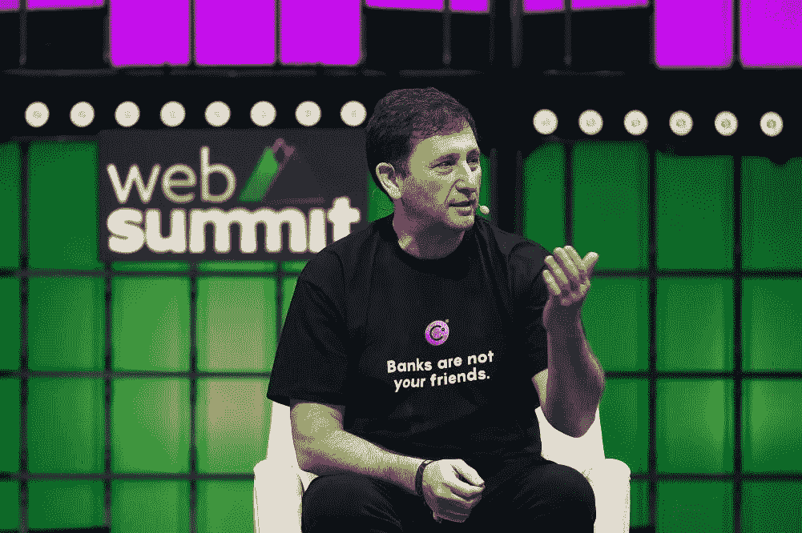

# 第二部分:亚历克斯·马辛斯基的傲慢

> 原文：<https://medium.com/coinmonks/celsius-part-2-the-hubris-of-alex-mashinsky-9cd594bf61c?source=collection_archive---------14----------------------->

亚历克斯·马辛斯基(Alex Mashinsky)是 Celsius 的创始人，他以憎恨银行而闻名。在最近的一集里，著名的互联网侦探 Coffeezilla 指出，Alex Mashinsky 非常讨厌银行，以至于他经常穿着一件写着“银行不是你的朋友”的衬衫。他会像布道一样向任何愿意聆听的人宣扬他的信仰。

*“当你在摩根大通或花旗银行存款时，他们付给你 1%的利息，然后他们转而用我的信用卡借钱给我，并收取我 25%的利息，”*

*“所以他们保留了 95%的收入。而且他们可以逍遥法外，因为他们有执照，我们绕不过他们。他们只是坐在中间，充当收费员。”—* 马辛斯基向*解释加密简报*

鉴于 Mashinsky 的立场，具有讽刺意味的是，作为与传统金融(TradFi)相反的 Web 3 集中式金融(CeFi)协议而构建的 Celsius 网络最终加速了加密冬天进入全消费冰川期。

在我的上一篇文章中，我广泛讨论了摄氏温度暴跌的根本原因:

 [## 第一部分:持续崩溃的 Web 3 崩溃

### 如果你今天还没有检查你的加密文件夹…帮你自己一个忙，走出去，触摸一些草和呼吸…

medium.com](/coinmonks/celsius-and-the-web-3-crash-that-keeps-crashing-7fe9bc5427fd) 

以下是摄氏温度如何工作的快速 TLDR:

Celsius 是一种集中式金融(CeFi)协议，它模仿了银行业中传统银行的许多功能，同时以对存放的加密资产收取近 10% APY 的形式为用户提供了更好的回报。Celsius 将这些资产以高于其向用户收取的利率贷给其他方，并将差价收入囊中。这与我们现有的 TradFi 银行基础设施非常相似，除了 Celsius 被定位为仁慈的 CeFI web 3 银行，具有慷慨的 APY 利率。

“我们没有发明新的业务，”马辛斯基解释道。*“我们把对冲基金和机构在传统华尔街上玩的所有游戏都用在了 crypto 上。”*

虽然我不同意当前的银行基础设施和你得到的少得可怜的低于 1%的存款利率，但我确实开始怀疑许多 Web 3 DeFi 和 CeFi 协议提供的过高的 APYs 是否从根本上长期可持续？CeFi 协议如何有效地完成与 TradFi 银行 10 倍回报相同的事情？这是不是好得难以置信？

要么是传统银行能够提供更高的利率，要么是摄氏协议根本不可持续。在周日给其社区的一份备忘录中，Celsius 宣布停止所有账户之间的提款、互换和转账，这实际上表明了资不抵债，并导致加密和 NFT 市场跌至今年的历史低点。

我们看到了 Terra Luna 的事情是如何发生的，它最终由于不可持续的 APYs 而崩溃，现在它再次发生在 Celsius 身上。虽然亚历克斯·马辛斯基可能真心希望通过 Web 3 的力量改善银行业，但他实际上却做了相反的事情。与 Terra Luna 的情况一样，摄氏温度的下降产生了传染效应，伤害了没有接触过该协议的用户，并使该行业更深地陷入了不确定的熊市。

一篇关于彭博的文章在 2018 年指出，“要么是银行在说谎，要么是摄氏在说谎”，因为本周事实证明是后者。

这是关于摄氏温度下降系列的第二部分。

感谢您的阅读。

在 Twitter 上查看我的德根之旅:

[https://twitter.com/wasifmrahman](https://twitter.com/wasifmrahman)

在 LinkedIn 上关注我的 Web 3 职业生涯:

 [## Wasif Rahman -营销伙伴关系总监- Ex Populus | LinkedIn

### 查看 Wasif Rahman 在全球最大的职业社区 LinkedIn 上的个人资料。Wasif 有 4 个工作列在他们的…

www.linkedin.com](https://www.linkedin.com/in/wasif-rahman-91114a85/) 

看看我的 Web 3 淋浴想法:

 [## 瓦西夫·拉赫曼-中号

### 阅读瓦西夫·拉赫曼在媒介上的作品。Web 3 德根 Ex Populus 营销伙伴关系总监。每天…

medium.com](/@wasifmrahman) 

来源:

 [## “憎恨银行”的加密贷款业务如何避免剥削客户

### 分享这篇文章一定年龄的读者会记得银行可以增加你的财富，以及…

cryptobriefing.com](https://cryptobriefing.com/mashinsky-costco-crypto-celsius/) 

> 加入 Coinmonks [电报频道](https://t.me/coincodecap)和 [Youtube 频道](https://www.youtube.com/c/coinmonks/videos)了解加密交易和投资

# 另外，阅读

*   [加密保证金交易交易所](/coinmonks/crypto-margin-trading-exchanges-428b1f7ad108) | [赚取比特币](/coinmonks/earn-bitcoin-6e8bd3c592d9) | [Mudrex 投资](https://coincodecap.com/mudrex-invest-review-the-best-way-to-invest-in-crypto)
*   [WazirX vs CoinDCX vs bit bns](/coinmonks/wazirx-vs-coindcx-vs-bitbns-149f4f19a2f1)|[block fi vs coin loan vs Nexo](/coinmonks/blockfi-vs-coinloan-vs-nexo-cb624635230d)
*   [比斯勒评论](https://coincodecap.com/bitsler-review)|[WazirX vs coin switch vs coin dcx](https://coincodecap.com/wazirx-vs-coinswitch-vs-coindcx)
*   [7 大副本交易平台](https://coincodecap.com/copy-trading-platforms) | [买币点评](https://coincodecap.com/buycoins-review)
*   《XT.COM 评论》|
*   [SmithBot 评论](https://coincodecap.com/smithbot-review) | [4 款最佳免费开源交易机器人](https://coincodecap.com/free-open-source-trading-bots)
*   [杠杆代币](/coinmonks/leveraged-token-3f5257808b22) | [最佳密码交易所](/coinmonks/crypto-exchange-dd2f9d6f3769) | [Paxful 点评](/coinmonks/paxful-review-4daf2354ab70)