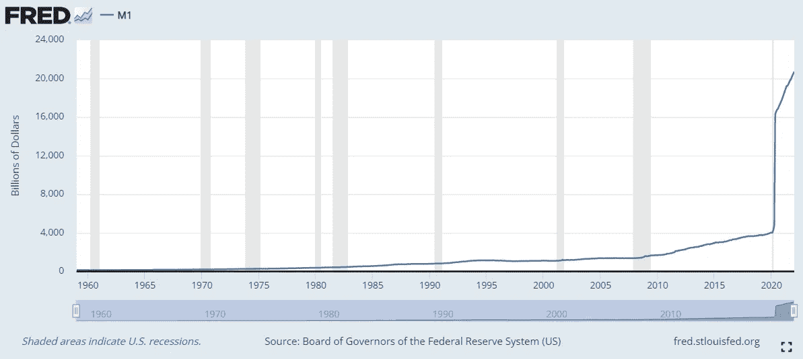

# 央行数字货币和货币的未来

> 原文：<https://medium.com/coinmonks/central-bank-digital-currencies-and-the-future-of-money-b557562ea4b?source=collection_archive---------16----------------------->

## web3 的未来与央行数字货币有冲突吗？

[Photo](https://unsplash.com/photos/cjeThQtJpaw?utm_source=unsplash&utm_medium=referral&utm_content=creditShareLink) by Travis Essinger on Unsplash

随着关于确保数字资产负责任发展的[行政命令](https://www.whitehouse.gov/briefing-room/presidential-actions/2022/03/09/executive-order-on-ensuring-responsible-development-of-digital-assets/)的发布，中央银行数字货币(CBDCs)的概念上周再次受到关注，该命令指示“美国政府评估潜在美国的技术基础设施和能力需求。”

已经有 9 个国家[已经推出了](https://fortune.com/2022/01/13/9-countries-central-digital-currencies-crypto/)他们自己的 CBDCs，但是美国加入了 100 多个国家探索发行数字货币的行列。但是，这些努力能否促进更好的治理和人类繁荣则是另一个问题。总之，人们严重关切的是，CBDCs 是一个寻找问题的解决方案。

不可否认，有一些关于 CBDCs 架构设计的重要决策，所以我们绝不应该用一把大刷子来描绘它们。但是，我们应该问一些关于它们的基本问题。

## 什么是 CBDCs？

中央银行肩负着促进充分就业和管理价格水平(如抑制通胀)的双重使命，这为经济和社会繁荣创造了条件。例如，美联储试图通过联邦公开市场委员会(FOMC)买卖政府证券来影响货币供应和利率。例如，他们可能从银行购买债券以向银行系统注入资金，并出售债券以减少货币供应。

考虑以下从圣路易斯美联储银行获得的关于 M1 货币供应的图表。或许令人难以置信的是，在疫情最繁荣的时候，货币供应量从 4 万亿激增至 20 万亿。虽然读者可以在他们的网站上看到 M1 的具体定义，但货币供应的激增是由美联储购买债券推动的——而不是正常的经济活动。

St. Louis Federal Reserve, M1 Money Supply

记住这一背景非常重要，尤其是在美国，因为它凸显了央行行为的反常以及它们在经济中已经掌握的绝对权力。通过形成一种全新的资产类别来授予额外的权力，需要经过仔细的考虑。

尽管央行发行两种货币——实物现金和电子银行存款——但它们的行为通常属于购买债券和“提供流动性”的范畴。虽然现金可以大规模流通，并实现点对点交易，但储备通常只有合格的金融机构才能获得。创造流动性在危机时期尤其重要，因为这有助于结算并实现商业和央行货币之间的转换，但也有开创先例、引发通胀并对信誉产生不利影响的风险。

从这个意义上说，央行数字货币(CBDC)只是央行储备或结算账户中货币的数字表示。这个名字有点难以捉摸，因为各国的货币通常没有黄金或其他实物形式的实物担保，所以货币已经“数字化”(商业银行的贷款背后显然有抵押品，尽管我们可以看到，在危机时期，对一些抵押品的价值有很多投机！)

然而，核心区别在于 CBDC 的架构设计，以及它们是否直接与消费者打交道(即“零售 CBDC”)，它们是否取代商业银行，或者它们是否作为合作伙伴与商业银行互动。对零售和一些批发 CBDC 方法的担忧是，它们会取代私人银行业务。

## CBDCS 的机遇和风险

包括国际清算银行的白皮书在内的 CBDCs 的支持者认为有一些潜在的好处。

*   金融包容性
*   跨境支付
*   金融弹性和稳定性
*   财政转移的效率
*   隐私

然而，当你一个一个地服用这些药物时，好处并不明显。

**金融普惠**

从根本上说，为什么完全由央行维护的新数字货币对金融包容性至关重要？事实上，分散金融的扩张和不可替代代币的出现正在迅速改变金融格局。此外，[我的研究](https://papers.ssrn.com/sol3/papers.cfm?abstract_id=3822561)发现，现有的 web1 工具，如手机银行，正变得越来越普遍，并为扩大不同人群的银行服务做出了很大贡献。

**跨境支付**

尽管跨境金融交易已经成为可能，但这需要时间和成本。然而，已经出现了许多支持跨境交易的 web3 公司，包括 [Ripple XRP](https://ripple.com/insights/the-role-of-blockchain-and-digital-assets-in-cross-border-payments/) 。为什么我们还需要另一种方法来做已经可能的事情？

**金融弹性和稳定性**

弹性对于缓冲系统的意外冲击很重要。例如，2007 年至 2008 年的金融危机发生在美国和许多发达国家，可以说是由高风险证券化资产的集中引起的。在危机爆发前，抵押贷款的数量迅速增加，但许多新房主在经济上没有准备好实际支付抵押贷款。

虽然有些人认为，通过房利美和房地美向信用较差的借款人发放抵押贷款是由积极的联邦政策推动的，但人们普遍认为，许多监管机构本可以采取行动，但却没有这样做。例如，[2011 年](https://www.govinfo.gov/content/pkg/GPO-FCIC/pdf/GPO-FCIC.pdf)金融危机调查报告称…

> 最典型的例子是美联储未能阻止有毒抵押贷款的流动，它本可以通过设定审慎的抵押贷款标准来做到这一点。美联储是有权这样做的一个实体，但它没有。我们的审查记录充满了其他失败的证据:金融机构制造、购买和出售他们从未审查、不愿审查或知道有缺陷的抵押证券；公司依赖数百亿美元的借款，这些借款必须每晚更新，由次级抵押贷款证券担保；大公司和投资者盲目依赖信用评级机构作为他们的风险仲裁者。

为什么监管机构和商业银行都没有检查贷款的特征，尤其是那些次级贷款？当时的想法是，贷款背后的数学原理——将贷款证券化，或将低质量贷款与其他贷款组合成一个包的过程——足够复杂，足以消除投资风险。事实上，如果像房利美和房地美这样的政府资助实体(GSE)参与其中，那么肯定没有风险吗？

这正是我们在 CBDCs 听到的口头禅。“央行实现其公共政策目标的核心工具是向银行、企业和公众提供最安全的货币形式——央行货币。”然而，我们清楚地看到，集中化是如何造成系统性风险和削弱实际检查基础资产质量的动力的。(这就是经济学家所说的“道德风险”问题。)

**财政转移支付的效率**

和跨境支付一样，这也是可能的。

**隐私**

尽管中央银行在区块链开展活动有其好处，但如果中央银行以数字化方式开展所有活动，并要求“了解你的客户”( KYC)规则——诚然这有助于减少非法活动——那么就有政府知道居民的一举一动和交易的风险。当我们看到中国共产党(CCP)对他们的数字货币[所做的事情时，这尤其令人担忧。](https://www.wired.co.uk/article/digital-yuan-china-bitcoin-libra)

总的来说，这并不是说 CBDCs 没有优势，但是优势并不像看起来那么明显，我们不应该自欺欺人地将某些功能称为优势，而实际上这些功能是非常普遍的——无论是满足现状还是接近替代品。

## 货币的未来和赤字的出现

金融的未来是去中心化的。尽管我们传统上知道大型中央机构并与之互动，但技术进步，加上对中央集权弊端的日益认识，导致了对分散化技术的广泛偏好和采用。

例如，P2P 贷款从未如此简单。如果你有一部手机和一个银行账户，你几乎可以立即轻松地转移资金，而且比以往任何时候都更安全。此外，像 [FibSWAP](https://fibswap.io/) 这样的多桥分散式交易所的出现，使用户能够高效、廉价地交换代币。这些进步确实有可能扩大融资渠道。此外，像[秘密网络](https://scrt.network/)这样的交易所正在为加密的私人通信和传输创造基础设施。总的来说，有很多令人兴奋的工作正在进行中。

但是，去中心化的账本技术——以及更一般的区块链——只是工具。他们仍然需要良好的治理和适当的管理。CBDCs 的出现带来了进一步集中金融“创造”和流动的风险，因为它赋予了央行更多发行代币的权力，而不是在某种程度上“开放”的市场上买卖债券。

中央银行仍然可以采用 DLT，但他们不需要发行自己的新型货币。相反，他们可以采用 DLT 来改善内部决策、提高透明度并简化流程。

*本文作者为* [*克里斯特斯·a·马克里迪斯*](http://www.christosmakridis.com/) *，* [*生活剧*](http://www.livingopera.org/) *首席技术官兼研究负责人。他还是斯坦福大学数字经济实验室和哥伦比亚商学院 Chazen Institute 的研究成员，并拥有斯坦福大学经济学和管理科学&工程学双博士学位。在@living_opera 关注我们！*

> 加入 Coinmonks [电报频道](https://t.me/coincodecap)和 [Youtube 频道](https://www.youtube.com/c/coinmonks/videos)了解加密交易和投资

# 另外，阅读

*   [Bitsgap 审查](/coinmonks/bitsgap-review-a-crypto-trading-bot-that-makes-easy-money-a5d88a336df2) | [Quadency 审查](/coinmonks/quadency-review-a-crypto-trading-automation-platform-3068eaa374e1) | [Bitbns 审查](/coinmonks/bitbns-review-38256a07e161)
*   [加密复制交易平台](/coinmonks/top-10-crypto-copy-trading-platforms-for-beginners-d0c37c7d698c) | [Coinmama 评论](/coinmonks/coinmama-review-ace5641bde6e)
*   [印度的加密交易所](/coinmonks/bitcoin-exchange-in-india-7f1fe79715c9) | [比特币储蓄账户](/coinmonks/bitcoin-savings-account-e65b13f92451)
*   [OKEx vs KuCoin](https://coincodecap.com/okex-kucoin) | [摄氏替代品](https://coincodecap.com/celsius-alternatives) | [如何购买 VeChain](https://coincodecap.com/buy-vechain)
*   [币安期货交易](https://coincodecap.com/binance-futures-trading)|[3 comas vs Mudrex vs eToro](https://coincodecap.com/mudrex-3commas-etoro)